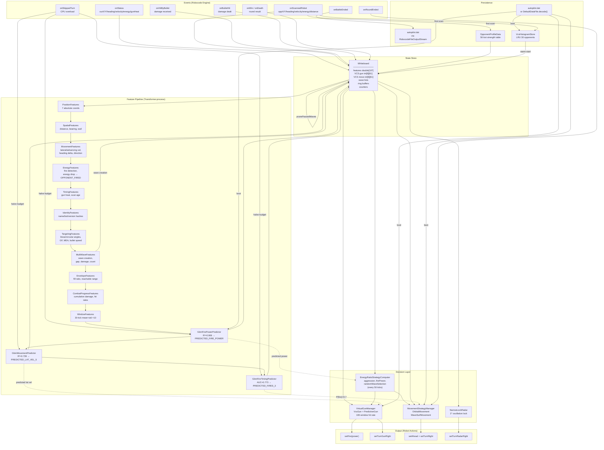

# Robot Code State — Online Robot Analysis

*Snapshot: 2026-05-08. Describes `Autopilot 0.1.0` as built and battled today.*

---

## 1. Data Loading & Storage

### Boot Sequence (first tick of first round)

```
ensureInitialized()
  ├─ ReachableEnvelope.ensureLoaded()          // force class-load of byte[][] tables (~120 KB static)
  ├─ new Whiteboard, Transformer, GunManager, MoveManager, Radar, Strategy, TickBudget, VcsStore
  ├─ Register 4 IPersistable sections with PersistenceManager
  ├─ Try load data file:
  │   ├─ getDataFile("autopilot.dat") exists? → read bytes → persistence.loadWithStatus()
  │   └─ else: DefaultDataFile.decode() → Base64 fallback → persistence.loadWithStatus()
  └─ Per-round init: Whiteboard.onRoundStart(), gunManager.onRoundStart(), moveManager.onRoundStart()
```

### What gets persisted (4 sections)

| Section ID | Class | What's Saved | Size | Purpose |
|---|---|---|---|---|
| 1 | `VirtualGunManager` | Hit/miss ring buffer (100-window) per strategy, hit counts, history index | ~400 B | Remember which gun works across battles |
| 2 | `MovementStrategyManager` | Active strategy index, rounds played, damage-per-round per strategy | ~50 B | Remember which movement works |
| 3 | `TickBudget` | Ceiling (max sustainable tree count) | 4 B | Don't re-learn CPU limits |
| 4 | `VcsHistogramStore` | Per-opponent LRU (30 entries) of gun+move VCS histograms, each 12×61 bins as `short` | ~88 KB | Warm-start targeting/dodge against known opponents |

### Battle end save

```
onBattleEnded()
  ├─ vcsStore.saveFrom(opponentBotIdHash, whiteboard)   // snapshot current VCS
  ├─ persistence.save() → byte[]
  └─ write to getDataFile("autopilot.dat") via RobocodeFileOutputStream
```

**Binary format:** `[MAGIC "RBAP":4][VERSION=1:4][SECTION_COUNT:4]` then per-section `[ID:4][LENGTH:4][DATA:length]`

### ML Model Blobs — who provides what

| Java Class | Embedded Data | Model | Trees | Features | Base Score | Size |
|---|---|---|---|---|---|---|
| `FirePowerData` | 8 Base64 string constants (D0-D7) | XGBoost fire power | 200 | 80 | 1.1802 | ~438 KB |
| `MovementData` | 8 Base64 string constants | XGBoost lateral velocity N=5 | 200 | 76 | -0.0156 | ~451 KB |
| `FireTimingData` | 8 Base64 string constants | XGBoost fire timing 3-tick | 200 | 81 | 0.5 | ~415 KB |
| `DefaultDataFile` | 1 Base64 string | Persistence blob (VCS histograms from training battles) | — | — | — | ~44 KB |
| `EnvelopeData` | Static `byte[][]` arrays | Pre-computed reachable positions at 9 velocity levels | — | — | — | ~120 KB |
| `OpponentProfileData` | 1 Base64 string | 50-entry sorted table of `[botIdHash, strength×1000]` | — | — | — | ~400 B |

**ML model loading is lazy** — models are decoded on the first `transformer.process()` call that reaches each predictor. The `GbmTreeEnsemble.load()` concatenates the split Base64 chunks, decodes, and parses the flat-array tree representation.

**First scan triggers VCS warm-start** — `loadOpponentProfile()` calls `vcsStore.loadInto(hash, wb)` to copy stored histograms into the active Whiteboard VCS arrays.

---

## 2. Feature Map — Producers, Consumers, and Lift

### Notation

- **Producer**: the `IInGameFeatures` class that calls `wb.setFeature(Feature.X, value)`
- **Depends on**: features that must be computed first (enforced by topological sort)
- **Consumed by**: downstream features, predictors, or decision components
- **Lift**: what competitive advantage this feature provides

### 2a. Core Observation Features

| Feature | Producer | Input Source | Consumed By | Lift |
|---|---|---|---|---|
| `OUR_X`, `OUR_Y`, `OUR_HEADING`, `OUR_VELOCITY` | `PositionFeatures` | `wb.getOurX()` etc. (from `onStatus`) | WindowFeatures, EnvelopeFeatures, PredictiveGun, PathPlanner | Foundation — absolute position for all geometry |
| `OPPONENT_X`, `OPPONENT_Y`, `OPPONENT_HEADING` | `PositionFeatures` | `wb.getOpponentX()` etc. (from `onScannedRobot`) | EnvelopeFeatures, VcsGun, PredictiveGun, PathPlanner | Foundation — opponent position for targeting |
| `DISTANCE` | `SpatialFeatures` | `hypot(dx, dy)` | MovementFeatures, TargetingFeatures, MultiWaveFeatures, EnvelopeFeatures, WindowFeatures, VCS segment selection, all GBM models | Foundation — core range metric |
| `BEARING_TO_OPPONENT_ABS` | `SpatialFeatures` | `atan2(dx, dy)` | MovementFeatures, TargetingFeatures, VcsGun, PredictiveGun, WaveSurfMovement | Foundation — all targeting and movement needs this |
| `OPPONENT_DIST_TO_WALL_MIN` | `SpatialFeatures` | min(oppX, oppY, bfW-oppX, bfH-oppY) - 18 | GBM models | Predicts movement constraints (wall-hugging opponents) |
| `OPPONENT_VELOCITY` | `MovementFeatures` | `wb.getOpponentVelocity()` | TargetingFeatures, PredictiveGun, GBM models | Raw opponent speed |
| `OPPONENT_LATERAL_VELOCITY` | `MovementFeatures` | `velocity × sin(heading - bearing)` | VCS segment, GBM models | Core VCS segmentation dimension |
| `OPPONENT_ADVANCING_VELOCITY` | `MovementFeatures` | `velocity × cos(heading - bearing)` | GBM models | Closing/retreating signal |
| `OPPONENT_HEADING_DELTA` | `MovementFeatures` | `heading - prevHeading` | TargetingFeatures, PredictiveGun, GBM models | Turn rate — critical for circular extrapolation |
| `OPPONENT_ENERGY` | `EnergyFeatures` | `wb.getOpponentEnergy()` | StrategyComputer, GBM models | Kill-shot decisions, energy management |
| `OPPONENT_FIRED` | `EnergyFeatures` | Energy drop ∈ [0.1, 3.0], not bullet-hit, not wall-hit | MultiWaveFeatures, GBM models | Wave creation trigger — entire wave system depends on this |
| `OPPONENT_FIRE_POWER` | `EnergyFeatures` | `prevEnergy - energy` (when fired) | MultiWaveFeatures, GBM models | Bullet speed calculation, damage estimation |
| `OUR_GUN_HEAT` | `TimingFeatures` | `wb.getOurGunHeat()` | GBM fire timing model, WindowFeatures | Predicts when we can fire; opponents model this too |
| `TICKS_SINCE_SCAN` | `TimingFeatures` | `tick - lastScanTick` | GBM models, WindowFeatures | Staleness indicator — features degrade without scans |
| `ENERGY_RATIO` | computed inline | `ourE / (ourE + oppE)` | StrategyComputer | **Aggression control** — energy ratio IS the win signal |

### 2b. Derived Targeting Features

| Feature | Producer | Formula | Consumed By | Lift |
|---|---|---|---|---|
| `OPPONENT_LATERAL_DIRECTION` | `MovementFeatures` | sign(lateralVelocity), sticky ±1 | VCS segment selection, TargetingFeatures | VCS segmentation — different histograms for left/right movers |
| `OPPONENT_VELOCITY_DELTA` | `MovementFeatures` | `velocity - prevVelocity` | GBM models | Acceleration signal |
| `OPPONENT_IS_DECELERATING` | `MovementFeatures` | `|velocity| < |prevVelocity| ? 1 : 0` | GBM models | Deceleration pattern detection |
| `OPPONENT_TIME_SINCE_DIRECTION_CHANGE` | `MovementFeatures` | Counter since last lateral dir flip | GBM models | Oscillation frequency (key for surfer detection) |
| `OPPONENT_ANGULAR_VELOCITY` | `TargetingFeatures` | `atan2(latVel, distance)` | GBM models | Angular motion for targeting |
| `OPPONENT_MAX_TURN_RATE` | `TargetingFeatures` | `10° - 0.75 × |v|` | GBM models | Physical turn limit at current speed |
| `DISTANCE_NORM` | `TargetingFeatures` | `distance / battlefield_diagonal` | GBM models | Normalized for cross-field-size training |
| `LINEAR_TARGET_ANGLE/OFFSET` | `TargetingFeatures` | Law-of-sines projection | GBM models (not used by any gun directly) | Linear targeting baseline |
| `CIRCULAR_TARGET_ANGLE/OFFSET` | `TargetingFeatures` | Iterative circular extrapolation | GBM models (not used by any gun directly) | Circular targeting baseline |
| `GF_BEARING_OFFSET` | `TargetingFeatures` | `bearing - fireBearing` of nearest wave | GBM models | Current position relative to wave |
| `GF_CURRENT_AT_POWER_{1,1_5,2}` | `TargetingFeatures` | `offset / MEA` at 3 bullet powers | GBM models | Normalized dodge position — key for movement prediction |
| `OPPONENT_GUESS_FACTOR` | `TargetingFeatures` | `lateralVel / 8` | GBM models | GF of opponent's current position |
| `MEA_FOR_OUR_BULLET` | `TargetingFeatures` | `arcsin(8 / ourBulletSpeed)` | VcsGun | Maximum escape angle — bounds the GF range |
| `OUR_BULLET_SPEED`, `OPPONENT_BULLET_SPEED` | `TargetingFeatures` | `20 - 3 × power` | GBM models | Bullet kinematics |

### 2c. Multi-Wave & Envelope Features

| Feature | Producer | Input | Consumed By | Lift |
|---|---|---|---|---|
| `N_OPPONENT_WAVES_IN_FLIGHT` | `MultiWaveFeatures` | `opponentWaves.size()` | GBM models | Pressure indicator |
| `N_OUR_WAVES_IN_FLIGHT` | `MultiWaveFeatures` | `ourWaves.size()` | GBM models | Our fire rate tracking |
| `NEAREST_OPPONENT_WAVE_GAP` | `MultiWaveFeatures` | O(N²) all-pairs min tick gap | GBM models | **34% of GF importance (nb13)** — wave spacing matters |
| `NEAREST_OUR_WAVE_GAP` | `MultiWaveFeatures` | Same for our waves | GBM models | Offensive wave spacing |
| `TOTAL_OPPONENT_WAVE_DAMAGE` | `MultiWaveFeatures` | Sum of `wave.damage()` | GBM models, VcsWaveDanger via urgency | Danger weighting |
| `ENVELOPE_FILL_RATIO` | `EnvelopeFeatures` | `ReachableEnvelope.scanEnvelope()` | GBM models | How constrained our movement is (wall/corner) |
| `REACHABLE_DISTANCE_MIN/MAX` | `EnvelopeFeatures` | Envelope scan | GBM models | Distance range we can reach in 10 ticks |
| `REACHABLE_GF_RANGE` | `EnvelopeFeatures` | Envelope scan | GBM models | GF range we can cover — movement capability |

### 2d. History & Window Features

| Feature | Producer | Window | Consumed By | Lift |
|---|---|---|---|---|
| `OPPONENT_AVG_VELOCITY_20` | `MovementFeatures` | 30-tick ring buffer | GBM models | Smoothed velocity |
| `OPPONENT_AVG_HEADING_DELTA_20` | `MovementFeatures` | 30-tick ring buffer | GBM models | Smoothed turn rate |
| `OPPONENT_VELOCITY_VARIABILITY` | `MovementFeatures` | std of 30-tick ring | GBM models | Random vs predictable movement |
| `OPPONENT_HEADING_VARIABILITY` | `MovementFeatures` | std of 30-tick ring | GBM models | Oscillation detection |
| `OPPONENT_DIST_SINCE_DIRECTION_CHANGE` | `MovementFeatures` | Accumulated since flip | GBM models | Segment length |
| `OPPONENT_CENTER_DISTANCE` | `SpatialFeatures` | None | GBM models | Center vs wall preference |
| `OPPONENT_CORNER_PROXIMITY` | `SpatialFeatures` | None | GBM models | Corner proximity |
| **WindowFeatures ×20** | `WindowFeatures` | 20-tick incremental ring | **All 3 GBM models** | **THE key innovation. Without these, R² drops from 0.96 → 0.07.** Mean+std of 10 base features over 20 ticks. O(1) update per tick. |

Base features for WindowFeatures: DISTANCE, BEARING, WALL_MIN, GUN_HEAT, TICKS_SINCE_SCAN, ENERGY, OUR_X, OUR_Y, OUR_HEADING, OUR_VELOCITY.

### 2e. Combat Progress Features

| Feature | Producer | Source | Consumed By | Lift |
|---|---|---|---|---|
| `CUMULATIVE_DAMAGE_DEALT` | `CombatProgressFeatures` | `wb.getDamageDealtThisRound()` | GBM models | Running battle score |
| `CUMULATIVE_DAMAGE_RECEIVED` | `CombatProgressFeatures` | `wb.getDamageReceivedThisRound()` | GBM models | How much we've been hit |
| `OUR_HIT_RATE` | `CombatProgressFeatures` | hits / shots | GBM models | Accuracy this round |
| `OPPONENT_HIT_RATE` | `CombatProgressFeatures` | oppHits / oppShots | GBM models | Opponent accuracy |
| `OUR_SHOTS_FIRED` | `CombatProgressFeatures` | Counter | GBM models | Fire rate |
| `OPPONENT_SHOTS_FIRED` | `CombatProgressFeatures` | Counter (from OPPONENT_FIRED) | GBM models | Opponent fire rate |

### 2f. Identity & Profile Features

| Feature | Producer | Source | Consumed By | Lift |
|---|---|---|---|---|
| `OPPONENT_NAME_HASH` | `IdentityFeatures` | FNV-1a of full name | GBM models (per-battle constant) | Bot identification |
| `OPPONENT_BOT_ID_HASH` | `IdentityFeatures` | FNV-1a of name before first space | GBM models, VCS store key | Cross-version identity |
| `OPPONENT_VERSION_HASH` | `IdentityFeatures` | FNV-1a of version string | GBM models | Version-specific patterns |
| `OPPONENT_STRENGTH_RATING` | `loadOpponentProfile()` | `OpponentProfileData` lookup (50 bots) | `StrategyComputer` | Aggression tuning for known opponents |

### 2g. ML Predictor Outputs

| Feature | Producer | Inputs | Consumed By | Lift |
|---|---|---|---|---|
| `PREDICTED_FIRE_POWER` | `GbmFirePowerPredictor` | 80 features → 200 trees (R²=0.906) | `EnergyRatioStrategyComputer` | Dodge urgency: high predicted power → reduce aggression, random wave selection |
| `PREDICTED_FIRE_POWER_CONFIDENCE` | `GbmFirePowerPredictor` | Model loaded? 1.0 : 0.0 | StrategyComputer (gate) | Only use prediction when model loaded |
| `PREDICTED_LAT_VEL_5` | `GbmMovementPredictor` | 76 features → 200 trees (R²=0.739) | `PredictiveGun` | Aim where opponent WILL be in 5 ticks |
| `PREDICTED_LAT_VEL_5_CONFIDENCE` | `GbmMovementPredictor` | Model loaded? 1.0 : 0.0 | PredictiveGun confidence | Controls PredictiveGun vs VcsGun selection |
| `PREDICTED_OPPONENT_FIRES_3` | `GbmFireTimingPredictor` | 81 features → 200 trees (AUC=0.773) | `WaveSurfMovement` | Pre-emptive dodge when P(fire) > 0.7 and no active waves |
| `PREDICTED_OPPONENT_FIRES_3_CONFIDENCE` | `GbmFireTimingPredictor` | Model loaded? 1.0 : 0.0 | WaveSurfMovement (gate) | Only pre-dodge when model loaded |

### 2h. Scan Coverage Features (not produced by any registered class!)

| Feature | Producer | Consumed By | Notes |
|---|---|---|---|
| `TICKS_BETWEEN_SCANS` | `TimingFeatures` | GBM models | Scan gap length |
| `SCAN_COVERAGE_20/50`, `SCAN_ARC_WIDTH`, `RADAR_LOCKED`, `RADAR_TURN_DIRECTION` | **Pipeline only** (ScanCoverageOfflineFeatures) | GBM models | **⚠ These features are NaN at runtime** — they exist in the Feature enum and are expected by GBM models trained on pipeline CSVs, but no in-game class computes them. Models get NaN for these 5 columns. |

---

## 3. Data Flow Diagram



---

## 4. Battle Tick Sequence — Detailed

### Phase 0: `onStatus(StatusEvent)` — called first every tick

```
1. ensureInitialized()                     // first-round: full boot; new-round: per-round reset
2. tickBudget.tickStart()                  // record System.nanoTime()
3. whiteboard.advanceTick()                // tick++, clear all 107 feature flags to NaN
4. whiteboard.setTick(time)                // set game clock
5. whiteboard.setOurState(x,y,h,gh,rh,v,e,gunHeat)  // from StatusEvent
6. interpolateIfNoScan()                   // if no scan this tick AND scan age < 5:
   │  dead-reckon: oppX += oppVel × sin(oppHead), oppY += oppVel × cos(oppHead)
   │  recompute DISTANCE and BEARING_TO_OPPONENT_ABS
   └─ Lift: keeps movement decisions fresh during 1-3 tick radar gaps
```

**Lift of onStatus phase:** Establishes fresh state each tick. Interpolation prevents "frozen opponent" during scan gaps, which would cause wave-surf to stop dodging for 1-3 ticks (potentially fatal at close range).

### Phase 1: `onScannedRobot(ScannedRobotEvent)` — may or may not fire each tick

```
1. Compute absolute opponent position from bearing + distance
2. whiteboard.setOpponentScan(name, x, y, heading, velocity, energy)
   │  Shifts current → prev (energy, heading, velocity)
   │  Sets scanAvailableThisTick = true
   │  Stores lastScanTick for scan gap detection
   │  Lift: prev values enable fire detection (energy drop) and heading delta

3. First scan only: loadOpponentProfile()
   │  a. Hash opponent name → OPPONENT_BOT_ID_HASH
   │  b. OpponentProfileData.getStrengthRating(hash) → OPPONENT_STRENGTH_RATING
   │  c. vcsStore.loadInto(hash, wb) → copy stored VCS histograms into Whiteboard
   │  Lift: warm-start VCS means we dodge intelligently from tick 1 vs known opponents

4. Push TickBudget → all 3 predictors (setMaxTrees)
   │  Lift: prevents skipped turns by dynamically reducing model tree count

5. transformer.process(whiteboard) — runs all features + predictors in topo order:
   │  PositionFeatures → SpatialFeatures → MovementFeatures → EnergyFeatures →
   │  TimingFeatures → IdentityFeatures → TargetingFeatures → MultiWaveFeatures →
   │  EnvelopeFeatures → CombatProgressFeatures → WindowFeatures →
   │  GbmFirePowerPredictor → GbmMovementPredictor → GbmFireTimingPredictor
   │
   │  Key sub-events during transform:
   │  ├─ EnergyFeatures: detects OPPONENT_FIRED from energy drop
   │  │   Guard: drop ∈ [0.1, 3.0], consecutive scans, not our bullet hit, not wall hit
   │  │   Lift: wave creation depends entirely on this — missed fires = no waves = blind movement
   │  ├─ MultiWaveFeatures: creates WaveRecord if OPPONENT_FIRED, prunes passed waves
   │  │   Whiteboard.prunePassedWaves() → increments VCS histogram bins at wave-break
   │  │   Lift: VCS data accumulation — the foundation of both gun and movement
   │  └─ WindowFeatures: O(1) incremental update of 20-tick mean+std for 10 features
   │      Lift: THE key ML feature — models go from R²=0.07 to R²=0.96 with windows

6. gunManager.onScan(wb, firePowerBudget)
   │  a. checkVirtualBullets() — test all in-flight virtual bullets for hits
   │     Hit if: angle diff ≤ atan2(18, fireDistance) [18px = robot half-size]
   │     Updates 100-window hit history per strategy
   │  b. Fire new virtual bullets for all strategies:
   │     VcsGun.getFireAngle(wb) — probabilistic sample from smoothed GF histogram
   │     PredictiveGun.getFireAngle(wb) — iterative simulation with PREDICTED_LAT_VEL_5
   │  c. selectBest() — pick highest hit-rate gun (epsilon=0.02, confidence tiebreak)
   │  Lift: virtual gun competition means we always aim with the best-performing strategy

7. strategyComputer.compute(wb) — every 50 ticks
   │  Reads: ENERGY_RATIO, OPPONENT_STRENGTH_RATING, PREDICTED_FIRE_POWER
   │  Outputs: StrategyParams {aggression, firePower, preferredDistance=350, randomWaveSelection}
   │  Kill-shot logic: energy<0.5 → power=0.1, <4 → exact kill, <20 → power=3.0
   │  Lift: energy-aware fire power prevents overkill waste and adapts to opponent strength
```

### Phase 2: `run()` loop body — executes every tick after events

```
1. Tick 10: Log ML model load status (ML_MODELS_LOADED or ML_MODELS_FAILED)

2. moveManager.getActiveCommand(wb, params) → {ahead, turnRight}
   │  Selection: first N rounds rotate strategies; then pick lowest-damage strategy
   │  OrbitalMovement: circle at 350px, wall-reverse
   │  WaveSurfMovement: PathPlanner.plan() → 30 candidates from ReachableEnvelope →
   │    score = 0.3 × positionDanger + 0.7 × waveDanger → pick lowest
   │    waveDanger: VcsWaveDanger reads moveVcs[segment], Gaussian prior blend,
   │               urgency=1/max(1,ticksUntilBreak), optional random wave selection
   │    If no candidates (no waves): check PREDICTED_OPPONENT_FIRES_3 > 0.7 → pre-emptive lateral move
   │  setAhead(cmd.ahead), setTurnRightRadians(cmd.turnRight)
   │  Lift: wave surfing dodges opponent's actual targeting pattern (from VCS)

3. radarStrategy.getRadarTurn(wb) → setTurnRadarRight
   │  NarrowLockRadar: oscillate on opponent bearing + 2° overshoot
   │  Falls back to infinite sweep if no scan yet
   │  Lift: near-100% scan rate → all features stay fresh, fire detection is reliable

4. gunManager.getGunTurnAngle(wb) → setTurnGunRight
   │  Returns angle to aim at selected strategy's target
   │  Lift: always aiming at best strategy's angle

5. Fire decision:
   │  if (shouldFire && ourEnergy > firePowerBudget):
   │    setFire(firePower)
   │    Track our wave → wb.addOurWave(WaveRecord)
   │    shouldFire = gunHeat≤0 AND |gunTurnAngle| < 0.02 rad (~1.1°)
   │  Lift: only fires when well-aimed (prevents wasting energy)

6. execute() — Robocode commits all setXxx commands
7. tickBudget.tickEnd() — measure tick duration, recover 5% toward ceiling
```

### Phase 3: Round/Battle lifecycle

```
onWin/onDeath → increment roundsWon/roundsLost
onRoundEnded → moveManager.onRoundEnd(wb) → record damage for strategy selection
onBattleEnded → save VCS to store → save all persistence → write data file
```

---

## 5. Component Assessment

### 5a. Battle Results Summary

| Opponent | Battles | Score % | Wins/Rounds | Our Bullet Dmg | Their Bullet Dmg |
|---|---|---|---|---|---|
| ScalarR 0.005h | 5 | 1.8% | 0/175 | 469 | 11,643 |
| Shadow 3.83c | 5 | 1.2% | 0/175 | 336 | 13,342 |
| Gilgalad 1.99.5c | 5 | 3.4% | 0/175 | 892 | 12,647 |
| Firestarter 2.0f | 5 | 3.0% | 0/175 | 826 | 12,211 |
| DrussGT 3.1.7 | 5 | 2.6% | 0/175 | 655 | 12,006 |
| BeepBoop 2.0 | 5 | 1.6% | 0/175 | 364 | 11,883 |
| Saguaro 1.0 | 5 | 11.0% | 2/175 | 2,787 | 12,760 |
| Roborio 1.2.4 | 5 | 4.6% | 0/175 | 1,146 | 11,948 |
| Diamond 1.8.22 | 5 | 3.6% | 0/175 | 908 | 12,175 |
| XanderCat 12.9 | 5 | 5.4% | 0/175 | 957 | 5,929 |

**Overall: 2 wins in 1,750 rounds. Average score 3.8%.**

### 5b. Gun Assessment

**Status: Very weak.** Total bullet damage 336-2787 per 5 battles, opponents do 6k-13k.

| Factor | Detail | Impact |
|---|---|---|
| **Only 2 gun strategies** | VcsGun + PredictiveGun. HeadOnGun/LinearGun/CircularGun were removed. | VcsGun needs wave-break observations to build histogram. PredictiveGun needs ML model confidence. In early rounds both are essentially random → no damage. |
| **VcsGun cold-start** | With 6 segments (3 dist × 2 dir), each needs observations to converge. At ~50 fires/round, each segment gets ~8 data points per round. | First 5-10 rounds, histogram is too sparse for accurate targeting. Gaussian smoothing helps but not enough. |
| **VcsGun fires probabilistically** | Samples from density, not argmax. Good for anti-profiling but bad for raw accuracy. | Against non-adaptive opponents, argmax would hit more. |
| **PredictiveGun's blended heading delta** | 50% current heading delta + 50% ML predicted. At R²=0.739 the prediction is noisy. | When the model errs, the blend pulls aim away from the circular extrapolation that would have been better. |
| **Virtual bullet hit detection** | Uses `atan2(18, fireDistance)` — angle to robot half-size. This checks if the bullet DIRECTION is correct, not if it would actually intersect. | May over-count hits for slow bullets at close range, under-count at long range. VGM selection data could be misleading. |
| **No simple guns for early rounds** | Linear/circular guns would provide immediate damage while VCS builds data. | We're effectively unarmed for the first several rounds. |

### 5c. Movement Assessment

**Status: Fatal weakness.** 0 wins means we die every single round (except 2 against Saguaro).

| Factor | Detail | Impact |
|---|---|---|
| **Strategy rotation wastes rounds** | First N rounds (N=2) rotate through strategies. OrbitalMovement round is a free loss. | Round 0: OrbitalMovement (no dodge capability). Round 1: WaveSurfMovement. Round 2+: pick lowest damage. |
| **OrbitalMovement has no dodge** | Circles at 350px, reverses at walls. No wave awareness. | Against top bots this is instant death. 30-40% hit rate opponent guns vs zero dodge. |
| **WaveSurfMovement depends on VCS data** | With empty moveVcs, `VcsWaveDanger` falls back to Gaussian prior at GF=0 → dodges toward head-on. | GF=0 is exactly where most bots AIM. We're dodging INTO the bullets in early rounds. |
| **Gaussian prior bias** | Prior is centered at GF=0 (head-on) with σ=0.4 and weight=10. This makes danger maximal at head-on. | We dodge AWAY from head-on, which is correct. But the prior is symmetric — no lateral bias. Most bots aim slightly positive GF. |
| **PathPlanner candidate count** | 30 candidates from reservoir sampling. With 10-tick horizon and jitter. | May miss optimal positions, especially when envelope is constrained (walls/corners). |
| **Wave detection gaps** | Fire detection requires consecutive scans. Any 2+ tick scan gap → missed fire → missed wave → blind movement. | NarrowLockRadar should provide near-100% scan rate, but any interruption is catastrophic. |
| **Pre-emptive dodge effectiveness** | `PREDICTED_OPPONENT_FIRES_3 > 0.7 AND no active waves` → lateral movement. Direction alternates every 30 ticks. | Only activates when no waves tracked. If we're missing fires (scan gaps), this helps. But 30-tick direction period is highly predictable. |
| **Round-end strategy selection** | Uses LAST round's damage, not cumulative. Single bad round can flip the strategy. | Noisy signal — one lucky/unlucky round determines strategy for all subsequent rounds. |

### 5d. Strategy Layer Assessment

| Factor | Detail | Impact |
|---|---|---|
| **Energy management** | Normal combat: power = 1.0 + aggression (typically 1.5-1.8). At 1.5 power, damage = 7, cost = 1.5 energy + gun heat. | We fire medium-power bullets but rarely hit. Opponents fire more accurately → we bleed energy faster. |
| **Kill-shot logic** | Correct: exact kill when energy < 4, finish shot when < 20. | Good — no energy waste on dying opponents. But rarely triggered since we rarely get opponents low. |
| **Strength rating** | Only covers 50 bots from LiteRumble. Default 0.5 for unknown. | Works for these top-50 opponents. Has some effect on aggression. |
| **Strategy refresh rate** | Every 50 ticks. | Reasonable — fast enough to react to energy changes. |
| **Predicted fire power wiring** | High predicted power → reduce aggression → dodge harder. | Good concept but aggression reduction only reduces OUR fire power, doesn't directly change movement urgency. |

### 5e. ML Model Assessment

| Model | Metric | Impact on Gameplay |
|---|---|---|
| Fire Power (R²=0.906) | Accurately predicts opponent fire power | Feeds into strategy layer for dodge urgency. Works well — R² is high. |
| Movement (R²=0.739) | Predicts lateral velocity 5 ticks ahead | Feeds PredictiveGun. R²=0.739 means ~26% of variance unexplained. The blend with current heading delta may not be the right way to use this. |
| Fire Timing (AUC=0.773) | Predicts if opponent fires in next 3 ticks | Pre-emptive dodge. AUC=0.773 is decent but P(fire)>0.7 threshold may be too aggressive — many legitimate fire events below 0.7 trigger won't activate dodge. |
| **Scan coverage features missing** | 5 features always NaN at runtime | Models trained with these features get NaN → tree splits on these features go to default branch. Unclear how much accuracy is lost. |

### 5f. Persistence Assessment

| Factor | Detail | Impact |
|---|---|---|
| **VCS warm-start** | From DefaultDataFile (training battles) or prior autopilot.dat | Good — provides some initial targeting data. But training data was from OBSERVING opponents, not from our own VCS perspective. |
| **TickBudget persistence** | Ceiling survives across battles | Prevents re-learning CPU limits. Good. |
| **Data file size** | ~44 KB (well under Robocode's 200 KB limit) | Plenty of room for more data. |

### 5g. CPU/Performance Assessment

| Factor | Detail | Impact |
|---|---|---|
| **3 × 200-tree GBM per scan** | Each model traverses up to 200 trees of depth 6 | At ~30 scans/sec, that's ~18,000 tree traversals/sec |
| **TickBudget throttling** | On skipped turn: ceiling--, budget/=2. Recovery: +5%/tick. | Conservative — one skip permanently lowers ceiling. May over-throttle. |
| **Envelope pre-computation** | 120 KB static tables, single-pass scanEnvelope() | Zero per-tick allocation. Good. |
| **Virtual bullet pools** | Pre-allocated 2×64 VirtualBullet array | No allocation per scan. Good. |

---

## 6. Issues & Improvement Recommendations

*(Separated from description as requested. Ordered by estimated impact.)*

### Critical (immediate battle survival)

1. **Re-add HeadOnGun + LinearGun + CircularGun to VGM** — VcsGun is useless until it accumulates data (needs ~50+ wave observations per segment). Simple guns provide immediate targeting ability. VGM will naturally select VCS once it converges. Expected: +3-5% hit rate in early rounds, which translates to visible damage on scoreboard.

2. **Fix movement Gaussian prior** — VcsWaveDanger's prior at GF=0 means danger is maximal at head-on, so we dodge away from head-on. But the danger scoring uses this as `(histValue + priorValue)/(totalObs + priorWeight)` — with empty histogram this is just `gaussian(gf)`, which peaks at GF=0 and falls off at ±1. So we navigate toward GF=±1 extremes. This seems correct actually. **BUT**: the prior weight=10 means even after 10 observations, 50% of the danger signal still comes from the prior. Against a bot that aims at GF=+0.5, the prior would still pull our dodge toward ±1 instead of toward GF=-0.5. Lower the prior weight or use a dynamic weight.

3. **Fix movement strategy selection** — Using only LAST round's damage is extremely noisy. One lucky round can force the robot onto OrbitalMovement permanently, which guarantees death against any competent opponent. Fix: use cumulative average or exponential moving average across all rounds.

4. **Skip OrbitalMovement in rotation** — Or give WaveSurfMovement at least a fighting chance by defaulting to it. OrbitalMovement has zero wave-dodge capability and is guaranteed to lose against top-50 bots. Possible approach: always start with WaveSurfMovement, keep Orbital only as fallback for when wave-surf demonstrably fails (which shouldn't happen against competent bots).

### High Priority (accuracy and damage)

5. **Scan coverage features missing at runtime** — 5 features that GBM models were trained on are always NaN during live play. Either: (a) add `ScanCoverageFeatures` in-game class (preferred), or (b) retrain models without these features. Current state: models handle NaN via default tree branches, but every tree split on a NaN feature goes the "wrong" way.

6. **PredictiveGun heading delta blend** — The 50/50 blend of current heading delta with predicted is arbitrary. When the model predicts correctly, we over-weight current state. When it's wrong, we under-weight. Consider: pure iterative simulation using predicted lateral velocity directly (without heading delta conversion).

7. **VcsGun should argmax in targeting, sample in anti-profiling** — Current probabilistic sampling hurts accuracy for no benefit on the offensive side. Anti-profiling (sampling) is only useful for movement VCS, not gun VCS. Peak firing would significantly increase hit rate.

### Medium Priority (robustness)

8. **Fire timing pre-emptive dodge threshold** — P(fire) > 0.7 with AUC=0.773 means we miss many true fire events (low recall at that threshold). Consider lowering to 0.5-0.6, or using a different activation (e.g., move laterally proportionally to P(fire), not binary).

9. **Virtual bullet hit detection geometry** — `atan2(18, fireDistance)` checks angular width at fire time, not at intercept time. At long range with slow bullets, the opponent moves significantly during flight. This systematically over-reports VcsGun hits vs PredictiveGun hits at long range because VcsGun fires at current-tick angles.

10. **Strategy refresh rate** — Every 50 ticks means kill-shot logic has up to 50 ticks of latency. When opponent energy drops below 4, we keep firing at old power level for up to 50 ticks. Consider: refresh strategy when `OPPONENT_FIRED` is detected (energy change event).

11. **30-tick pre-emptive dodge period** — Alternating direction every 30 ticks is highly predictable. Smart opponents can time shots to our direction changes. Use random intervals (15-45 ticks).

### Low Priority (polish)

12. **VCS warm-start data quality** — DefaultDataFile contains VCS from training battles where we were OBSERVING, not controlling. The gun VCS reflects observed opponent dodge patterns, and the move VCS reflects observed opponent targeting. This is correct in principle, but the training bot's movement was different from our current movement, so moveVcs may be slightly biased.

13. **TickBudget is too conservative** — One skipped turn permanently lowers the ceiling. A single tick spike (GC pause, OS scheduler) can cripple model inference for the rest of the battle. Consider: require 2+ consecutive skips before lowering ceiling, or use a softer decay.

14. **Wave gap computation is O(N²)** — With typically 1-5 waves in flight, this is negligible. But it could be replaced with a sorted-list approach for correctness.
