# ML Intuition — Battle Dataset Report

> Auto-generated by [`scripts/intuition.py`](../scripts/intuition.py). Fully regenerated each run; do not edit by hand.

## Run header

- **Source run directory:** `pipeline/build/battle-csv-producer/1780763098676-1780763098676`
- **Generated (UTC):** 2026-06-07 08:39:37Z
- **Resolved producer contract:** full split (dejavu-waves + autopilot-waves)
- **Assets directory:** `wiki/ml-intuition`
- **Inventory:** 36 matchups · 6 distinct robots · 72 perspectives · 6 self-play matchups · 579.6 MB of CSV
- **Robots:** `aaa.r.ScalarR`, `cz.zamboch.Autopilot`, `jk.mega.DrussGT`, `kc.mega.BeepBoop`, `rsalesc.mega.Knight`, `voidious.Diamond`
- **Self-play matchups (shown but excluded from cross-opponent aggregates):** `aaa.r.ScalarR__vs__aaa.r.ScalarR`, `cz.zamboch.Autopilot__vs__cz.zamboch.Autopilot`, `jk.mega.DrussGT__vs__jk.mega.DrussGT`, `kc.mega.BeepBoop__vs__kc.mega.BeepBoop`, `rsalesc.mega.Knight__vs__rsalesc.mega.Knight`, `voidious.Diamond__vs__voidious.Diamond`

## Canonical definitions

- **Hit (canonical, analytic):** `|aim_gf − break_gf| ≤ (18 / fire_distance) / mea`, computed per wave (robot half-width 18 px). Engine hits (`our_break_hit==1`) are reported only in a separate column.
- **GF binning:** fixed 47-bin uniform grid over [−1, 1] with Laplace (add-one) smoothing for entropy/KL.
  - Bin edges: `[-1.0000, -0.9574, …, 0.9574, 1.0000]` (width 0.042553).
- **Uncertainty:** Wilson 95% CI for proportions; seeded 1000-resample bootstrap for GF peak/entropy/KL.
- **Small-N flag:** per-opponent cells with N < 200 resolved waves are flagged `†` and excluded from cross-opponent rankings.
- **Random seed:** 1234567 (deterministic across runs).

## Producer contract & checksums

Per-perspective file presence, data-row count, and SHA-256 of each CSV. Two reports are comparable only when these checksums match.

| Perspective | File | Present | Rows | Size | SHA-256 |
|-------------|------|:-------:|-----:|-----:|---------|
| `aaa.r.ScalarR__vs__aaa.r.ScalarR/Perspective0-aaa.r.ScalarR` | `ticks.csv` | ✓ | 24,237 | 4.3 MB | `ceab8da3890d35f1c26eccdcf86892c07f3ce6d9fe7d09434c9ec51697f95281` |
| `aaa.r.ScalarR__vs__aaa.r.ScalarR/Perspective0-aaa.r.ScalarR` | `scan.csv` | ✓ | 23,626 | 6.0 MB | `fdf56faac3197a11c7ba1e9efa7a8236b684e8d0a2540bf95e1e7bbb47be86e4` |
| `aaa.r.ScalarR__vs__aaa.r.ScalarR/Perspective0-aaa.r.ScalarR` | `their-waves.csv` | ✓ | 366 | 139.9 KB | `7f15573f3ce16dad9d451455c227b0ca93225e23313a7f947b60c4ddd63f4510` |
| `aaa.r.ScalarR__vs__aaa.r.ScalarR/Perspective0-aaa.r.ScalarR` | `autopilot-waves.csv` | ✓ | 4,444 | 1.9 MB | `6433f1dc20a0c991719ca543dbec3c5cf66af4370c3c91f7da5f2d25108103a4` |
| `aaa.r.ScalarR__vs__aaa.r.ScalarR/Perspective0-aaa.r.ScalarR` | `dejavu-waves.csv` | ✓ | 2,067 | 931.1 KB | `91d630cedf1036aef5fc92b90f40686efce8519f2390dbf9ed82604ccfc75f09` |
| `aaa.r.ScalarR__vs__aaa.r.ScalarR/Perspective0-aaa.r.ScalarR` | `scores.csv` | ✓ | 1 | 0.1 KB | `77abf571955e4ff531829e7c070f261a559ef15b4f28bc9f1440c855b8ea0520` |
| `aaa.r.ScalarR__vs__aaa.r.ScalarR/Perspective1-aaa.r.ScalarR` | `ticks.csv` | ✓ | 23,784 | 4.2 MB | `1b79311a67c73962d4ac713f403413672c45e4eddf0e002e8ca58fe13af7c813` |
| `aaa.r.ScalarR__vs__aaa.r.ScalarR/Perspective1-aaa.r.ScalarR` | `scan.csv` | ✓ | 23,627 | 6.0 MB | `17f905b06e273e1f657f865840a8247e14cdd56fe406883706e8a0bd52919cf2` |
| `aaa.r.ScalarR__vs__aaa.r.ScalarR/Perspective1-aaa.r.ScalarR` | `their-waves.csv` | ✓ | 253 | 95.8 KB | `2beb0694702727d34c5c2db947ee9127aeed6021b15c81d8cc11fecfd4ebbb8d` |
| `aaa.r.ScalarR__vs__aaa.r.ScalarR/Perspective1-aaa.r.ScalarR` | `autopilot-waves.csv` | ✓ | 4,323 | 1.9 MB | `aff1c4a7a02324e64f91170da2b58a8db165c3c5b9040f6f765e5e8c68e1a37c` |
| `aaa.r.ScalarR__vs__aaa.r.ScalarR/Perspective1-aaa.r.ScalarR` | `dejavu-waves.csv` | ✓ | 2,064 | 930.6 KB | `a9418740fb13218caa9ded9db53ab01964e1631fc4ebb453dcd1f4992488a9a1` |
| `aaa.r.ScalarR__vs__aaa.r.ScalarR/Perspective1-aaa.r.ScalarR` | `scores.csv` | ✓ | 1 | 0.1 KB | `79ff11e3c1db1b55d869789959a57e0477c7b2a88e2f3609aee35fa92b8b1a3e` |
| `aaa.r.ScalarR__vs__cz.zamboch.Autopilot/Perspective0-aaa.r.ScalarR` | `ticks.csv` | ✓ | 3,825 | 688.9 KB | `b8db24426cd6370bb2999a1d2c85e2796f85a937a08c129339c9530b119ddb69` |
| `aaa.r.ScalarR__vs__cz.zamboch.Autopilot/Perspective0-aaa.r.ScalarR` | `scan.csv` | ✓ | 3,059 | 762.6 KB | `84b0e8566163c60d0cffdf89579b52fba5820bbc4a633b09c20adb534b9ffc69` |
| `aaa.r.ScalarR__vs__cz.zamboch.Autopilot/Perspective0-aaa.r.ScalarR` | `their-waves.csv` | ✓ | 200 | 72.6 KB | `66112a24acdb137578066840ec87d0bc8fbac58a758818e5dba672df7d881b7a` |
| `aaa.r.ScalarR__vs__cz.zamboch.Autopilot/Perspective0-aaa.r.ScalarR` | `autopilot-waves.csv` | ✓ | 737 | 328.4 KB | `1df15431c730ba2c994ce48c2155bca5ce898ddc01ad0cd0e8c43cf4f4138958` |
| `aaa.r.ScalarR__vs__cz.zamboch.Autopilot/Perspective0-aaa.r.ScalarR` | `dejavu-waves.csv` | ✓ | 225 | 102.5 KB | `a87839c77fe6ccf49feffa0a46ac63b7344ffefe71908d132e642337c9ae959c` |
| `aaa.r.ScalarR__vs__cz.zamboch.Autopilot/Perspective0-aaa.r.ScalarR` | `scores.csv` | ✓ | 1 | 0.1 KB | `c7d9a0fb462cb0b4efe94dfcd3cd72dab23ded16f9addec83942d3777e202f02` |
| `aaa.r.ScalarR__vs__cz.zamboch.Autopilot/Perspective1-cz.zamboch.Autopilot` | `ticks.csv` | ✓ | 3,070 | 505.0 KB | `cc1dc82b8124423cdc1c588224a6d6fbeeb51039beb7906e44a833ec95ffaf8a` |
| `aaa.r.ScalarR__vs__cz.zamboch.Autopilot/Perspective1-cz.zamboch.Autopilot` | `scan.csv` | ✓ | 3,056 | 842.9 KB | `914b05c030689aecb096b6958e3652c6f93d93c81fa75381b5aa4f9a25363d64` |
| `aaa.r.ScalarR__vs__cz.zamboch.Autopilot/Perspective1-cz.zamboch.Autopilot` | `their-waves.csv` | ✓ | 213 | 83.0 KB | `43f06fc2cfbfb521148d885d3325f0134d9154b1d73b1b7f39c57cd7f30468cf` |
| `aaa.r.ScalarR__vs__cz.zamboch.Autopilot/Perspective1-cz.zamboch.Autopilot` | `autopilot-waves.csv` | ✓ | 2,123 | 946.0 KB | `0b87c1b0b8cae8be07c51c0e4d09b858393e6c0c29b18cc80e0a2f93107a7ed5` |
| `aaa.r.ScalarR__vs__cz.zamboch.Autopilot/Perspective1-cz.zamboch.Autopilot` | `dejavu-waves.csv` | ✓ | 205 | 93.4 KB | `75f46fccafc54ab8e555ebc756c2bb72dd56a3381443a95b66e5d1e957d8efb0` |
| `aaa.r.ScalarR__vs__cz.zamboch.Autopilot/Perspective1-cz.zamboch.Autopilot` | `scores.csv` | ✓ | 1 | 0.1 KB | `93a4d37194a95123028e697414a3c5b26e0fb1b591b577904f7a42fc3807dd30` |
| `aaa.r.ScalarR__vs__jk.mega.DrussGT/Perspective0-aaa.r.ScalarR` | `ticks.csv` | ✓ | 13,528 | 2.4 MB | `c6d071caa574397cdd263e9e9ba8fa96943ae10a9f5bbe812e90f6e451686930` |
| `aaa.r.ScalarR__vs__jk.mega.DrussGT/Perspective0-aaa.r.ScalarR` | `scan.csv` | ✓ | 12,916 | 3.3 MB | `85f339012435c917b5072779eedb67148f0fd622302007015e5863dbc49f0b45` |
| `aaa.r.ScalarR__vs__jk.mega.DrussGT/Perspective0-aaa.r.ScalarR` | `their-waves.csv` | ✓ | 1,102 | 423.9 KB | `cde7f677896c84b7730b4e0bc93fbed13f91854083bab81faf1fa4fddb859dc1` |
| `aaa.r.ScalarR__vs__jk.mega.DrussGT/Perspective0-aaa.r.ScalarR` | `autopilot-waves.csv` | ✓ | 1,815 | 798.9 KB | `0531e5569069951b01359efd650455ce333d83ccf17da5d83e9ab7bc1ff679b4` |
| `aaa.r.ScalarR__vs__jk.mega.DrussGT/Perspective0-aaa.r.ScalarR` | `dejavu-waves.csv` | ✓ | 1,103 | 498.6 KB | `c85b6381dfd5a43a9e0c2abe465fc1ba0c1c7281164abcae64ecb83ea232b087` |
| `aaa.r.ScalarR__vs__jk.mega.DrussGT/Perspective0-aaa.r.ScalarR` | `scores.csv` | ✓ | 1 | 0.1 KB | `cfa8260d31b0ba6007174391ede0b9e3e245c9878f2adf7bdbf6f99c6b54c0a1` |
| `aaa.r.ScalarR__vs__jk.mega.DrussGT/Perspective1-jk.mega.DrussGT` | `ticks.csv` | ✓ | 13,075 | 2.2 MB | `126881c0b7206dae71ec4cd3a0d14872e70d4ef5085aa9be4ff1d0809ffa6575` |
| `aaa.r.ScalarR__vs__jk.mega.DrussGT/Perspective1-jk.mega.DrussGT` | `scan.csv` | ✓ | 12,893 | 3.3 MB | `f76291aa80bfc5160890a3c04d335dd07688b068cb45f084ab2027e330e60cc1` |
| `aaa.r.ScalarR__vs__jk.mega.DrussGT/Perspective1-jk.mega.DrussGT` | `their-waves.csv` | ✓ | 339 | 130.2 KB | `59ab1edcf6e5ea138ca21c973edbe78c83d32b39ccc838135bc3e72593b11b8d` |
| `aaa.r.ScalarR__vs__jk.mega.DrussGT/Perspective1-jk.mega.DrussGT` | `autopilot-waves.csv` | ✓ | 2,508 | 1.1 MB | `d9a630864dc6b7b5d81c68e56fbea5aef9603f02b72fed199f1fbcb0b1cfc89f` |
| `aaa.r.ScalarR__vs__jk.mega.DrussGT/Perspective1-jk.mega.DrussGT` | `dejavu-waves.csv` | ✓ | 1,109 | 519.0 KB | `bfd1278aac6b55df8f65dee4075d2daeac83d26d6552748c02ca53f10f231ac0` |
| `aaa.r.ScalarR__vs__jk.mega.DrussGT/Perspective1-jk.mega.DrussGT` | `scores.csv` | ✓ | 1 | 0.1 KB | `63f5360d84c7323cf09dc72a8b3697554381068c53258a627ddbbdba4f4cef5a` |
| `aaa.r.ScalarR__vs__kc.mega.BeepBoop/Perspective0-aaa.r.ScalarR` | `ticks.csv` | ✓ | 30,490 | 5.5 MB | `5e0f6e109489f20e6e08bc9cfcc24e12e8724697a5dbd701ddea725876cd754f` |
| `aaa.r.ScalarR__vs__kc.mega.BeepBoop/Perspective0-aaa.r.ScalarR` | `scan.csv` | ✓ | 30,174 | 7.7 MB | `8e770cd586b1cf5aac1c7ad7abfb228a13a40c94ac2d0772561eaf16f917c24c` |
| `aaa.r.ScalarR__vs__kc.mega.BeepBoop/Perspective0-aaa.r.ScalarR` | `their-waves.csv` | ✓ | 268 | 102.7 KB | `7682861eab4b6b2c9ce29e13ded0b10d778f460c20043a08bf3b0f3c54657ee4` |
| `aaa.r.ScalarR__vs__kc.mega.BeepBoop/Perspective0-aaa.r.ScalarR` | `autopilot-waves.csv` | ✓ | 3,113 | 1.3 MB | `71b6fd6aa487cb7d5ed8d61f46fede11488a1f555e595b215dd98d67858e2f1c` |
| `aaa.r.ScalarR__vs__kc.mega.BeepBoop/Perspective0-aaa.r.ScalarR` | `dejavu-waves.csv` | ✓ | 2,670 | 1.2 MB | `fc06d91d4d6818885ba4d9dce0977c2e3711d003bf32a774e64312802fbd0403` |
| `aaa.r.ScalarR__vs__kc.mega.BeepBoop/Perspective0-aaa.r.ScalarR` | `scores.csv` | ✓ | 1 | 0.1 KB | `df6d47605cd67cb162d13c44f84784a7fd65c9a488c38c776b6bd849123a7a9d` |
| `aaa.r.ScalarR__vs__kc.mega.BeepBoop/Perspective1-kc.mega.BeepBoop` | `ticks.csv` | ✓ | 30,641 | 5.5 MB | `8a278c76b567671ce9d9630eefc55109282209409043bb671e0227af54aaeb64` |
| `aaa.r.ScalarR__vs__kc.mega.BeepBoop/Perspective1-kc.mega.BeepBoop` | `scan.csv` | ✓ | 30,183 | 7.7 MB | `c5acb4135e372925e1216528bffdcab654c96b345732ea99e1ce8cbcc45a4559` |
| `aaa.r.ScalarR__vs__kc.mega.BeepBoop/Perspective1-kc.mega.BeepBoop` | `their-waves.csv` | ✓ | 203 | 77.8 KB | `2a0a81251fa0038411a8f0baf28c2a762e3441944f8d013a7afed5e5f2dfa890` |
| `aaa.r.ScalarR__vs__kc.mega.BeepBoop/Perspective1-kc.mega.BeepBoop` | `autopilot-waves.csv` | ✓ | 5,654 | 2.5 MB | `9de9742fbafc2dd8ac9362e1d0761853403bbaa8207d8bd1a9b381b53daf5624` |
| `aaa.r.ScalarR__vs__kc.mega.BeepBoop/Perspective1-kc.mega.BeepBoop` | `dejavu-waves.csv` | ✓ | 2,669 | 1.2 MB | `c8d7c9fa3b32f3ac8b971720cc673059f7fd5321aada9cdbe7078292724c8d1b` |
| `aaa.r.ScalarR__vs__kc.mega.BeepBoop/Perspective1-kc.mega.BeepBoop` | `scores.csv` | ✓ | 1 | 0.1 KB | `b63367b2ee677438a86c572c1202b56732c94444666179f32dd8a2e0eb972333` |
| `aaa.r.ScalarR__vs__rsalesc.mega.Knight/Perspective0-aaa.r.ScalarR` | `ticks.csv` | ✓ | 26,711 | 4.9 MB | `fdd64cfae29803c873690d46883f1fd3a724de503ecb983ed414aa237fba6e47` |
| `aaa.r.ScalarR__vs__rsalesc.mega.Knight/Perspective0-aaa.r.ScalarR` | `scan.csv` | ✓ | 25,945 | 6.6 MB | `0f676b354cee4ee1bc3528b3cc196dd77d65a94774f996db8e871b063ec7e7e0` |
| `aaa.r.ScalarR__vs__rsalesc.mega.Knight/Perspective0-aaa.r.ScalarR` | `their-waves.csv` | ✓ | 2,017 | 787.5 KB | `1571f93acb537cb42c589b42b71c12fcfd375e581e2210975b5fe82dee0f46f6` |
| `aaa.r.ScalarR__vs__rsalesc.mega.Knight/Perspective0-aaa.r.ScalarR` | `autopilot-waves.csv` | ✓ | 3,025 | 1.3 MB | `5da823f1e82959134630e3f657f9706316abb851dcfdf5f78487641b16112aa4` |
| `aaa.r.ScalarR__vs__rsalesc.mega.Knight/Perspective0-aaa.r.ScalarR` | `dejavu-waves.csv` | ✓ | 2,314 | 1.0 MB | `d20e1d1dc07ead9210ff4f217b55daae6db3d62963e4bee67042117a102c4b5a` |
| `aaa.r.ScalarR__vs__rsalesc.mega.Knight/Perspective0-aaa.r.ScalarR` | `scores.csv` | ✓ | 1 | 0.1 KB | `a3ad9d4cc99e6c69171feba90822bec42b24cc7ecd6afa7ceaa0f590f0d9c63c` |
| `aaa.r.ScalarR__vs__rsalesc.mega.Knight/Perspective1-rsalesc.mega.Knight` | `ticks.csv` | ✓ | 25,956 | 4.4 MB | `756773134d0787616e9fb40c24ca6662243596d3c97105642a4ed07a4cbecc78` |
| `aaa.r.ScalarR__vs__rsalesc.mega.Knight/Perspective1-rsalesc.mega.Knight` | `scan.csv` | ✓ | 25,941 | 6.8 MB | `149bd8b6b5c4a0649efa25218b1b5cf89fe8e5bb00e347b0a48ec8a941b84416` |
| `aaa.r.ScalarR__vs__rsalesc.mega.Knight/Perspective1-rsalesc.mega.Knight` | `their-waves.csv` | ✓ | 733 | 285.3 KB | `31deb38b27e58dfe5bec264ca34fa787c269301bf38d8910912a658e13f82e70` |
| `aaa.r.ScalarR__vs__rsalesc.mega.Knight/Perspective1-rsalesc.mega.Knight` | `autopilot-waves.csv` | ✓ | 5,687 | 2.5 MB | `2e6ce7c1088ecb69664e0bcca465904ce40b9ad642d3c7c65e46236ea9827665` |
| `aaa.r.ScalarR__vs__rsalesc.mega.Knight/Perspective1-rsalesc.mega.Knight` | `dejavu-waves.csv` | ✓ | 2,295 | 1.0 MB | `98cadde89ad244e479fd47eec2bf3772791622aefa9bb10aa70103262ecc191e` |
| `aaa.r.ScalarR__vs__rsalesc.mega.Knight/Perspective1-rsalesc.mega.Knight` | `scores.csv` | ✓ | 1 | 0.1 KB | `59ac99ce085d99d01e5a514844dc311443adcd05accec2cc6b2f757235d7d58e` |
| `aaa.r.ScalarR__vs__voidious.Diamond/Perspective0-aaa.r.ScalarR` | `ticks.csv` | ✓ | 13,617 | 2.4 MB | `a9b22159f1832982e5dbfd0921a9608267d6be7686170929ef9662490abffe43` |
| `aaa.r.ScalarR__vs__voidious.Diamond/Perspective0-aaa.r.ScalarR` | `scan.csv` | ✓ | 13,004 | 3.2 MB | `028e32471362b4250b3ac9f92be70c9b1d62d3ccf977f228d5aa51f49b49fdf6` |
| `aaa.r.ScalarR__vs__voidious.Diamond/Perspective0-aaa.r.ScalarR` | `their-waves.csv` | ✓ | 449 | 172.9 KB | `fe24f2b61f65cc082fdadf93be68a1c386891afc1ad253cbf60aab8bec2a8500` |
| `aaa.r.ScalarR__vs__voidious.Diamond/Perspective0-aaa.r.ScalarR` | `autopilot-waves.csv` | ✓ | 2,057 | 906.8 KB | `10987c1bc3f0f2f58874c633a278bc2b4c7d90116c0caa49d5e84d3d58bce905` |
| `aaa.r.ScalarR__vs__voidious.Diamond/Perspective0-aaa.r.ScalarR` | `dejavu-waves.csv` | ✓ | 1,092 | 491.6 KB | `a225c55072e511ca77e16f8108b574a973dc5df02eadaa8956e96d5aeb7b2076` |
| `aaa.r.ScalarR__vs__voidious.Diamond/Perspective0-aaa.r.ScalarR` | `scores.csv` | ✓ | 1 | 0.1 KB | `77ab94f2547dbbdc1e4620da6919d76da53be4e84ee48f007e6ce4d0491b96af` |
| `aaa.r.ScalarR__vs__voidious.Diamond/Perspective1-voidious.Diamond` | `ticks.csv` | ✓ | 13,164 | 2.2 MB | `76a9cc9ec16d06ffb8002d340e7f42056749412250b28d60ca874519f030762f` |
| `aaa.r.ScalarR__vs__voidious.Diamond/Perspective1-voidious.Diamond` | `scan.csv` | ✓ | 12,997 | 3.4 MB | `ef87ff3cc3753e5236df5393db9d37017370fbea0b243281da5baa9e4d3b8f89` |
| `aaa.r.ScalarR__vs__voidious.Diamond/Perspective1-voidious.Diamond` | `their-waves.csv` | ✓ | 244 | 94.2 KB | `e53bb4f386832774c9229e0dbefb77fb4e5a495cb86dd4a49da3ea9fb99ee42c` |
| `aaa.r.ScalarR__vs__voidious.Diamond/Perspective1-voidious.Diamond` | `autopilot-waves.csv` | ✓ | 2,563 | 1.1 MB | `43b9ea3e196a0f3427cf77b6dfebaf1eb9ca019f76347eb239463429cde532b6` |
| `aaa.r.ScalarR__vs__voidious.Diamond/Perspective1-voidious.Diamond` | `dejavu-waves.csv` | ✓ | 1,115 | 512.0 KB | `8fb6f98519c97d87e4d19ca147ab64f8d1afd1ad99a1b8c746fe491508fdf946` |
| `aaa.r.ScalarR__vs__voidious.Diamond/Perspective1-voidious.Diamond` | `scores.csv` | ✓ | 1 | 0.1 KB | `3afa66ff29538dc3f81dd441d24da3592bca8dd8859674c83024513eaeb0cab7` |
| `cz.zamboch.Autopilot__vs__aaa.r.ScalarR/Perspective0-cz.zamboch.Autopilot` | `ticks.csv` | ✓ | 1,928 | 324.2 KB | `aff63361d449ac9b4b97961112719b9169b40bff5b24d53fea1b96420955ae24` |
| `cz.zamboch.Autopilot__vs__aaa.r.ScalarR/Perspective0-cz.zamboch.Autopilot` | `scan.csv` | ✓ | 1,915 | 525.8 KB | `ae9779a46e7f34974c683e4af5cf80015189de97606a5c30ba45dff4930d5992` |
| `cz.zamboch.Autopilot__vs__aaa.r.ScalarR/Perspective0-cz.zamboch.Autopilot` | `their-waves.csv` | ✓ | 124 | 48.3 KB | `3c277a422aed8c5046ded7f73da10764e23ee2704311e4d4fe94e0a8eb59df02` |
| `cz.zamboch.Autopilot__vs__aaa.r.ScalarR/Perspective0-cz.zamboch.Autopilot` | `autopilot-waves.csv` | ✓ | 1,320 | 589.9 KB | `0525995eeec9f05df90899edea2fcb336643c76a76f9489b514f566eadb86eeb` |
| `cz.zamboch.Autopilot__vs__aaa.r.ScalarR/Perspective0-cz.zamboch.Autopilot` | `dejavu-waves.csv` | ✓ | 129 | 59.0 KB | `de4b87be5619009eb5ecb612865e5d7a2211c361fd2ef0a11220d5f8aede7fa1` |
| `cz.zamboch.Autopilot__vs__aaa.r.ScalarR/Perspective0-cz.zamboch.Autopilot` | `scores.csv` | ✓ | 1 | 0.1 KB | `4b0a88be99a06acfe434e36c20c707668848fc05c0fee730c245ba0c301eb096` |
| `cz.zamboch.Autopilot__vs__aaa.r.ScalarR/Perspective1-aaa.r.ScalarR` | `ticks.csv` | ✓ | 2,683 | 480.5 KB | `a49547ffeb9007ac3e1655240c48db4195e9f2835836ef79d70ac92bc6d3a559` |
| `cz.zamboch.Autopilot__vs__aaa.r.ScalarR/Perspective1-aaa.r.ScalarR` | `scan.csv` | ✓ | 1,918 | 487.0 KB | `a74b41c546c29cccda91886c32830126ecd963c6920051c12668a0cf3d41a956` |
| `cz.zamboch.Autopilot__vs__aaa.r.ScalarR/Perspective1-aaa.r.ScalarR` | `their-waves.csv` | ✓ | 124 | 45.4 KB | `d542556439de072f836a168160d424a9e9a043ecb9c25a6cbdf7e06ea8bf48bf` |
| `cz.zamboch.Autopilot__vs__aaa.r.ScalarR/Perspective1-aaa.r.ScalarR` | `autopilot-waves.csv` | ✓ | 484 | 215.6 KB | `2063b036c7cedabd36e92c98225c619cd7f0d86e30a84d9fbae0afe08b59cce7` |
| `cz.zamboch.Autopilot__vs__aaa.r.ScalarR/Perspective1-aaa.r.ScalarR` | `dejavu-waves.csv` | ✓ | 135 | 61.6 KB | `e1731a992bef648e255633f9eebeeb04a7296b99a93bfbb1e0706ef1e4fbdcd4` |
| `cz.zamboch.Autopilot__vs__aaa.r.ScalarR/Perspective1-aaa.r.ScalarR` | `scores.csv` | ✓ | 1 | 0.1 KB | `fa1d72383457ac75266b4f0f75c50395803045dd7fbae5364d494aa7a5046c35` |
| `cz.zamboch.Autopilot__vs__cz.zamboch.Autopilot/Perspective0-cz.zamboch.Autopilot` | `ticks.csv` | ✓ | 4,232 | 699.3 KB | `daf2edd5bd8b2121f8b7c48a212f9f7f94ad5db1d825c802e6bcc8c919b58ba0` |
| `cz.zamboch.Autopilot__vs__cz.zamboch.Autopilot/Perspective0-cz.zamboch.Autopilot` | `scan.csv` | ✓ | 3,759 | 920.2 KB | `3198075e703c4e62ac19ceebe4a7e5cfebde078dee8dd72811a4fe3af1d60653` |
| `cz.zamboch.Autopilot__vs__cz.zamboch.Autopilot/Perspective0-cz.zamboch.Autopilot` | `their-waves.csv` | ✓ | 259 | 94.6 KB | `a4d8b97d02ad0ccdaa2b83a651640c9cac17606d17a22a74266597cc13aa5b72` |
| `cz.zamboch.Autopilot__vs__cz.zamboch.Autopilot/Perspective0-cz.zamboch.Autopilot` | `autopilot-waves.csv` | ✓ | 2,750 | 1.2 MB | `8c7e6ba14ae4ab2a0e900bb856b63cd3381da3a21f89c33970db65ec47b48666` |
| `cz.zamboch.Autopilot__vs__cz.zamboch.Autopilot/Perspective0-cz.zamboch.Autopilot` | `dejavu-waves.csv` | ✓ | 259 | 116.2 KB | `c951b8518b0bfb168e82a0fcbd0b1ce3d14c30a652350d1f83dcd5c986a71b72` |
| `cz.zamboch.Autopilot__vs__cz.zamboch.Autopilot/Perspective0-cz.zamboch.Autopilot` | `scores.csv` | ✓ | 1 | 0.1 KB | `3c94cb228ab831c065e9093cc1bc1e76f67a9073016e193fee81881236dd79b4` |
| `cz.zamboch.Autopilot__vs__cz.zamboch.Autopilot/Perspective1-cz.zamboch.Autopilot` | `ticks.csv` | ✓ | 4,081 | 666.1 KB | `4ff666bb7248eb0aa7fbde1980107fd949950ac01da7c78936d02fc7bc9a13a6` |
| `cz.zamboch.Autopilot__vs__cz.zamboch.Autopilot/Perspective1-cz.zamboch.Autopilot` | `scan.csv` | ✓ | 3,758 | 936.1 KB | `4b313a335944dedf01e418f93e32579193a82699127e90fd2c9fa1c0851aa477` |
| `cz.zamboch.Autopilot__vs__cz.zamboch.Autopilot/Perspective1-cz.zamboch.Autopilot` | `their-waves.csv` | ✓ | 252 | 92.3 KB | `4052a4efe5dafce56d906279cc3b49c8d056c69d3aa625867d01811c0cfbacf7` |
| `cz.zamboch.Autopilot__vs__cz.zamboch.Autopilot/Perspective1-cz.zamboch.Autopilot` | `autopilot-waves.csv` | ✓ | 2,794 | 1.2 MB | `42149a265f8f391d1c56e795d63ba229e845e02adb2303f6d52c1ae05f4d2683` |
| `cz.zamboch.Autopilot__vs__cz.zamboch.Autopilot/Perspective1-cz.zamboch.Autopilot` | `dejavu-waves.csv` | ✓ | 264 | 119.0 KB | `1a30bd7fd7f80b6c4aa7afcbeb8d4aac92f74f7b7038eb949c9a53a6dca03db4` |
| `cz.zamboch.Autopilot__vs__cz.zamboch.Autopilot/Perspective1-cz.zamboch.Autopilot` | `scores.csv` | ✓ | 1 | 0.1 KB | `b1d73dbf4ec61439658efaebbb8ad04d9db77ebf8b09691bc76eb94561a2be3f` |
| `cz.zamboch.Autopilot__vs__jk.mega.DrussGT/Perspective0-cz.zamboch.Autopilot` | `ticks.csv` | ✓ | 2,422 | 396.1 KB | `f084b4137649ce35457f7aa3ead563fcc5e78c7054e780362038facc364756b9` |
| `cz.zamboch.Autopilot__vs__jk.mega.DrussGT/Perspective0-cz.zamboch.Autopilot` | `scan.csv` | ✓ | 2,407 | 592.4 KB | `63256507c91cab6745e68dd6fefb653229835682d49a3452cd5821f8209aebfe` |
| `cz.zamboch.Autopilot__vs__jk.mega.DrussGT/Perspective0-cz.zamboch.Autopilot` | `their-waves.csv` | ✓ | 156 | 60.7 KB | `774f74c8a2daac0c65e7593293316da2273a03301e5e55714398eafd7c4d4123` |
| `cz.zamboch.Autopilot__vs__jk.mega.DrussGT/Perspective0-cz.zamboch.Autopilot` | `autopilot-waves.csv` | ✓ | 1,760 | 745.2 KB | `ffc6fba3cd8c8e18074d7b23d87375d89763967ab64f3f6e36276e1f563c413b` |
| `cz.zamboch.Autopilot__vs__jk.mega.DrussGT/Perspective0-cz.zamboch.Autopilot` | `dejavu-waves.csv` | ✓ | 169 | 71.4 KB | `2d3c8e78e6eaa95e80a5ea215debe44d4859aefe5568b2ea4735cafc7307570f` |
| `cz.zamboch.Autopilot__vs__jk.mega.DrussGT/Perspective0-cz.zamboch.Autopilot` | `scores.csv` | ✓ | 1 | 0.1 KB | `d40f9ae8372e657d44d9afecdfd18e48525e7806134f7cf4c3da3b9476496f25` |
| `cz.zamboch.Autopilot__vs__jk.mega.DrussGT/Perspective1-jk.mega.DrussGT` | `ticks.csv` | ✓ | 3,177 | 549.2 KB | `86c323615780c8e5ac5237e5bf3f4ebf7cd6509e4f41cdcacca98a71ce9c084e` |
| `cz.zamboch.Autopilot__vs__jk.mega.DrussGT/Perspective1-jk.mega.DrussGT` | `scan.csv` | ✓ | 2,379 | 593.5 KB | `9d3e69c395166e0a855b795d00aba87826737b32fdd6958c4c13748aead562de` |
| `cz.zamboch.Autopilot__vs__jk.mega.DrussGT/Perspective1-jk.mega.DrussGT` | `their-waves.csv` | ✓ | 164 | 57.3 KB | `1f67c277d15eef58c499d73c5d4fa762ca2b7b98888c9fb6532c16f4a3dc4bab` |
| `cz.zamboch.Autopilot__vs__jk.mega.DrussGT/Perspective1-jk.mega.DrussGT` | `autopilot-waves.csv` | ✓ | 165 | 73.2 KB | `e1ccf2032a118ea622239cce7d5780602e8bd59e99bb6476bb82ab05a7c6c1ca` |
| `cz.zamboch.Autopilot__vs__jk.mega.DrussGT/Perspective1-jk.mega.DrussGT` | `dejavu-waves.csv` | ✓ | 165 | 78.1 KB | `b293262525137612f0b7af4843bdb4686688a4d8eac4f136b961aa45acbec207` |
| `cz.zamboch.Autopilot__vs__jk.mega.DrussGT/Perspective1-jk.mega.DrussGT` | `scores.csv` | ✓ | 1 | 0.1 KB | `0ad2ee18f843efed7b55fed79282cac5512d03f82e68a87405e45c1e4213e83d` |
| `cz.zamboch.Autopilot__vs__kc.mega.BeepBoop/Perspective0-cz.zamboch.Autopilot` | `ticks.csv` | ✓ | 1,849 | 311.5 KB | `39c7162f17646ec412d9dc29dc1d1c229e952dde10a23085b3f8df6c04622fb8` |
| `cz.zamboch.Autopilot__vs__kc.mega.BeepBoop/Perspective0-cz.zamboch.Autopilot` | `scan.csv` | ✓ | 1,837 | 511.7 KB | `6d38959eb1c2fa0bcf8ccac86a6da71af9487d1742d5776e68ce6eb0640debcf` |
| `cz.zamboch.Autopilot__vs__kc.mega.BeepBoop/Perspective0-cz.zamboch.Autopilot` | `their-waves.csv` | ✓ | 113 | 44.2 KB | `57d004085a4b9bab60c94d49476667b00a879a0154c379a633f3b15577644bd6` |
| `cz.zamboch.Autopilot__vs__kc.mega.BeepBoop/Perspective0-cz.zamboch.Autopilot` | `autopilot-waves.csv` | ✓ | 1,045 | 473.2 KB | `a5711b337f29f4f8ea64aed3c9297d9be1cfafbdc2040a1063c1485122176913` |
| `cz.zamboch.Autopilot__vs__kc.mega.BeepBoop/Perspective0-cz.zamboch.Autopilot` | `dejavu-waves.csv` | ✓ | 105 | 48.6 KB | `e608576e6e23003526f8a810265f74c9bce71e387e4cf437be4238e18b7ca745` |
| `cz.zamboch.Autopilot__vs__kc.mega.BeepBoop/Perspective0-cz.zamboch.Autopilot` | `scores.csv` | ✓ | 1 | 0.1 KB | `32289875c2c3e23a24387c8a5810d5bc4ccba28956784791becdc4601fb92ae3` |
| `cz.zamboch.Autopilot__vs__kc.mega.BeepBoop/Perspective1-kc.mega.BeepBoop` | `ticks.csv` | ✓ | 2,604 | 476.2 KB | `ac8cc46bb300d08b0b17118838dda338d38843d3500ba2f7cb98201fbf2ddffb` |
| `cz.zamboch.Autopilot__vs__kc.mega.BeepBoop/Perspective1-kc.mega.BeepBoop` | `scan.csv` | ✓ | 1,839 | 465.4 KB | `40a895651ae1ae6b0a2ac8425d56a4f98906ce5059adfc4018e3536e3b0d18a4` |
| `cz.zamboch.Autopilot__vs__kc.mega.BeepBoop/Perspective1-kc.mega.BeepBoop` | `their-waves.csv` | ✓ | 100 | 37.4 KB | `d18527ebeebd1633a32f4cc5098c9ad8fbdf469e85971d22589cb899f9fa9217` |
| `cz.zamboch.Autopilot__vs__kc.mega.BeepBoop/Perspective1-kc.mega.BeepBoop` | `autopilot-waves.csv` | ✓ | 363 | 164.8 KB | `84346e3726e61c2cdaf64bc4ff513a80afc7306cc20f007c82410b1c9fd845b4` |
| `cz.zamboch.Autopilot__vs__kc.mega.BeepBoop/Perspective1-kc.mega.BeepBoop` | `dejavu-waves.csv` | ✓ | 129 | 59.1 KB | `616deaa0f86b98da7d1665602f963fd924d0f678041fc9bdd78347b4f9d352ad` |
| `cz.zamboch.Autopilot__vs__kc.mega.BeepBoop/Perspective1-kc.mega.BeepBoop` | `scores.csv` | ✓ | 1 | 0.1 KB | `3517cae824ddf8b3075d942ad6324ff14b5715a930ba4d6b40bfc44aa1ef119c` |
| `cz.zamboch.Autopilot__vs__rsalesc.mega.Knight/Perspective0-cz.zamboch.Autopilot` | `ticks.csv` | ✓ | 1,598 | 278.2 KB | `81b9e7c163b9b6f20c5a78016856e8ebbc74b979bfd5b69d31baadc2c5db5c6f` |
| `cz.zamboch.Autopilot__vs__rsalesc.mega.Knight/Perspective0-cz.zamboch.Autopilot` | `scan.csv` | ✓ | 1,573 | 412.7 KB | `679d1f5f240988fa9b8a968512bc39cadc416a7355824ead86e6b3d7c700fa14` |
| `cz.zamboch.Autopilot__vs__rsalesc.mega.Knight/Perspective0-cz.zamboch.Autopilot` | `their-waves.csv` | ✓ | 91 | 35.8 KB | `30b08d65217c817c1e9ae964a334a3d691138c67685f9c9c8c67f0571733f46f` |
| `cz.zamboch.Autopilot__vs__rsalesc.mega.Knight/Perspective0-cz.zamboch.Autopilot` | `autopilot-waves.csv` | ✓ | 1,012 | 461.6 KB | `ab5e4443e8a6b6f203cbad26a7cbd73a8bffef90d7756a29ff90ecd6cbd6789a` |
| `cz.zamboch.Autopilot__vs__rsalesc.mega.Knight/Perspective0-cz.zamboch.Autopilot` | `dejavu-waves.csv` | ✓ | 101 | 47.2 KB | `f49959ec4d87e009951c215b82731afbc6e8a12dab2824818b33bd5903ae570b` |
| `cz.zamboch.Autopilot__vs__rsalesc.mega.Knight/Perspective0-cz.zamboch.Autopilot` | `scores.csv` | ✓ | 1 | 0.1 KB | `978a60941a218c09d5ca0708dce2945e74757ca935c3a1509b2a8cefe2455f72` |
| `cz.zamboch.Autopilot__vs__rsalesc.mega.Knight/Perspective1-rsalesc.mega.Knight` | `ticks.csv` | ✓ | 2,353 | 416.0 KB | `4ae4c78b9d55f673916dd6d5221e57bffabcadad17ef0059136684dac84206b2` |
| `cz.zamboch.Autopilot__vs__rsalesc.mega.Knight/Perspective1-rsalesc.mega.Knight` | `scan.csv` | ✓ | 1,581 | 408.6 KB | `10f3c858756bafc4a8f30920beeb662acb82e740b82351bcd515a15b6b889d3b` |
| `cz.zamboch.Autopilot__vs__rsalesc.mega.Knight/Perspective1-rsalesc.mega.Knight` | `their-waves.csv` | ✓ | 96 | 36.6 KB | `e7c5d78ea825bd886fe8e22b84f0c38c539bf28d807b158e76a2b0beed3fbfbd` |
| `cz.zamboch.Autopilot__vs__rsalesc.mega.Knight/Perspective1-rsalesc.mega.Knight` | `autopilot-waves.csv` | ✓ | 286 | 131.7 KB | `4ecf074eb453e11411a4953a1d48a21040a508f95151d9c4fdeeaaa4c8dc05b5` |
| `cz.zamboch.Autopilot__vs__rsalesc.mega.Knight/Perspective1-rsalesc.mega.Knight` | `dejavu-waves.csv` | ✓ | 138 | 62.9 KB | `971b8f8f94f771ba25d73fb6f7e14b31306134e0577a16d8194eae195753267e` |
| `cz.zamboch.Autopilot__vs__rsalesc.mega.Knight/Perspective1-rsalesc.mega.Knight` | `scores.csv` | ✓ | 1 | 0.1 KB | `3396d32aa3ad224cbb625e2d6af24c0f566503d44faaeee0bef840c679ded956` |
| `cz.zamboch.Autopilot__vs__voidious.Diamond/Perspective0-cz.zamboch.Autopilot` | `ticks.csv` | ✓ | 2,206 | 373.9 KB | `960b3c9333e2cabb9bc87a98f4f01af2aadb90453420e008b59019f3409d716d` |
| `cz.zamboch.Autopilot__vs__voidious.Diamond/Perspective0-cz.zamboch.Autopilot` | `scan.csv` | ✓ | 2,182 | 572.5 KB | `4deb50b94b1a28599db6930f99189e604f2953bdb1763bef62bcc56f259c3c9d` |
| `cz.zamboch.Autopilot__vs__voidious.Diamond/Perspective0-cz.zamboch.Autopilot` | `their-waves.csv` | ✓ | 142 | 55.9 KB | `b50fac476a64e07137ac53bcd5975d2d96baa1f2f253c1726357a0e406f00f40` |
| `cz.zamboch.Autopilot__vs__voidious.Diamond/Perspective0-cz.zamboch.Autopilot` | `autopilot-waves.csv` | ✓ | 1,507 | 676.8 KB | `da8ee77eb697585711d668264ab4d85f8ec626b0f2f8c3758884863c163f6c9e` |
| `cz.zamboch.Autopilot__vs__voidious.Diamond/Perspective0-cz.zamboch.Autopilot` | `dejavu-waves.csv` | ✓ | 150 | 68.9 KB | `bc4e75ac9f1c931dd77e35b7f3c21d05e280df25e97ff6862cd70c747d3da53e` |
| `cz.zamboch.Autopilot__vs__voidious.Diamond/Perspective0-cz.zamboch.Autopilot` | `scores.csv` | ✓ | 1 | 0.1 KB | `cd746f4d8d6e457af43f5a17ac2b327a39a1e65099b22d3e9b312634456baa0c` |
| `cz.zamboch.Autopilot__vs__voidious.Diamond/Perspective1-voidious.Diamond` | `ticks.csv` | ✓ | 2,961 | 512.0 KB | `66747d6b16250dcda9a4247ce7454ec7d8454e7b05a2fa9c8339e93a93e0dfbb` |
| `cz.zamboch.Autopilot__vs__voidious.Diamond/Perspective1-voidious.Diamond` | `scan.csv` | ✓ | 2,185 | 557.8 KB | `02fb624d2d8e3c3c01ba08c58f04500318c35d3187a8f12c7c0d1264ca0a1c42` |
| `cz.zamboch.Autopilot__vs__voidious.Diamond/Perspective1-voidious.Diamond` | `their-waves.csv` | ✓ | 145 | 53.8 KB | `b8124b075fd58063aac7eabe785c6fb41135d5daf01ea18a5573f381ff986a69` |
| `cz.zamboch.Autopilot__vs__voidious.Diamond/Perspective1-voidious.Diamond` | `autopilot-waves.csv` | ✓ | 660 | 296.0 KB | `bf452c9833abdf3b0e6a36f8775bd7c47724098571d5f177f46bfa200718de26` |
| `cz.zamboch.Autopilot__vs__voidious.Diamond/Perspective1-voidious.Diamond` | `dejavu-waves.csv` | ✓ | 202 | 92.0 KB | `005a57bab5d0ea9f8789dc1cd0d4299bbe36a885578416a3876005f3016c7ae5` |
| `cz.zamboch.Autopilot__vs__voidious.Diamond/Perspective1-voidious.Diamond` | `scores.csv` | ✓ | 1 | 0.1 KB | `a846cb9c00c03131c7873c6dd59557d6370f2b97b416770dd3d5ef629beca561` |
| `jk.mega.DrussGT__vs__aaa.r.ScalarR/Perspective0-jk.mega.DrussGT` | `ticks.csv` | ✓ | 12,880 | 2.2 MB | `a85966e6ea6bc45ccf5918a62d55a0235e2f725e55242ea838c2d4e9dd5c9f2d` |
| `jk.mega.DrussGT__vs__aaa.r.ScalarR/Perspective0-jk.mega.DrussGT` | `scan.csv` | ✓ | 12,717 | 3.3 MB | `c5d700a6ff31ccecc44a770edde098d5158253831f022bf6667b1c630f93cc3c` |
| `jk.mega.DrussGT__vs__aaa.r.ScalarR/Perspective0-jk.mega.DrussGT` | `their-waves.csv` | ✓ | 712 | 275.2 KB | `2392c6d4b541f15f923149256e26136e68503a3b9e76dd93caa03461f3dc09d9` |
| `jk.mega.DrussGT__vs__aaa.r.ScalarR/Perspective0-jk.mega.DrussGT` | `autopilot-waves.csv` | ✓ | 2,167 | 959.3 KB | `2a8ac17b31f41923f35c45baa952c99b466e6634ce485bfd67395f80d518e9ae` |
| `jk.mega.DrussGT__vs__aaa.r.ScalarR/Perspective0-jk.mega.DrussGT` | `dejavu-waves.csv` | ✓ | 1,058 | 495.5 KB | `0ea6e5d0aee0b4778cc2715ec62219a738c44dec6c31340cbfbdf9e0fa5cd362` |
| `jk.mega.DrussGT__vs__aaa.r.ScalarR/Perspective0-jk.mega.DrussGT` | `scores.csv` | ✓ | 1 | 0.1 KB | `f73c49988d866159c847bb7f3b741d4352ed86cedd7b571018d8fd24dcc8a8ec` |
| `jk.mega.DrussGT__vs__aaa.r.ScalarR/Perspective1-aaa.r.ScalarR` | `ticks.csv` | ✓ | 13,333 | 2.4 MB | `b1855c08571d4f39f8b5d4c7e639ac83cc29ddbf70664469059560c05938cd74` |
| `jk.mega.DrussGT__vs__aaa.r.ScalarR/Perspective1-aaa.r.ScalarR` | `scan.csv` | ✓ | 12,710 | 3.3 MB | `85eaa208e3146ff36b8fad326fd8afca11697f557666ee3dc19491c0dfb4042c` |
| `jk.mega.DrussGT__vs__aaa.r.ScalarR/Perspective1-aaa.r.ScalarR` | `their-waves.csv` | ✓ | 1,053 | 405.6 KB | `b54a88d7e2c5b4731981f264e19fb70f09805dc4209690f228d8b49c63c52b79` |
| `jk.mega.DrussGT__vs__aaa.r.ScalarR/Perspective1-aaa.r.ScalarR` | `autopilot-waves.csv` | ✓ | 2,772 | 1.2 MB | `1b3bef84e6232f4b4506a7cb4875883c70aadd8288d2097c2684013f52d9ed5c` |
| `jk.mega.DrussGT__vs__aaa.r.ScalarR/Perspective1-aaa.r.ScalarR` | `dejavu-waves.csv` | ✓ | 1,036 | 469.1 KB | `9fbf61c2ea2eb48d78cf0f1df2b1eadcfd46e28e025978c948eb387cefde7429` |
| `jk.mega.DrussGT__vs__aaa.r.ScalarR/Perspective1-aaa.r.ScalarR` | `scores.csv` | ✓ | 1 | 0.1 KB | `b719c13ad610d3e9dd1ef25e0bd1dabd0ce2239ccaaf7f9857bb21a129bd213c` |
| `jk.mega.DrussGT__vs__cz.zamboch.Autopilot/Perspective0-jk.mega.DrussGT` | `ticks.csv` | ✓ | 3,352 | 590.9 KB | `e57b5ec975cf926c14eb0dde6e6b619e28bc02f84313921adc3f92c56fcd26ed` |
| `jk.mega.DrussGT__vs__cz.zamboch.Autopilot/Perspective0-jk.mega.DrussGT` | `scan.csv` | ✓ | 2,553 | 645.8 KB | `22257386d6528262bb50f954a926761b40598f820e7f83ba684ff08755a82dd5` |
| `jk.mega.DrussGT__vs__cz.zamboch.Autopilot/Perspective0-jk.mega.DrussGT` | `their-waves.csv` | ✓ | 173 | 64.3 KB | `ca005ba58e7b5603f3c40ca4db932c3a11c6af8de380bfa0c1581cad3b8568a5` |
| `jk.mega.DrussGT__vs__cz.zamboch.Autopilot/Perspective0-jk.mega.DrussGT` | `autopilot-waves.csv` | ✓ | 803 | 363.3 KB | `5fe2a5f7da4b2fe24f68b8abae29dbebaf9f425f8317153cd38ac75533cfa9b2` |
| `jk.mega.DrussGT__vs__cz.zamboch.Autopilot/Perspective0-jk.mega.DrussGT` | `dejavu-waves.csv` | ✓ | 181 | 85.0 KB | `16b973e8b1f78455c89452812a99d4a27f96f7c71dc2b569553dd98789b99728` |
| `jk.mega.DrussGT__vs__cz.zamboch.Autopilot/Perspective0-jk.mega.DrussGT` | `scores.csv` | ✓ | 1 | 0.1 KB | `fac5301c78c552c06cf83f6b561c62da10294f5e717f12cd8b3c028eb22ec676` |
| `jk.mega.DrussGT__vs__cz.zamboch.Autopilot/Perspective1-cz.zamboch.Autopilot` | `ticks.csv` | ✓ | 2,597 | 436.6 KB | `8337b0d50f8e61fd2b69578f49694e8ce8865ab4ddd0c4931dcf9c88a19b63de` |
| `jk.mega.DrussGT__vs__cz.zamboch.Autopilot/Perspective1-cz.zamboch.Autopilot` | `scan.csv` | ✓ | 2,577 | 690.6 KB | `096bfa1a7c60e8e651bb824086dd6761f86b80743461979a92ea9482a8d1e33c` |
| `jk.mega.DrussGT__vs__cz.zamboch.Autopilot/Perspective1-cz.zamboch.Autopilot` | `their-waves.csv` | ✓ | 173 | 67.7 KB | `ea4252296000657a6142667e7407b98fbedcd7c47f2ce31cb52da9cba28a2a7e` |
| `jk.mega.DrussGT__vs__cz.zamboch.Autopilot/Perspective1-cz.zamboch.Autopilot` | `autopilot-waves.csv` | ✓ | 1,826 | 829.0 KB | `9d53a0857b044976bb375353ce6f4f55b4e4132a5b04680e6c4d8596a1fb02d3` |
| `jk.mega.DrussGT__vs__cz.zamboch.Autopilot/Perspective1-cz.zamboch.Autopilot` | `dejavu-waves.csv` | ✓ | 178 | 82.3 KB | `a69214e3de51df36ce3783b0545702a7c890fa300eb3d5a50a96ef1dbc9bfad7` |
| `jk.mega.DrussGT__vs__cz.zamboch.Autopilot/Perspective1-cz.zamboch.Autopilot` | `scores.csv` | ✓ | 1 | 0.1 KB | `0c83d00e6368fee00d7de04c1714849127d9a32378167cf0e4d07ed567a494ec` |
| `jk.mega.DrussGT__vs__jk.mega.DrussGT/Perspective0-jk.mega.DrussGT` | `ticks.csv` | ✓ | 13,290 | 2.3 MB | `b836774fa12141b737e69ee79be4902110d57045c59a0020996adfee54be6ca9` |
| `jk.mega.DrussGT__vs__jk.mega.DrussGT/Perspective0-jk.mega.DrussGT` | `scan.csv` | ✓ | 13,112 | 3.4 MB | `24673a28285aeb012f0c9818466c8d081f058859d50a187c3c227e62cc96e3a6` |
| `jk.mega.DrussGT__vs__jk.mega.DrussGT/Perspective0-jk.mega.DrussGT` | `their-waves.csv` | ✓ | 1,110 | 429.1 KB | `822ee5077c0ea79dec587c2d5dc2734177f968908046a2bad5ae7b57545e2e99` |
| `jk.mega.DrussGT__vs__jk.mega.DrussGT/Perspective0-jk.mega.DrussGT` | `autopilot-waves.csv` | ✓ | 2,684 | 1.2 MB | `e2f05480294c233d6a1c79a75b87c1a8c7fa9ec5a81153574f2e74f72843a1ec` |
| `jk.mega.DrussGT__vs__jk.mega.DrussGT/Perspective0-jk.mega.DrussGT` | `dejavu-waves.csv` | ✓ | 1,111 | 521.0 KB | `f042dc90ea7c86f530ae0ba64e408827cf65b54200f0f8b70c1341941e281031` |
| `jk.mega.DrussGT__vs__jk.mega.DrussGT/Perspective0-jk.mega.DrussGT` | `scores.csv` | ✓ | 1 | 0.1 KB | `e74a34b227b62f97edc3345e06c0be67c467daef9467c0b78d105d1b52cbc181` |
| `jk.mega.DrussGT__vs__jk.mega.DrussGT/Perspective1-jk.mega.DrussGT` | `ticks.csv` | ✓ | 13,743 | 2.4 MB | `a1efba7bcf961d2d3838da1ba2cf28ada01e7c23ce7f3cca268e891d55c41192` |
| `jk.mega.DrussGT__vs__jk.mega.DrussGT/Perspective1-jk.mega.DrussGT` | `scan.csv` | ✓ | 13,119 | 3.4 MB | `99c34bce325dd3867593ff3cee7ba83cde86bf30581deab8458a0a68011186ea` |
| `jk.mega.DrussGT__vs__jk.mega.DrussGT/Perspective1-jk.mega.DrussGT` | `their-waves.csv` | ✓ | 1,107 | 428.1 KB | `47f8bd8e72e8277ed2f9c62774f62653d79a2095204bd8db6ed8df04ec4a9b88` |
| `jk.mega.DrussGT__vs__jk.mega.DrussGT/Perspective1-jk.mega.DrussGT` | `autopilot-waves.csv` | ✓ | 2,607 | 1.1 MB | `d06ba1662c212873cff0a207869f8a7352a602d8595c39d931063c0f0051998c` |
| `jk.mega.DrussGT__vs__jk.mega.DrussGT/Perspective1-jk.mega.DrussGT` | `dejavu-waves.csv` | ✓ | 1,122 | 525.4 KB | `b06823a363770c9871a692f4f781a2459737a6ad60eb90b0b58e6f27bda76ca2` |
| `jk.mega.DrussGT__vs__jk.mega.DrussGT/Perspective1-jk.mega.DrussGT` | `scores.csv` | ✓ | 1 | 0.1 KB | `4574192eca26574a626bda30db20508f8cbd7b411005fe222399ebcaddbdd102` |
| `jk.mega.DrussGT__vs__kc.mega.BeepBoop/Perspective0-jk.mega.DrussGT` | `ticks.csv` | ✓ | 22,705 | 3.9 MB | `0fb863648302c1bbfa8320a9dd06dcae2ed8748f32a918af96e3785540fff998` |
| `jk.mega.DrussGT__vs__kc.mega.BeepBoop/Perspective0-jk.mega.DrussGT` | `scan.csv` | ✓ | 22,675 | 6.1 MB | `393df81b5ea48a9a6e4a3829727a00899fca4ffc61898f976462b76e67705b62` |
| `jk.mega.DrussGT__vs__kc.mega.BeepBoop/Perspective0-jk.mega.DrussGT` | `their-waves.csv` | ✓ | 1,778 | 671.5 KB | `2d9c6b607fc2a5f67ccd5758bdf19b7d7cff6be3f3c74d2700324ef97e36c03f` |
| `jk.mega.DrussGT__vs__kc.mega.BeepBoop/Perspective0-jk.mega.DrussGT` | `autopilot-waves.csv` | ✓ | 1,914 | 850.4 KB | `df4cd1ff585609b3dae0af3d8f3486bf0e817cc7ecb3ee2e359e293238809760` |
| `jk.mega.DrussGT__vs__kc.mega.BeepBoop/Perspective0-jk.mega.DrussGT` | `dejavu-waves.csv` | ✓ | 2,028 | 955.7 KB | `867b8dd2a19bd3eecd044db0c1733447567d616b86cae322a46d57195b70639d` |
| `jk.mega.DrussGT__vs__kc.mega.BeepBoop/Perspective0-jk.mega.DrussGT` | `scores.csv` | ✓ | 1 | 0.1 KB | `486ebcda7e251e75820a9e37eaf7fce83489cf398751fac6b902f45827af09d0` |
| `jk.mega.DrussGT__vs__kc.mega.BeepBoop/Perspective1-kc.mega.BeepBoop` | `ticks.csv` | ✓ | 23,460 | 4.2 MB | `88cb12083797a90da5a006b1a7cddec96291378c914007795fb9b78d28f306dc` |
| `jk.mega.DrussGT__vs__kc.mega.BeepBoop/Perspective1-kc.mega.BeepBoop` | `scan.csv` | ✓ | 22,699 | 5.9 MB | `ea74d23026bc7cfa2dd87a067308d6348629e220e2788f1883e2dfc441f6a3cb` |
| `jk.mega.DrussGT__vs__kc.mega.BeepBoop/Perspective1-kc.mega.BeepBoop` | `their-waves.csv` | ✓ | 1,873 | 727.1 KB | `42adb738d68564cdfbf9702a6559696c40a7356071dc82b0fe2c86b4820fe93d` |
| `jk.mega.DrussGT__vs__kc.mega.BeepBoop/Perspective1-kc.mega.BeepBoop` | `autopilot-waves.csv` | ✓ | 4,455 | 1.9 MB | `b14a0b4fa437fdb540a8cef0315f64fd71922ddfccb6fc26dee60fd172b63a3a` |
| `jk.mega.DrussGT__vs__kc.mega.BeepBoop/Perspective1-kc.mega.BeepBoop` | `dejavu-waves.csv` | ✓ | 2,022 | 921.6 KB | `76d1f85f4f6553e1ef61f1b7825293be9b532bd7242545c27bab100b9d9f0c01` |
| `jk.mega.DrussGT__vs__kc.mega.BeepBoop/Perspective1-kc.mega.BeepBoop` | `scores.csv` | ✓ | 1 | 0.1 KB | `27b1f13f2c890a8e6a37040af061a5802ddaaccf117c51daf5878d04625beb86` |
| `jk.mega.DrussGT__vs__rsalesc.mega.Knight/Perspective0-jk.mega.DrussGT` | `ticks.csv` | ✓ | 11,964 | 2.1 MB | `acabb19bc55e1f4fdcce9b7876cf7a5707a88e3946f9ba4afe8c46598ee1699c` |
| `jk.mega.DrussGT__vs__rsalesc.mega.Knight/Perspective0-jk.mega.DrussGT` | `scan.csv` | ✓ | 11,765 | 3.0 MB | `fe4d6f64a60b5543d6369636477fa98f1b3257ce0055ed2560860a904145f64a` |
| `jk.mega.DrussGT__vs__rsalesc.mega.Knight/Perspective0-jk.mega.DrussGT` | `their-waves.csv` | ✓ | 994 | 387.7 KB | `2750d49aee5c890665ad5b9ae0f50f6608d2c4f2d2d9c3c1580e622cae834467` |
| `jk.mega.DrussGT__vs__rsalesc.mega.Knight/Perspective0-jk.mega.DrussGT` | `autopilot-waves.csv` | ✓ | 1,562 | 694.9 KB | `3f1d5127cd0271b0097ee8d30e3e1eb23ba75bc56488d1da250ed186a32e7cf6` |
| `jk.mega.DrussGT__vs__rsalesc.mega.Knight/Perspective0-jk.mega.DrussGT` | `dejavu-waves.csv` | ✓ | 1,016 | 476.6 KB | `f18113390d5f7814fa58c8489f9c1494bd474ad3a9a6e41a006f643bd1d84ba8` |
| `jk.mega.DrussGT__vs__rsalesc.mega.Knight/Perspective0-jk.mega.DrussGT` | `scores.csv` | ✓ | 1 | 0.1 KB | `eaa634bfb4b3730be4c59b162803ca5c1440ea45463f18e4474015dd8ca701a2` |
| `jk.mega.DrussGT__vs__rsalesc.mega.Knight/Perspective1-rsalesc.mega.Knight` | `ticks.csv` | ✓ | 12,417 | 2.1 MB | `bde6d5d2387682c450208a5417a57f18f11849f587fcb28558867c474e29bf64` |
| `jk.mega.DrussGT__vs__rsalesc.mega.Knight/Perspective1-rsalesc.mega.Knight` | `scan.csv` | ✓ | 11,795 | 3.1 MB | `2b801617c3ec8ba6c00fdecf583a818f1b493031ff49dff5f1c78247c534b023` |
| `jk.mega.DrussGT__vs__rsalesc.mega.Knight/Perspective1-rsalesc.mega.Knight` | `their-waves.csv` | ✓ | 1,009 | 394.3 KB | `67716920d390e66ef271895d83f09a2d30704db9727ac9a71939592b01f94a40` |
| `jk.mega.DrussGT__vs__rsalesc.mega.Knight/Perspective1-rsalesc.mega.Knight` | `autopilot-waves.csv` | ✓ | 2,442 | 1.1 MB | `4005c48ed2112572dfc034e33d952130f36b36383f0d20b48c3ff39594954e49` |
| `jk.mega.DrussGT__vs__rsalesc.mega.Knight/Perspective1-rsalesc.mega.Knight` | `dejavu-waves.csv` | ✓ | 1,026 | 470.8 KB | `71a69088ff9a90201c37c70a0a77066d10e4fbd12630ac5a0eb2ac222446705f` |
| `jk.mega.DrussGT__vs__rsalesc.mega.Knight/Perspective1-rsalesc.mega.Knight` | `scores.csv` | ✓ | 1 | 0.1 KB | `08f405c82e1814a0245c5866c1eb5c1f580a84e13ce9c981111cfde466d45e66` |
| `jk.mega.DrussGT__vs__voidious.Diamond/Perspective0-jk.mega.DrussGT` | `ticks.csv` | ✓ | 13,384 | 2.3 MB | `e4749d157fc64dd969be4a0205584d1732f80e60fa209b6d900cfb185065afb3` |
| `jk.mega.DrussGT__vs__voidious.Diamond/Perspective0-jk.mega.DrussGT` | `scan.csv` | ✓ | 12,905 | 3.2 MB | `e6e9780c979f27b906d7d20143dc1d2438cb3c55c38a02dc8cecd49f0c2022d1` |
| `jk.mega.DrussGT__vs__voidious.Diamond/Perspective0-jk.mega.DrussGT` | `their-waves.csv` | ✓ | 492 | 189.8 KB | `249fcee5f64972bd860231e17254269b3b94a24c2efd0addfb035d71169f726a` |
| `jk.mega.DrussGT__vs__voidious.Diamond/Perspective0-jk.mega.DrussGT` | `autopilot-waves.csv` | ✓ | 2,629 | 1.1 MB | `1659978992b8740263adccb96420d83ab852c187132d20d138f2afdf1304fae4` |
| `jk.mega.DrussGT__vs__voidious.Diamond/Perspective0-jk.mega.DrussGT` | `dejavu-waves.csv` | ✓ | 1,125 | 526.7 KB | `520be719caae512fbb3b32ad687eebc13e5e81af3fd775968ba601d10965a2a7` |
| `jk.mega.DrussGT__vs__voidious.Diamond/Perspective0-jk.mega.DrussGT` | `scores.csv` | ✓ | 1 | 0.1 KB | `a870749ff6887f815640bc95db2207124497db05797404a8c71af9ab28d525b2` |
| `jk.mega.DrussGT__vs__voidious.Diamond/Perspective1-voidious.Diamond` | `ticks.csv` | ✓ | 13,233 | 2.2 MB | `cbf04c65ec5d133ac1520d71d87d117cb1718c79211689ac5127e113af29d2bd` |
| `jk.mega.DrussGT__vs__voidious.Diamond/Perspective1-voidious.Diamond` | `scan.csv` | ✓ | 12,912 | 3.4 MB | `adb505ed26489689db7b33b2e69275d31600e506c5a824966e023b6384e5f2ca` |
| `jk.mega.DrussGT__vs__voidious.Diamond/Perspective1-voidious.Diamond` | `their-waves.csv` | ✓ | 1,115 | 433.3 KB | `6af3734c02a14aa85373db747bf3e42d113dae841e4deb490868743f14e9bd5a` |
| `jk.mega.DrussGT__vs__voidious.Diamond/Perspective1-voidious.Diamond` | `autopilot-waves.csv` | ✓ | 2,629 | 1.1 MB | `1974775d926647de44a45367b97ceda116a69e0f480319952d0be36b1f2e9261` |
| `jk.mega.DrussGT__vs__voidious.Diamond/Perspective1-voidious.Diamond` | `dejavu-waves.csv` | ✓ | 1,124 | 518.1 KB | `7596e94113d35fa09bf4887c05d441cb0ae96956b0afa9c2436efb5da5faf16b` |
| `jk.mega.DrussGT__vs__voidious.Diamond/Perspective1-voidious.Diamond` | `scores.csv` | ✓ | 1 | 0.1 KB | `019a29db351e8536d1573ff4c473cb99d1b55f8c98551b626064ce39d9dd40c6` |
| `kc.mega.BeepBoop__vs__aaa.r.ScalarR/Perspective0-kc.mega.BeepBoop` | `ticks.csv` | ✓ | 29,137 | 5.2 MB | `c036f5b7a26618a90504e51d99319f305aeae7774112e12b5077227d26c3e5e5` |
| `kc.mega.BeepBoop__vs__aaa.r.ScalarR/Perspective0-kc.mega.BeepBoop` | `scan.csv` | ✓ | 28,678 | 7.3 MB | `6ba3bc3cb7f7b02de9667f363295be2b348ef712e0c122a4414a8ba9813e920a` |
| `kc.mega.BeepBoop__vs__aaa.r.ScalarR/Perspective0-kc.mega.BeepBoop` | `their-waves.csv` | ✓ | 184 | 70.5 KB | `014599d9364d2190d27367f9c5c0c4712bd76fd39c5c4a82082ac318c7ad357d` |
| `kc.mega.BeepBoop__vs__aaa.r.ScalarR/Perspective0-kc.mega.BeepBoop` | `autopilot-waves.csv` | ✓ | 6,215 | 2.7 MB | `f73e267bc97ceeb002d69c0f1ea5ab543324c45b0ad3a5376920e849debf350d` |
| `kc.mega.BeepBoop__vs__aaa.r.ScalarR/Perspective0-kc.mega.BeepBoop` | `dejavu-waves.csv` | ✓ | 2,485 | 1.1 MB | `5af96b3f4335d3544282fa5b565354ae8d54681e3f4657deff80a2a3a846d00a` |
| `kc.mega.BeepBoop__vs__aaa.r.ScalarR/Perspective0-kc.mega.BeepBoop` | `scores.csv` | ✓ | 1 | 0.1 KB | `478ec84a0dcde572ec29644c4aca0dde257bef5a2c6ca40f5c99ce0114104094` |
| `kc.mega.BeepBoop__vs__aaa.r.ScalarR/Perspective1-aaa.r.ScalarR` | `ticks.csv` | ✓ | 28,986 | 5.2 MB | `e32715ef24f82ff5c882beb73a78182bc0063b4f4f31231f6547a727e33e048c` |
| `kc.mega.BeepBoop__vs__aaa.r.ScalarR/Perspective1-aaa.r.ScalarR` | `scan.csv` | ✓ | 28,682 | 7.4 MB | `914f77c86c5a99557bcb7b5df71b7829c6bd4a02dd383b06f45a39748335d691` |
| `kc.mega.BeepBoop__vs__aaa.r.ScalarR/Perspective1-aaa.r.ScalarR` | `their-waves.csv` | ✓ | 577 | 220.8 KB | `139c4d3c9b4441bb698817ed9bd77bc508b1ad8620b676e1d58fb01693487c8f` |
| `kc.mega.BeepBoop__vs__aaa.r.ScalarR/Perspective1-aaa.r.ScalarR` | `autopilot-waves.csv` | ✓ | 3,377 | 1.5 MB | `30c52e3094416e2878cd1ce47c7286294127d7d8c601f4f7d318cce2c15219b8` |
| `kc.mega.BeepBoop__vs__aaa.r.ScalarR/Perspective1-aaa.r.ScalarR` | `dejavu-waves.csv` | ✓ | 2,481 | 1.1 MB | `284ea0488294af7c5a33c7c81f5784b7a6be8989f9c17d4751615b0e472d28db` |
| `kc.mega.BeepBoop__vs__aaa.r.ScalarR/Perspective1-aaa.r.ScalarR` | `scores.csv` | ✓ | 1 | 0.1 KB | `be91efdba8eed501f3eeba4f1977fb290e9fc4c20180d5ce7584ace0c6c63b0a` |
| `kc.mega.BeepBoop__vs__cz.zamboch.Autopilot/Perspective0-kc.mega.BeepBoop` | `ticks.csv` | ✓ | 2,876 | 527.8 KB | `10654a885afda64ce32ff5529e2e316b49950054aad23f5ddc69a117c7ed1b2d` |
| `kc.mega.BeepBoop__vs__cz.zamboch.Autopilot/Perspective0-kc.mega.BeepBoop` | `scan.csv` | ✓ | 2,114 | 534.8 KB | `f1c7800db2a4b0b992754529d14ed46856f53444878b609fd877b9d7b10c1f58` |
| `kc.mega.BeepBoop__vs__cz.zamboch.Autopilot/Perspective0-kc.mega.BeepBoop` | `their-waves.csv` | ✓ | 125 | 46.5 KB | `5d25b6b4d4c673fc19e62b55eac2d1a319c64618a852c8da63cfb3ab5236a3e2` |
| `kc.mega.BeepBoop__vs__cz.zamboch.Autopilot/Perspective0-kc.mega.BeepBoop` | `autopilot-waves.csv` | ✓ | 627 | 283.7 KB | `02fc07b7088863b16958f55972d718056a1fa7e5350758538bd60f2df44c47bf` |
| `kc.mega.BeepBoop__vs__cz.zamboch.Autopilot/Perspective0-kc.mega.BeepBoop` | `dejavu-waves.csv` | ✓ | 169 | 76.6 KB | `b3e88807980251dc1be0880fcb7b81f844f220a1a791282d529827fd87516510` |
| `kc.mega.BeepBoop__vs__cz.zamboch.Autopilot/Perspective0-kc.mega.BeepBoop` | `scores.csv` | ✓ | 1 | 0.1 KB | `6988e674086644a3811ed823c4d88ed5c668ce8eab312bb42c601a475c380d62` |
| `kc.mega.BeepBoop__vs__cz.zamboch.Autopilot/Perspective1-cz.zamboch.Autopilot` | `ticks.csv` | ✓ | 2,121 | 357.2 KB | `d9b83438f90082b22f6de0447d894559c801589cacdac849ed98380c97feeec9` |
| `kc.mega.BeepBoop__vs__cz.zamboch.Autopilot/Perspective1-cz.zamboch.Autopilot` | `scan.csv` | ✓ | 2,102 | 588.0 KB | `255814ce8b36793d91740b64f522dc5ffe79eb6df9fbe4436642c0f8f3fcd76f` |
| `kc.mega.BeepBoop__vs__cz.zamboch.Autopilot/Perspective1-cz.zamboch.Autopilot` | `their-waves.csv` | ✓ | 137 | 53.5 KB | `b26aab0e1311429028624a9e20a3cb0562dd69aff70278cf2d3a973397044fb8` |
| `kc.mega.BeepBoop__vs__cz.zamboch.Autopilot/Perspective1-cz.zamboch.Autopilot` | `autopilot-waves.csv` | ✓ | 1,320 | 595.5 KB | `bac25853303f4ac39ef3e2abd56e4effde40a6a707b3b3a204f55e874e634ba4` |
| `kc.mega.BeepBoop__vs__cz.zamboch.Autopilot/Perspective1-cz.zamboch.Autopilot` | `dejavu-waves.csv` | ✓ | 130 | 60.0 KB | `31938e79e9b7eeea55c4dfc6dc70ef6707a0cdc6e7ff0a1da4ebfef231538b2d` |
| `kc.mega.BeepBoop__vs__cz.zamboch.Autopilot/Perspective1-cz.zamboch.Autopilot` | `scores.csv` | ✓ | 1 | 0.1 KB | `16262f6f1e849209f6117afe0c6e10b6665e0a73ebef12cf5bf9471061364b0d` |
| `kc.mega.BeepBoop__vs__jk.mega.DrussGT/Perspective0-kc.mega.BeepBoop` | `ticks.csv` | ✓ | 27,082 | 4.8 MB | `f1d8d06ece42dd22e221977176993baccf723fdbe05c86858935d582790c369f` |
| `kc.mega.BeepBoop__vs__jk.mega.DrussGT/Perspective0-kc.mega.BeepBoop` | `scan.csv` | ✓ | 26,319 | 6.9 MB | `256ef3f3e7ca0be422abfb8d782407f7c8d1490ec442b425688c057ade0245a3` |
| `kc.mega.BeepBoop__vs__jk.mega.DrussGT/Perspective0-kc.mega.BeepBoop` | `their-waves.csv` | ✓ | 2,173 | 845.8 KB | `5964a8b3f13fbd249796693874aeb66ae993327743596a0a7eccbfc35dfb0a67` |
| `kc.mega.BeepBoop__vs__jk.mega.DrussGT/Perspective0-kc.mega.BeepBoop` | `autopilot-waves.csv` | ✓ | 4,664 | 2.0 MB | `7d7944b4c1bac2b13b660566c02f71ab6868130ded72250d7ee07164a410f0de` |
| `kc.mega.BeepBoop__vs__jk.mega.DrussGT/Perspective0-kc.mega.BeepBoop` | `dejavu-waves.csv` | ✓ | 2,359 | 1.1 MB | `c0142f0a112c9513588497b9b1cf904c76b4408bd263db4b9a0fb19fb04c6dc0` |
| `kc.mega.BeepBoop__vs__jk.mega.DrussGT/Perspective0-kc.mega.BeepBoop` | `scores.csv` | ✓ | 1 | 0.1 KB | `a4a054e5b4ab379feaccb3904523ae1d687da7232c9fc83b442e92ac017a53a2` |
| `kc.mega.BeepBoop__vs__jk.mega.DrussGT/Perspective1-jk.mega.DrussGT` | `ticks.csv` | ✓ | 26,327 | 4.6 MB | `86b3dafbd5095f7c31030dad47be27b62b8382ac30f19e335a0ed695d3da5677` |
| `kc.mega.BeepBoop__vs__jk.mega.DrussGT/Perspective1-jk.mega.DrussGT` | `scan.csv` | ✓ | 26,297 | 7.0 MB | `95bfb6c8c2c004ff6659734aed2cb09a5fb82ee468ffce3a6f1499d0830b18a5` |
| `kc.mega.BeepBoop__vs__jk.mega.DrussGT/Perspective1-jk.mega.DrussGT` | `their-waves.csv` | ✓ | 2,154 | 819.6 KB | `edccbefec44aaacc34ee73205419ee42c555a93eaef6d99ceb41b2e05a10bffe` |
| `kc.mega.BeepBoop__vs__jk.mega.DrussGT/Perspective1-jk.mega.DrussGT` | `autopilot-waves.csv` | ✓ | 2,651 | 1.1 MB | `ceaddf87bfae78a732cfe52f9db07667e71a7a6eddb5d7bd7e464d1d7bd1b2f6` |
| `kc.mega.BeepBoop__vs__jk.mega.DrussGT/Perspective1-jk.mega.DrussGT` | `dejavu-waves.csv` | ✓ | 2,362 | 1.1 MB | `df7d07415be37eb01c4ced7bb5574149031a232b4f0ab123fbeb35b6359d2c2b` |
| `kc.mega.BeepBoop__vs__jk.mega.DrussGT/Perspective1-jk.mega.DrussGT` | `scores.csv` | ✓ | 1 | 0.1 KB | `b77df5648d72b2eeaa7fa0a71f8e96b94a8bfe75ac03f8c6ce5abc2ae3d53c8d` |
| `kc.mega.BeepBoop__vs__kc.mega.BeepBoop/Perspective0-kc.mega.BeepBoop` | `ticks.csv` | ✓ | 33,336 | 6.1 MB | `36a09b62885d3c25b2f7bee7883e9d73a3ac800e082c756a6eefb4862a08c6b6` |
| `kc.mega.BeepBoop__vs__kc.mega.BeepBoop/Perspective0-kc.mega.BeepBoop` | `scan.csv` | ✓ | 32,871 | 8.7 MB | `87f8b1e8d1ab0be466114805fdbf5336310ad734dde2cdfe8b26773346aa1dfc` |
| `kc.mega.BeepBoop__vs__kc.mega.BeepBoop/Perspective0-kc.mega.BeepBoop` | `their-waves.csv` | ✓ | 622 | 242.7 KB | `dcc3afe3d73bd32b7cd508914e49b295d2a8abe534a85a5c73a66181767fcf27` |
| `kc.mega.BeepBoop__vs__kc.mega.BeepBoop/Perspective0-kc.mega.BeepBoop` | `autopilot-waves.csv` | ✓ | 2,926 | 1.3 MB | `69f31c7dd991fe34432b8301f7cf4d1c1180d927d67ffd110cf5fbf950a52af0` |
| `kc.mega.BeepBoop__vs__kc.mega.BeepBoop/Perspective0-kc.mega.BeepBoop` | `dejavu-waves.csv` | ✓ | 2,931 | 1.3 MB | `0b4d97e763fa4e6bbda45fcf6987f026e578d54135f4d9038d0608a4c88f2a05` |
| `kc.mega.BeepBoop__vs__kc.mega.BeepBoop/Perspective0-kc.mega.BeepBoop` | `scores.csv` | ✓ | 1 | 0.1 KB | `3110741c72430ca42ebc544885c585a2963f1fbdde6652253a80b4177498b111` |
| `kc.mega.BeepBoop__vs__kc.mega.BeepBoop/Perspective1-kc.mega.BeepBoop` | `ticks.csv` | ✓ | 33,185 | 6.0 MB | `686bfe37fb63bd79650470646f6adbe548b9990e57b409e056d77c2ff00248e3` |
| `kc.mega.BeepBoop__vs__kc.mega.BeepBoop/Perspective1-kc.mega.BeepBoop` | `scan.csv` | ✓ | 32,881 | 8.6 MB | `3c9124c94d50b7f9ab8546ba785db99045f865d3839b06addd68867d8275ae95` |
| `kc.mega.BeepBoop__vs__kc.mega.BeepBoop/Perspective1-kc.mega.BeepBoop` | `their-waves.csv` | ✓ | 629 | 243.6 KB | `411df59a69322d4587521c416ae2403b9bea8b8e106bbb902989edc067015718` |
| `kc.mega.BeepBoop__vs__kc.mega.BeepBoop/Perspective1-kc.mega.BeepBoop` | `autopilot-waves.csv` | ✓ | 2,684 | 1.2 MB | `60a53666cba4c915a7495a15e99d2bbdcd08903f128aac6dcfe6c6cba0e87523` |
| `kc.mega.BeepBoop__vs__kc.mega.BeepBoop/Perspective1-kc.mega.BeepBoop` | `dejavu-waves.csv` | ✓ | 2,915 | 1.3 MB | `3636de8ed867f11fc369e403681f7db291e72e5fe63baeea034eccc1b72bdcf3` |
| `kc.mega.BeepBoop__vs__kc.mega.BeepBoop/Perspective1-kc.mega.BeepBoop` | `scores.csv` | ✓ | 1 | 0.1 KB | `38d48d2116d1a82b7b4128e69bdd6a915746fe18a0817c082ac98343b2421c95` |
| `kc.mega.BeepBoop__vs__rsalesc.mega.Knight/Perspective0-kc.mega.BeepBoop` | `ticks.csv` | ✓ | 26,979 | 4.9 MB | `05344a0cc669c67fdd9521aca58ea45ff39f856ee6d28b1858f7ce2a91e1ed39` |
| `kc.mega.BeepBoop__vs__rsalesc.mega.Knight/Perspective0-kc.mega.BeepBoop` | `scan.csv` | ✓ | 26,214 | 6.8 MB | `10467887dfcb2dc7226ba0723eef71f8c90e93720e3bd5853145d006fd97d7ad` |
| `kc.mega.BeepBoop__vs__rsalesc.mega.Knight/Perspective0-kc.mega.BeepBoop` | `their-waves.csv` | ✓ | 2,211 | 869.5 KB | `55e9ecbf75e5f6e09e9022bbdfbf8b72794c9ab605444e42315b7a6851a5e389` |
| `kc.mega.BeepBoop__vs__rsalesc.mega.Knight/Perspective0-kc.mega.BeepBoop` | `autopilot-waves.csv` | ✓ | 4,015 | 1.7 MB | `666605906e7568a90ea51ec7b45083f360fc07dec85149ee4328143257433bd1` |
| `kc.mega.BeepBoop__vs__rsalesc.mega.Knight/Perspective0-kc.mega.BeepBoop` | `dejavu-waves.csv` | ✓ | 2,350 | 1.0 MB | `f8397f0b65b0e4de39910d5c5e6b75ee0bd6b175b2da917690915517ef4a3d00` |
| `kc.mega.BeepBoop__vs__rsalesc.mega.Knight/Perspective0-kc.mega.BeepBoop` | `scores.csv` | ✓ | 1 | 0.1 KB | `c3f17dda682d01f3b91ae37b310738c290347beb212d1da7692b596d1b6af2f9` |
| `kc.mega.BeepBoop__vs__rsalesc.mega.Knight/Perspective1-rsalesc.mega.Knight` | `ticks.csv` | ✓ | 26,224 | 4.5 MB | `b02423ff4b93f2e2cc3253e46586f5cf62811197ce5e3087b09055476ba45124` |
| `kc.mega.BeepBoop__vs__rsalesc.mega.Knight/Perspective1-rsalesc.mega.Knight` | `scan.csv` | ✓ | 26,213 | 7.2 MB | `a9e6448d8b1cebfd19142663ce81a5d03ba944c6bfd04fbc38cd73ee70e963c7` |
| `kc.mega.BeepBoop__vs__rsalesc.mega.Knight/Perspective1-rsalesc.mega.Knight` | `their-waves.csv` | ✓ | 2,164 | 841.9 KB | `70f4c90d7ce4db7c9e58c7b8d14c69632a14793f60e93ceb6e829aaca726407b` |
| `kc.mega.BeepBoop__vs__rsalesc.mega.Knight/Perspective1-rsalesc.mega.Knight` | `autopilot-waves.csv` | ✓ | 3,498 | 1.5 MB | `c9b7e5d28199b8ffe281b1e0d70ab2a6e33a7bb4c4b4848f187c24475583621f` |
| `kc.mega.BeepBoop__vs__rsalesc.mega.Knight/Perspective1-rsalesc.mega.Knight` | `dejavu-waves.csv` | ✓ | 2,338 | 1.1 MB | `fd018828c8d85337811bc6575aa156fee9c7fa74af0148a0b4c0f6756527b731` |
| `kc.mega.BeepBoop__vs__rsalesc.mega.Knight/Perspective1-rsalesc.mega.Knight` | `scores.csv` | ✓ | 1 | 0.1 KB | `865a6d4cd72a538b71710f5317785de2004045a2080097fd7ad4ed11d1ee30ee` |
| `kc.mega.BeepBoop__vs__voidious.Diamond/Perspective0-kc.mega.BeepBoop` | `ticks.csv` | ✓ | 15,978 | 2.9 MB | `b510d0a066c699d38033ea34c1c81f12da94c49cf9764e7cddbcf5ec415b485f` |
| `kc.mega.BeepBoop__vs__voidious.Diamond/Perspective0-kc.mega.BeepBoop` | `scan.csv` | ✓ | 15,215 | 3.7 MB | `e42d186ea4117b7bab251a2e87682bf1137e325f30376697c785ca76264c9b54` |
| `kc.mega.BeepBoop__vs__voidious.Diamond/Perspective0-kc.mega.BeepBoop` | `their-waves.csv` | ✓ | 530 | 205.0 KB | `c7325f6774dee42013936f20a30d7ad4823b1eafc03d59218bbd4cd560c6880d` |
| `kc.mega.BeepBoop__vs__voidious.Diamond/Perspective0-kc.mega.BeepBoop` | `autopilot-waves.csv` | ✓ | 3,278 | 1.4 MB | `4b2f4909fb43be83bdf4f4bec733eb0d17baf80ebf48e6be9d9c176cf2e26da2` |
| `kc.mega.BeepBoop__vs__voidious.Diamond/Perspective0-kc.mega.BeepBoop` | `dejavu-waves.csv` | ✓ | 1,346 | 610.4 KB | `702cd7c15d2a1042a2f13f872682ceb7a1dfc5a84cddc76a89675cada3a528fb` |
| `kc.mega.BeepBoop__vs__voidious.Diamond/Perspective0-kc.mega.BeepBoop` | `scores.csv` | ✓ | 1 | 0.1 KB | `c461f96463b67fe23c325703c69a1ccf267b454af3d27f5eeca02b0f18bb06e3` |
| `kc.mega.BeepBoop__vs__voidious.Diamond/Perspective1-voidious.Diamond` | `ticks.csv` | ✓ | 15,223 | 2.6 MB | `42df1703b412d20d1837785b2ca7bcbc097626ef209d48cd5d74595ff39d07cc` |
| `kc.mega.BeepBoop__vs__voidious.Diamond/Perspective1-voidious.Diamond` | `scan.csv` | ✓ | 15,214 | 4.1 MB | `9aeacad5930b5744aaf1674c380b2a983f8e54ffe9120caad7cff7768b9c4e18` |
| `kc.mega.BeepBoop__vs__voidious.Diamond/Perspective1-voidious.Diamond` | `their-waves.csv` | ✓ | 1,146 | 441.1 KB | `33add60a2019ef392176896062f79d25bf13df4d3e6e4a75b9117e045eacd5d0` |
| `kc.mega.BeepBoop__vs__voidious.Diamond/Perspective1-voidious.Diamond` | `autopilot-waves.csv` | ✓ | 1,716 | 762.4 KB | `8a155056d898f7a197b2ce64db56601b5698628ae5e64976526f264c1cff7232` |
| `kc.mega.BeepBoop__vs__voidious.Diamond/Perspective1-voidious.Diamond` | `dejavu-waves.csv` | ✓ | 1,297 | 601.3 KB | `637fb1754372d18b7b7a5f05bdd1ef247b9a87284b2ac07b0bf69c867845b07d` |
| `kc.mega.BeepBoop__vs__voidious.Diamond/Perspective1-voidious.Diamond` | `scores.csv` | ✓ | 1 | 0.1 KB | `08f3d5bd166453ae988681fd3dde1bf19731b258f8d6deb151bd35f447b6adb3` |
| `rsalesc.mega.Knight__vs__aaa.r.ScalarR/Perspective0-rsalesc.mega.Knight` | `ticks.csv` | ✓ | 21,043 | 3.6 MB | `83a86232cd58ccd0d399507d22d1c25dfd424a83593ee86125100d2de0014f8b` |
| `rsalesc.mega.Knight__vs__aaa.r.ScalarR/Perspective0-rsalesc.mega.Knight` | `scan.csv` | ✓ | 20,872 | 5.5 MB | `42f84b2bb9cfbc7fb81733844fb3a1aa54cce8e79b1772e2573af9e641c484bb` |
| `rsalesc.mega.Knight__vs__aaa.r.ScalarR/Perspective0-rsalesc.mega.Knight` | `their-waves.csv` | ✓ | 1,016 | 396.3 KB | `99f28db1eef2b196aede3054e618b9d278af0a56bafc0851da6dd4f469f85688` |
| `rsalesc.mega.Knight__vs__aaa.r.ScalarR/Perspective0-rsalesc.mega.Knight` | `autopilot-waves.csv` | ✓ | 3,960 | 1.7 MB | `80d98a5dff17235c66b87e68d67398d71c6d6cc87694e84ddda66c2edf2666a8` |
| `rsalesc.mega.Knight__vs__aaa.r.ScalarR/Perspective0-rsalesc.mega.Knight` | `dejavu-waves.csv` | ✓ | 1,854 | 847.6 KB | `e52f1fd346c0aa89dfca9951b93bf37d98f622776cd080022412334da91d9483` |
| `rsalesc.mega.Knight__vs__aaa.r.ScalarR/Perspective0-rsalesc.mega.Knight` | `scores.csv` | ✓ | 1 | 0.1 KB | `8e2a3bb9d2470ca5db7069f482c6ddfbd36a89392f6173e5d4c75b49896c4cd6` |
| `rsalesc.mega.Knight__vs__aaa.r.ScalarR/Perspective1-aaa.r.ScalarR` | `ticks.csv` | ✓ | 21,496 | 3.9 MB | `55145961adffbfee2dc4a30f6b4ce26d835de6387b47b31fb4da928708f826ee` |
| `rsalesc.mega.Knight__vs__aaa.r.ScalarR/Perspective1-aaa.r.ScalarR` | `scan.csv` | ✓ | 20,887 | 5.3 MB | `542b89c74a4e37b8029493e80795f9aa3ed20f52615fe9df1d5fdefa9e833220` |
| `rsalesc.mega.Knight__vs__aaa.r.ScalarR/Perspective1-aaa.r.ScalarR` | `their-waves.csv` | ✓ | 1,781 | 694.6 KB | `eeb8a1bf87c2581941f26a22fc3d0af12aaa57b7165faadddc80f9af44e85c33` |
| `rsalesc.mega.Knight__vs__aaa.r.ScalarR/Perspective1-aaa.r.ScalarR` | `autopilot-waves.csv` | ✓ | 2,805 | 1.2 MB | `52fb9dd2c08ac2e7ad0e18a6c46954097fc641b8fa99c515dfa57a99b58002bb` |
| `rsalesc.mega.Knight__vs__aaa.r.ScalarR/Perspective1-aaa.r.ScalarR` | `dejavu-waves.csv` | ✓ | 1,859 | 841.2 KB | `448304d56344cd1cd007c264ce513c76434ac0150f58dedefcaf337e0018c3e4` |
| `rsalesc.mega.Knight__vs__aaa.r.ScalarR/Perspective1-aaa.r.ScalarR` | `scores.csv` | ✓ | 1 | 0.1 KB | `f7e8b72de933ff36b1a71e4af84b030cdcfbcb391e44e1cc19b179070fc91d11` |
| `rsalesc.mega.Knight__vs__cz.zamboch.Autopilot/Perspective0-rsalesc.mega.Knight` | `ticks.csv` | ✓ | 2,128 | 372.2 KB | `52201dc8a3c5a85d88bc0a6c46ff5fc260c9ab7f2dc98892e3e82139d48a852f` |
| `rsalesc.mega.Knight__vs__cz.zamboch.Autopilot/Perspective0-rsalesc.mega.Knight` | `scan.csv` | ✓ | 1,359 | 355.1 KB | `594ac69a93dfb6c8b8d05659a51a19e5d7eee2e357a43d871b46336f0d0ae408` |
| `rsalesc.mega.Knight__vs__cz.zamboch.Autopilot/Perspective0-rsalesc.mega.Knight` | `their-waves.csv` | ✓ | 85 | 33.0 KB | `20d1d3c1f96271353e80a7a19df000ba01745f7b0fabdec56ad349bffc93cf9f` |
| `rsalesc.mega.Knight__vs__cz.zamboch.Autopilot/Perspective0-rsalesc.mega.Knight` | `autopilot-waves.csv` | ✓ | 187 | 87.9 KB | `f4488266cfc990ba287d869c0c82f4b96817f47fbd0065229667439ac538335d` |
| `rsalesc.mega.Knight__vs__cz.zamboch.Autopilot/Perspective0-rsalesc.mega.Knight` | `dejavu-waves.csv` | ✓ | 99 | 46.6 KB | `da1729a87747ab35365fd4dd442646735349e55b7b104088356ab2de561ccb76` |
| `rsalesc.mega.Knight__vs__cz.zamboch.Autopilot/Perspective0-rsalesc.mega.Knight` | `scores.csv` | ✓ | 1 | 0.1 KB | `2c92b5b87ca0a21ba5e847bcabbeb6306652cd0fb78953c58badfb18407736bb` |
| `rsalesc.mega.Knight__vs__cz.zamboch.Autopilot/Perspective1-cz.zamboch.Autopilot` | `ticks.csv` | ✓ | 1,373 | 241.3 KB | `a28f46df819401973a5e7bdc55ff30893675087462a63243c8fcd5aa03228616` |
| `rsalesc.mega.Knight__vs__cz.zamboch.Autopilot/Perspective1-cz.zamboch.Autopilot` | `scan.csv` | ✓ | 1,358 | 353.9 KB | `3c3f246d51fc5e77f940f24de5553ade346134da9a82fe138d01ba57eaaa0e25` |
| `rsalesc.mega.Knight__vs__cz.zamboch.Autopilot/Perspective1-cz.zamboch.Autopilot` | `their-waves.csv` | ✓ | 75 | 29.7 KB | `733aa46dc8091b40f96f384b6ad20b4112b60152ae468ae39dd718f58a0ad11f` |
| `rsalesc.mega.Knight__vs__cz.zamboch.Autopilot/Perspective1-cz.zamboch.Autopilot` | `autopilot-waves.csv` | ✓ | 858 | 398.1 KB | `b5cc8822fc7ecc9e8b6e579750f779538a6dae9c721678464e7b2ed7a0e02469` |
| `rsalesc.mega.Knight__vs__cz.zamboch.Autopilot/Perspective1-cz.zamboch.Autopilot` | `dejavu-waves.csv` | ✓ | 90 | 42.6 KB | `f0fee010bd3cadc5bc65cce01551bb00df08ad71e7e8022a8d88e38f5ca04a22` |
| `rsalesc.mega.Knight__vs__cz.zamboch.Autopilot/Perspective1-cz.zamboch.Autopilot` | `scores.csv` | ✓ | 1 | 0.1 KB | `5f5a3d3b77ba61f43e08e6f0792ad9a717bc18ff6ff6437e4ddb966280f9789d` |
| `rsalesc.mega.Knight__vs__jk.mega.DrussGT/Perspective0-rsalesc.mega.Knight` | `ticks.csv` | ✓ | 11,487 | 1.9 MB | `b0721a637f63268b00bbc604bf16a7980b777dff5bf796782581f03c19d9431c` |
| `rsalesc.mega.Knight__vs__jk.mega.DrussGT/Perspective0-rsalesc.mega.Knight` | `scan.csv` | ✓ | 11,021 | 2.9 MB | `4c56fa24fef694f2664542b821eae5fa5573a3ef7e58eca2ab1cf5029f6f7ef6` |
| `rsalesc.mega.Knight__vs__jk.mega.DrussGT/Perspective0-rsalesc.mega.Knight` | `their-waves.csv` | ✓ | 948 | 369.3 KB | `afc4ddd60380bd3d31a6d5d69dc313163ce87faa28654dd8ab88512ce5db7635` |
| `rsalesc.mega.Knight__vs__jk.mega.DrussGT/Perspective0-rsalesc.mega.Knight` | `autopilot-waves.csv` | ✓ | 2,233 | 998.8 KB | `8b52d7b3f03ec35feb963bd8a76006a9dfc6f2e75e88788be03556959f7cfd9e` |
| `rsalesc.mega.Knight__vs__jk.mega.DrussGT/Perspective0-rsalesc.mega.Knight` | `dejavu-waves.csv` | ✓ | 945 | 435.0 KB | `acc6b273a7458b98f1773e8776f16e97907a124d275c872bda3c6b29b98809f8` |
| `rsalesc.mega.Knight__vs__jk.mega.DrussGT/Perspective0-rsalesc.mega.Knight` | `scores.csv` | ✓ | 1 | 0.1 KB | `b82a320cdc2270345a3a045c1b71b7e50fb1b778e032d0106cc0fe473348f2c4` |
| `rsalesc.mega.Knight__vs__jk.mega.DrussGT/Perspective1-jk.mega.DrussGT` | `ticks.csv` | ✓ | 11,336 | 2.0 MB | `64768c5b4ffa3e8a1c9bbbb0170ce72be0ce4d8036e14ce32cd0fc5c1874c49b` |
| `rsalesc.mega.Knight__vs__jk.mega.DrussGT/Perspective1-jk.mega.DrussGT` | `scan.csv` | ✓ | 10,972 | 2.8 MB | `920e5eee80fe501b14e05ad6016ac87cebfe8f19a7a59114517de70dd13ec46e` |
| `rsalesc.mega.Knight__vs__jk.mega.DrussGT/Perspective1-jk.mega.DrussGT` | `their-waves.csv` | ✓ | 922 | 359.6 KB | `22618a557476f2da276da198ec8cf51b68d837a01600bdfeb16c8661b6302a3c` |
| `rsalesc.mega.Knight__vs__jk.mega.DrussGT/Perspective1-jk.mega.DrussGT` | `autopilot-waves.csv` | ✓ | 1,408 | 631.2 KB | `361833203611cee9266346f01bf34b5389be49cd61fa23ccfc9eff2fc96320e2` |
| `rsalesc.mega.Knight__vs__jk.mega.DrussGT/Perspective1-jk.mega.DrussGT` | `dejavu-waves.csv` | ✓ | 953 | 446.7 KB | `5854bbfb6d9403816eacffd422cbce4f826ae91b51f6ac69b1dc8f8ce13b72b6` |
| `rsalesc.mega.Knight__vs__jk.mega.DrussGT/Perspective1-jk.mega.DrussGT` | `scores.csv` | ✓ | 1 | 0.1 KB | `52756f5f2d92b071fa85ca385ec61bc38a8c65f989f4e2716cea4367a6790f90` |
| `rsalesc.mega.Knight__vs__kc.mega.BeepBoop/Perspective0-rsalesc.mega.Knight` | `ticks.csv` | ✓ | 29,146 | 5.0 MB | `b309f7db37528406a9331396575b6a6d66710ff7053b31dbd5fb5f0be650d091` |
| `rsalesc.mega.Knight__vs__kc.mega.BeepBoop/Perspective0-rsalesc.mega.Knight` | `scan.csv` | ✓ | 29,133 | 8.0 MB | `372c560d554bdcad29e9d652330d1101db4bc7c683240a54d767f8d307b7cee6` |
| `rsalesc.mega.Knight__vs__kc.mega.BeepBoop/Perspective0-rsalesc.mega.Knight` | `their-waves.csv` | ✓ | 2,503 | 975.6 KB | `fe67891e92df61ebb5bbf5c881820bf45e40e2427846e794b2449d13c3ba2e76` |
| `rsalesc.mega.Knight__vs__kc.mega.BeepBoop/Perspective0-rsalesc.mega.Knight` | `autopilot-waves.csv` | ✓ | 1,463 | 655.5 KB | `1061f616071f9993fb2f8e8aceb4d8d35907fde42bb4b2cff9a8757d22cec813` |
| `rsalesc.mega.Knight__vs__kc.mega.BeepBoop/Perspective0-rsalesc.mega.Knight` | `dejavu-waves.csv` | ✓ | 2,601 | 1.2 MB | `560682d8b5690ffaf4a53347c8447b56ed1fa614cc00fce827d7680c7551795f` |
| `rsalesc.mega.Knight__vs__kc.mega.BeepBoop/Perspective0-rsalesc.mega.Knight` | `scores.csv` | ✓ | 1 | 0.1 KB | `bf39ce54588019f01ee855c1a98a8c8657f6813b6d2fcddd7f1f58a1aad8d967` |
| `rsalesc.mega.Knight__vs__kc.mega.BeepBoop/Perspective1-kc.mega.BeepBoop` | `ticks.csv` | ✓ | 29,901 | 5.5 MB | `f035bacc5be92bf4e24de340b1972f8f7cbcc77edd19d7848cd27d8e442ba7f9` |
| `rsalesc.mega.Knight__vs__kc.mega.BeepBoop/Perspective1-kc.mega.BeepBoop` | `scan.csv` | ✓ | 29,134 | 7.5 MB | `96786b1cd8aebdae43cbdd4455a7e511d240ba4202576a06be8a2baaa2df4642` |
| `rsalesc.mega.Knight__vs__kc.mega.BeepBoop/Perspective1-kc.mega.BeepBoop` | `their-waves.csv` | ✓ | 2,514 | 988.6 KB | `2de72869aaab98a7f2394b523ecf4df764a8347a23819cd914d38d938027dd85` |
| `rsalesc.mega.Knight__vs__kc.mega.BeepBoop/Perspective1-kc.mega.BeepBoop` | `autopilot-waves.csv` | ✓ | 4,675 | 2.0 MB | `71dba523340286de978562356155ea2697396b4f30dac4224853cbcaa3f307d4` |
| `rsalesc.mega.Knight__vs__kc.mega.BeepBoop/Perspective1-kc.mega.BeepBoop` | `dejavu-waves.csv` | ✓ | 2,616 | 1.2 MB | `63ad8b5483851006079e44c32cdd4a50385a8034cab0f4efb6b9402d370014e9` |
| `rsalesc.mega.Knight__vs__kc.mega.BeepBoop/Perspective1-kc.mega.BeepBoop` | `scores.csv` | ✓ | 1 | 0.1 KB | `392de9e5af37529c22aa82a4b9e8629e116807d5d0fcf1290700d4304d01d7c4` |
| `rsalesc.mega.Knight__vs__rsalesc.mega.Knight/Perspective0-rsalesc.mega.Knight` | `ticks.csv` | ✓ | 31,836 | 5.5 MB | `3cacb0c95d5ee0e1088cbdca63b36e15c8a64b4e4ff89d1c77df537458c9f678` |
| `rsalesc.mega.Knight__vs__rsalesc.mega.Knight/Perspective0-rsalesc.mega.Knight` | `scan.csv` | ✓ | 31,518 | 8.2 MB | `d55e7952e77b4c506a79eb0aba72f84b1c4f4b444a74fc6cda8947e2601ed6ca` |
| `rsalesc.mega.Knight__vs__rsalesc.mega.Knight/Perspective0-rsalesc.mega.Knight` | `their-waves.csv` | ✓ | 2,532 | 1002.1 KB | `a9218510a9fc61ec162d6a6f63d478dc2816b111ab2eab7dcdb25170ad6f3c0b` |
| `rsalesc.mega.Knight__vs__rsalesc.mega.Knight/Perspective0-rsalesc.mega.Knight` | `autopilot-waves.csv` | ✓ | 4,950 | 2.2 MB | `de6e3afaa4e25080f5f5f15e046404d8a5d5f11885175bb86287d6fa54ba5dc7` |
| `rsalesc.mega.Knight__vs__rsalesc.mega.Knight/Perspective0-rsalesc.mega.Knight` | `dejavu-waves.csv` | ✓ | 2,810 | 1.3 MB | `9bb1bd647e1dd9f28eb6303bfbae0e4facc8d3680d2aa20f36b55d787654d6d5` |
| `rsalesc.mega.Knight__vs__rsalesc.mega.Knight/Perspective0-rsalesc.mega.Knight` | `scores.csv` | ✓ | 1 | 0.1 KB | `80a81093687b3e027dbb95bbd12dd830e5b605331fa19d049d67a7e511514141` |
| `rsalesc.mega.Knight__vs__rsalesc.mega.Knight/Perspective1-rsalesc.mega.Knight` | `ticks.csv` | ✓ | 31,987 | 5.6 MB | `584f716218ff4ead06c2b89bfd70464fae6d1185c99967da7bc2f1c847d02a6d` |
| `rsalesc.mega.Knight__vs__rsalesc.mega.Knight/Perspective1-rsalesc.mega.Knight` | `scan.csv` | ✓ | 31,519 | 8.2 MB | `b43463eb45b8bfe7389d6217c121b6c987369737cf394a3d9dede78847023d6c` |
| `rsalesc.mega.Knight__vs__rsalesc.mega.Knight/Perspective1-rsalesc.mega.Knight` | `their-waves.csv` | ✓ | 2,532 | 1006.0 KB | `3fdcc3c2e33d5710a13ac6abec4810386a9faa77991a188a713e570e531c2104` |
| `rsalesc.mega.Knight__vs__rsalesc.mega.Knight/Perspective1-rsalesc.mega.Knight` | `autopilot-waves.csv` | ✓ | 5,071 | 2.2 MB | `cfd73eec034d491a517f3a6de26d96c51fe9851e3acf4a98b0ac75a0d12af8cd` |
| `rsalesc.mega.Knight__vs__rsalesc.mega.Knight/Perspective1-rsalesc.mega.Knight` | `dejavu-waves.csv` | ✓ | 2,826 | 1.3 MB | `c936d5e15f83b1e369a9c08bb8e538aee9c962e20ada0e4b35b814699c617688` |
| `rsalesc.mega.Knight__vs__rsalesc.mega.Knight/Perspective1-rsalesc.mega.Knight` | `scores.csv` | ✓ | 1 | 0.1 KB | `7d10f030a5adfd51c3031279f5c047dc63de59030c25a9a4685021c09273a57d` |
| `rsalesc.mega.Knight__vs__voidious.Diamond/Perspective0-rsalesc.mega.Knight` | `ticks.csv` | ✓ | 12,504 | 2.1 MB | `a756da10c322746a590dbd2e3e1c4949da3b71208bc759322e4d8877463494f6` |
| `rsalesc.mega.Knight__vs__voidious.Diamond/Perspective0-rsalesc.mega.Knight` | `scan.csv` | ✓ | 12,195 | 3.1 MB | `caa504c03178da0938593aae17346562434a61c7b39bcb0e2c86b7ea991a4284` |
| `rsalesc.mega.Knight__vs__voidious.Diamond/Perspective0-rsalesc.mega.Knight` | `their-waves.csv` | ✓ | 451 | 175.9 KB | `0c7c8a5d0a12ebdbd6d9fc7c3ee9b763222b4139489d7efc0e9971923c4c548b` |
| `rsalesc.mega.Knight__vs__voidious.Diamond/Perspective0-rsalesc.mega.Knight` | `autopilot-waves.csv` | ✓ | 2,827 | 1.2 MB | `08c1e767ecdfbe80b4f0138f07e54d27848cb50b099cca07974315d4eaca08c2` |
| `rsalesc.mega.Knight__vs__voidious.Diamond/Perspective0-rsalesc.mega.Knight` | `dejavu-waves.csv` | ✓ | 1,051 | 480.3 KB | `aedddd84dbca084c8d48b6b223ff19a23d985d4ca3c0ffaef8730f0320280849` |
| `rsalesc.mega.Knight__vs__voidious.Diamond/Perspective0-rsalesc.mega.Knight` | `scores.csv` | ✓ | 1 | 0.1 KB | `1097982a874f14d99cedf03241cd177268d7885ddeb5c5c85514998357a3ddbd` |
| `rsalesc.mega.Knight__vs__voidious.Diamond/Perspective1-voidious.Diamond` | `ticks.csv` | ✓ | 12,655 | 2.2 MB | `4c623b69f1d14b4ee671d0c1586a877b87ea47ac87da13f710811c36576ae4dc` |
| `rsalesc.mega.Knight__vs__voidious.Diamond/Perspective1-voidious.Diamond` | `scan.csv` | ✓ | 12,184 | 3.1 MB | `21f3e37a4cb9dddb2e39697613d6a56920188f170d9408c99c4cc783fe3a51f7` |
| `rsalesc.mega.Knight__vs__voidious.Diamond/Perspective1-voidious.Diamond` | `their-waves.csv` | ✓ | 1,034 | 404.6 KB | `e8c4c7a0c19170c16e6dbf0dfabebb2758af59c0e2fa387545a5f36d2ecb2822` |
| `rsalesc.mega.Knight__vs__voidious.Diamond/Perspective1-voidious.Diamond` | `autopilot-waves.csv` | ✓ | 2,376 | 1.0 MB | `1675bd1321f4d5d8f288a7c6c9c6043ed1ac5610d64cc5bcb1893995179cac08` |
| `rsalesc.mega.Knight__vs__voidious.Diamond/Perspective1-voidious.Diamond` | `dejavu-waves.csv` | ✓ | 1,052 | 484.9 KB | `13fbbe3a2e38860777a7dae87b499627084c98ff0e3d19a9bc4ece88c17d0d9f` |
| `rsalesc.mega.Knight__vs__voidious.Diamond/Perspective1-voidious.Diamond` | `scores.csv` | ✓ | 1 | 0.1 KB | `d3c0ddbae6600cf674d4119cab3cb64256d38ae3b17cb752595260a10dfd00d2` |
| `voidious.Diamond__vs__aaa.r.ScalarR/Perspective0-voidious.Diamond` | `ticks.csv` | ✓ | 10,363 | 1.7 MB | `5ab66006086da56db8dc46d2c5ad78ccdb17c4c87a80712a3a9e4bd810a76027` |
| `voidious.Diamond__vs__aaa.r.ScalarR/Perspective0-voidious.Diamond` | `scan.csv` | ✓ | 10,049 | 2.6 MB | `743df102f1d58ce18720a6e55f11746337199367da65672bd245a4b0bdd1d473` |
| `voidious.Diamond__vs__aaa.r.ScalarR/Perspective0-voidious.Diamond` | `their-waves.csv` | ✓ | 227 | 87.2 KB | `6e9363e3275fd5459626eff50a34fb5d419b8267990f7a40120f98d51071b91f` |
| `voidious.Diamond__vs__aaa.r.ScalarR/Perspective0-voidious.Diamond` | `autopilot-waves.csv` | ✓ | 2,156 | 955.9 KB | `4128fb7fb7a0d7fc88b6898531ad365c07ed29c8b7ba4e0fd4ba09622a7ae383` |
| `voidious.Diamond__vs__aaa.r.ScalarR/Perspective0-voidious.Diamond` | `dejavu-waves.csv` | ✓ | 868 | 400.4 KB | `794afc6478fb26296458a289b2da3f3d8a9a6b403b13d4a4d1b6f9b34327b49e` |
| `voidious.Diamond__vs__aaa.r.ScalarR/Perspective0-voidious.Diamond` | `scores.csv` | ✓ | 1 | 0.1 KB | `725231c9fd033661d64ebb2e97135e171b947521c720af02e58fccc18dd4f0c8` |
| `voidious.Diamond__vs__aaa.r.ScalarR/Perspective1-aaa.r.ScalarR` | `ticks.csv` | ✓ | 10,514 | 1.9 MB | `019bfac17d3f3cb53e48b4cea757c35bed38395ded8cd950f76a8e0eb0399dbf` |
| `voidious.Diamond__vs__aaa.r.ScalarR/Perspective1-aaa.r.ScalarR` | `scan.csv` | ✓ | 10,055 | 2.5 MB | `f446aa591aeb46486337b447b03d097e0d6a123e196a321bfb06fa041d5b1dea` |
| `voidious.Diamond__vs__aaa.r.ScalarR/Perspective1-aaa.r.ScalarR` | `their-waves.csv` | ✓ | 420 | 162.0 KB | `4184a59ce17cfa994742a17c44203a17489fae6cd4dfea29fd3da45f6b31e610` |
| `voidious.Diamond__vs__aaa.r.ScalarR/Perspective1-aaa.r.ScalarR` | `autopilot-waves.csv` | ✓ | 1,914 | 844.5 KB | `fdd4dc037e51c17bd1deb1222d6173651eba428bba3758305109e92878b88e8f` |
| `voidious.Diamond__vs__aaa.r.ScalarR/Perspective1-aaa.r.ScalarR` | `dejavu-waves.csv` | ✓ | 845 | 379.5 KB | `5cde167857799eabacc7ff401e436bec36201ebc5d83a5f8a18a007fcab82020` |
| `voidious.Diamond__vs__aaa.r.ScalarR/Perspective1-aaa.r.ScalarR` | `scores.csv` | ✓ | 1 | 0.1 KB | `d68c65cabe10d9bb7bde6313195ab6a1eaa73b8523e6968870a734a9c1227068` |
| `voidious.Diamond__vs__cz.zamboch.Autopilot/Perspective0-voidious.Diamond` | `ticks.csv` | ✓ | 2,720 | 470.6 KB | `e24d339d111f425afd4bcee997bdd83325a297b61ca78c34c8c1597be32b3f9d` |
| `voidious.Diamond__vs__cz.zamboch.Autopilot/Perspective0-voidious.Diamond` | `scan.csv` | ✓ | 1,937 | 489.0 KB | `555d8491c30601554b8ea3f58b213c16fc9c0f8c54c5b471b31e5f2b1b4e68ae` |
| `voidious.Diamond__vs__cz.zamboch.Autopilot/Perspective0-voidious.Diamond` | `their-waves.csv` | ✓ | 130 | 48.2 KB | `e983bdb0e8c4133e8e989fa47fbbb53755a212e42caf73cfa1690cde79e42d90` |
| `voidious.Diamond__vs__cz.zamboch.Autopilot/Perspective0-voidious.Diamond` | `autopilot-waves.csv` | ✓ | 330 | 149.5 KB | `1ea83bf5c423fe38133875b192014c42f9f404cfaa859cf90b7b5dc5f2909f01` |
| `voidious.Diamond__vs__cz.zamboch.Autopilot/Perspective0-voidious.Diamond` | `dejavu-waves.csv` | ✓ | 176 | 80.6 KB | `36504d87ee8dde0011964b2ee0ee2b22ccb9a099ddb5e7fec7cc39650283212d` |
| `voidious.Diamond__vs__cz.zamboch.Autopilot/Perspective0-voidious.Diamond` | `scores.csv` | ✓ | 1 | 0.1 KB | `8abf92eb10c448b89b574caa1c06a47ed55bf516431dc5c96d1aebca4b5691bb` |
| `voidious.Diamond__vs__cz.zamboch.Autopilot/Perspective1-cz.zamboch.Autopilot` | `ticks.csv` | ✓ | 1,965 | 328.6 KB | `014515e926c7fa5dbeef99c79ef6bd110df261b8351bcbcb67c8b3c5315a7585` |
| `voidious.Diamond__vs__cz.zamboch.Autopilot/Perspective1-cz.zamboch.Autopilot` | `scan.csv` | ✓ | 1,952 | 507.1 KB | `475e801690f0aae916c1e253a41ed0b50e98a992834213c10e81c61ab77f4f09` |
| `voidious.Diamond__vs__cz.zamboch.Autopilot/Perspective1-cz.zamboch.Autopilot` | `their-waves.csv` | ✓ | 121 | 47.5 KB | `f3b3029a246e5cf03e1d7d27c289ddd500e16c5ff4b5f2888a27137e8715f8a7` |
| `voidious.Diamond__vs__cz.zamboch.Autopilot/Perspective1-cz.zamboch.Autopilot` | `autopilot-waves.csv` | ✓ | 1,342 | 598.3 KB | `0a5baba9da5b141343e5156c9aecb7dd0dc906b4c5c3fd93451dca2161e116f7` |
| `voidious.Diamond__vs__cz.zamboch.Autopilot/Perspective1-cz.zamboch.Autopilot` | `dejavu-waves.csv` | ✓ | 135 | 61.8 KB | `1fb5bd893266e3ff1adceeaf6daea767ad6d43bc867984671ada08d99b8ff995` |
| `voidious.Diamond__vs__cz.zamboch.Autopilot/Perspective1-cz.zamboch.Autopilot` | `scores.csv` | ✓ | 1 | 0.1 KB | `8eafa770f6ce4a79ae6300c1ff2037e667ad9cf1c89f93e052882ba68d32562b` |
| `voidious.Diamond__vs__jk.mega.DrussGT/Perspective0-voidious.Diamond` | `ticks.csv` | ✓ | 13,373 | 2.2 MB | `1c9f434ad170a8a4c60120c31020cd49bf0ef0952d432589cc489e7748283ce0` |
| `voidious.Diamond__vs__jk.mega.DrussGT/Perspective0-voidious.Diamond` | `scan.csv` | ✓ | 13,054 | 3.4 MB | `5b1d151bce4451e8d809e4346895ad0d8a7ee9080c777b5b370ec979908921b2` |
| `voidious.Diamond__vs__jk.mega.DrussGT/Perspective0-voidious.Diamond` | `their-waves.csv` | ✓ | 1,120 | 434.8 KB | `43b0fcd2027abbd21f717aa205015b5c48471a9cd8cb10ca5c5b33b528f9c6ae` |
| `voidious.Diamond__vs__jk.mega.DrussGT/Perspective0-voidious.Diamond` | `autopilot-waves.csv` | ✓ | 2,233 | 991.9 KB | `fb355ad06d17c9abb5d3f385dc9bebf939a24bb5dd26824883fe2a323c3bf6ee` |
| `voidious.Diamond__vs__jk.mega.DrussGT/Perspective0-voidious.Diamond` | `dejavu-waves.csv` | ✓ | 1,145 | 528.3 KB | `60f867f809d32dec30e16d5e41da7f5463825673c0b8e08adab539062cc70c4b` |
| `voidious.Diamond__vs__jk.mega.DrussGT/Perspective0-voidious.Diamond` | `scores.csv` | ✓ | 1 | 0.1 KB | `032fe1dfbe5e7fcfcabba25d6a4c6fedc3c7a31abf843af36845cacb3735543f` |
| `voidious.Diamond__vs__jk.mega.DrussGT/Perspective1-jk.mega.DrussGT` | `ticks.csv` | ✓ | 13,524 | 2.3 MB | `4249e2c27873c214aaf46a284a979ff86010dfb83ba83a8fb7a306d4d09a7c37` |
| `voidious.Diamond__vs__jk.mega.DrussGT/Perspective1-jk.mega.DrussGT` | `scan.csv` | ✓ | 13,045 | 3.2 MB | `481a03e2bcf0b597191d5fc3886919976cba60355630c43b1a3eee599f5f9205` |
| `voidious.Diamond__vs__jk.mega.DrussGT/Perspective1-jk.mega.DrussGT` | `their-waves.csv` | ✓ | 494 | 191.2 KB | `3de1a0ac7b2e2395bb8480c5cca2073ccfc43fb6ef680ad773bbcc5448b961ba` |
| `voidious.Diamond__vs__jk.mega.DrussGT/Perspective1-jk.mega.DrussGT` | `autopilot-waves.csv` | ✓ | 2,893 | 1.3 MB | `fd6f9688f7e368a164d304b071915403dcd2ca9e093a31d2fec11815c81ea759` |
| `voidious.Diamond__vs__jk.mega.DrussGT/Perspective1-jk.mega.DrussGT` | `dejavu-waves.csv` | ✓ | 1,131 | 528.2 KB | `892c87ee33109eb7ea77ac147030bb875b049991b8b343723153ad3811f5da6a` |
| `voidious.Diamond__vs__jk.mega.DrussGT/Perspective1-jk.mega.DrussGT` | `scores.csv` | ✓ | 1 | 0.1 KB | `04bc79adefd1f2ac6c4face36bed4102ed726dfedd142c818ed0e0b4b9c15606` |
| `voidious.Diamond__vs__kc.mega.BeepBoop/Perspective0-voidious.Diamond` | `ticks.csv` | ✓ | 14,446 | 2.4 MB | `0360a3019d297f4d142962db687fd58df44c99ad5a057445b2a8006c9b0587ad` |
| `voidious.Diamond__vs__kc.mega.BeepBoop/Perspective0-voidious.Diamond` | `scan.csv` | ✓ | 14,441 | 3.9 MB | `25205ab8d5bbf20d934a33932e815885ada8a147ec90802f938daac65573ea96` |
| `voidious.Diamond__vs__kc.mega.BeepBoop/Perspective0-voidious.Diamond` | `their-waves.csv` | ✓ | 1,098 | 425.3 KB | `d0aa120d96198941f4150cd01e355be72987d802a5ae1be4387e6247f0e88d3e` |
| `voidious.Diamond__vs__kc.mega.BeepBoop/Perspective0-voidious.Diamond` | `autopilot-waves.csv` | ✓ | 1,661 | 739.3 KB | `0c82640ce6389442fc1cb69ec739d52fe55fd34e01f4e60a437bf81e822ae598` |
| `voidious.Diamond__vs__kc.mega.BeepBoop/Perspective0-voidious.Diamond` | `dejavu-waves.csv` | ✓ | 1,242 | 577.0 KB | `7698587a73219b63dbae0a0f15fee04c539ed67f48d241157759cc1e83af485e` |
| `voidious.Diamond__vs__kc.mega.BeepBoop/Perspective0-voidious.Diamond` | `scores.csv` | ✓ | 1 | 0.1 KB | `0157c17dfb6752a69ab237e67c8c14f1cfd8d74909e17f6aceed9f9d08b58988` |
| `voidious.Diamond__vs__kc.mega.BeepBoop/Perspective1-kc.mega.BeepBoop` | `ticks.csv` | ✓ | 15,201 | 2.7 MB | `3bd78d193b6efb3c5ea76b8a79ed0f254e8920b54276d3e7d54228744928b56e` |
| `voidious.Diamond__vs__kc.mega.BeepBoop/Perspective1-kc.mega.BeepBoop` | `scan.csv` | ✓ | 14,428 | 3.6 MB | `fc3beed0986c1c1b6680570ef66d4a1d698748164cb9c0a036b910fd73c7c737` |
| `voidious.Diamond__vs__kc.mega.BeepBoop/Perspective1-kc.mega.BeepBoop` | `their-waves.csv` | ✓ | 573 | 222.0 KB | `1a005c5c66584c80d12478256062eb40353e8481a486f7f77b26dc63cd24bcef` |
| `voidious.Diamond__vs__kc.mega.BeepBoop/Perspective1-kc.mega.BeepBoop` | `autopilot-waves.csv` | ✓ | 3,234 | 1.4 MB | `104479fe159f4734ac0a32bcaafc2c49970c9f67b0faeb224cf4ec5394c2b08d` |
| `voidious.Diamond__vs__kc.mega.BeepBoop/Perspective1-kc.mega.BeepBoop` | `dejavu-waves.csv` | ✓ | 1,274 | 578.0 KB | `fb316697ddd448d8efaf483d8f510f5a45c926fcac2046823dd3a8c2511ec56e` |
| `voidious.Diamond__vs__kc.mega.BeepBoop/Perspective1-kc.mega.BeepBoop` | `scores.csv` | ✓ | 1 | 0.1 KB | `3dee0a893abcd6d8ea95538d51c851939fb8160466c968591ab594a169d9bedb` |
| `voidious.Diamond__vs__rsalesc.mega.Knight/Perspective0-voidious.Diamond` | `ticks.csv` | ✓ | 14,630 | 2.5 MB | `fde114f5963b2c6c8daa76c6b7c3074a54a98c6ae93c6cf848be549f5377b734` |
| `voidious.Diamond__vs__rsalesc.mega.Knight/Perspective0-voidious.Diamond` | `scan.csv` | ✓ | 14,469 | 3.7 MB | `f7c8d35f46eacbe6d10d832bc27d72c467db01caafa67d4a48cf07c6be23d6bf` |
| `voidious.Diamond__vs__rsalesc.mega.Knight/Perspective0-voidious.Diamond` | `their-waves.csv` | ✓ | 1,255 | 491.6 KB | `d2686a73e82843588317ead935f7ef3310e551d22c6280b9c6f30129d0eadf4e` |
| `voidious.Diamond__vs__rsalesc.mega.Knight/Perspective0-voidious.Diamond` | `autopilot-waves.csv` | ✓ | 2,057 | 920.0 KB | `0c3e5cdb38d851c63483876911b26ee86e4a4d785461952ac8a9e5c36947ae16` |
| `voidious.Diamond__vs__rsalesc.mega.Knight/Perspective0-voidious.Diamond` | `dejavu-waves.csv` | ✓ | 1,273 | 588.4 KB | `3277de37b133ed5a7ea59a5ee8d673d481cb86ee635fb77ba72ac86e4c9796cd` |
| `voidious.Diamond__vs__rsalesc.mega.Knight/Perspective0-voidious.Diamond` | `scores.csv` | ✓ | 1 | 0.1 KB | `5f4bb8efda4866c83183e636d06278b3818b68d901f937df6fa2de63eaf815a9` |
| `voidious.Diamond__vs__rsalesc.mega.Knight/Perspective1-rsalesc.mega.Knight` | `ticks.csv` | ✓ | 15,083 | 2.6 MB | `fad938571dfb363d4beb3cf48f52f1efebe7e32d4e0ff19e62f58d62c3ed3ae4` |
| `voidious.Diamond__vs__rsalesc.mega.Knight/Perspective1-rsalesc.mega.Knight` | `scan.csv` | ✓ | 14,460 | 3.6 MB | `ddef5a81fbaaeeeea2fa6b79b11d6c1f5ed189022ec7bbbad8b29ac78d35af0a` |
| `voidious.Diamond__vs__rsalesc.mega.Knight/Perspective1-rsalesc.mega.Knight` | `their-waves.csv` | ✓ | 473 | 185.4 KB | `2a9d6f2f4fc971f3d909c973ee2531489bdf35ba05c069ec47f668fab5f76315` |
| `voidious.Diamond__vs__rsalesc.mega.Knight/Perspective1-rsalesc.mega.Knight` | `autopilot-waves.csv` | ✓ | 3,476 | 1.5 MB | `4db649189dc5b46e35399bbc3bc94ce5263911e88c4cd3b7a8f6505f2b579d37` |
| `voidious.Diamond__vs__rsalesc.mega.Knight/Perspective1-rsalesc.mega.Knight` | `dejavu-waves.csv` | ✓ | 1,305 | 595.1 KB | `6032a97d35d6f36eaaf287c32adf69d3af006b883cfbe868d53b49a81dd202dd` |
| `voidious.Diamond__vs__rsalesc.mega.Knight/Perspective1-rsalesc.mega.Knight` | `scores.csv` | ✓ | 1 | 0.1 KB | `993ed3d5fdf149875d26f2a1daf72a2dc19f5ef8986e86a98285669b4e4ed02f` |
| `voidious.Diamond__vs__voidious.Diamond/Perspective0-voidious.Diamond` | `ticks.csv` | ✓ | 14,829 | 2.5 MB | `8858603b16dda3a77cc4db41265ae9b8dff8e9e223959b38f6cbb1cae6dad8a0` |
| `voidious.Diamond__vs__voidious.Diamond/Perspective0-voidious.Diamond` | `scan.csv` | ✓ | 14,513 | 3.6 MB | `4349f6e1d71070d09ee2228eaf0c3ee7ddc627b2b9773f8b6ae2e13300a01686` |
| `voidious.Diamond__vs__voidious.Diamond/Perspective0-voidious.Diamond` | `their-waves.csv` | ✓ | 462 | 179.3 KB | `da43da909d441377924c999c568cb934a0937c65a9bc884ab5fa7b8a9a7689a2` |
| `voidious.Diamond__vs__voidious.Diamond/Perspective0-voidious.Diamond` | `autopilot-waves.csv` | ✓ | 3,146 | 1.4 MB | `b07e43f3ef0c8181bb0c13a7b13598a9333e3033f2ac5611a6f51e33838a52df` |
| `voidious.Diamond__vs__voidious.Diamond/Perspective0-voidious.Diamond` | `dejavu-waves.csv` | ✓ | 1,288 | 589.7 KB | `1d8a9748c22f08e877838094979705a107d8849d1dbcc8fdcf6bbe42d294fbd9` |
| `voidious.Diamond__vs__voidious.Diamond/Perspective0-voidious.Diamond` | `scores.csv` | ✓ | 1 | 0.1 KB | `136ee7f33fc7264eae737b3c61c262cebcf6eb362f31e3d5cee7f7cbc7a7f0ff` |
| `voidious.Diamond__vs__voidious.Diamond/Perspective1-voidious.Diamond` | `ticks.csv` | ✓ | 14,831 | 2.5 MB | `ddbac6f60b641bc7ec56a044ca77e776a1daf7356cfde06e11fbf9477e40b8b1` |
| `voidious.Diamond__vs__voidious.Diamond/Perspective1-voidious.Diamond` | `scan.csv` | ✓ | 14,509 | 3.6 MB | `bb9f3e27aed3157e39339bcbe4e3be4aca9feb5ca04df17e84eddca0b6d7f151` |
| `voidious.Diamond__vs__voidious.Diamond/Perspective1-voidious.Diamond` | `their-waves.csv` | ✓ | 437 | 169.1 KB | `a329c6819bfc79fb72b245ab4ecd15ff0edf276859dffff772c03c07c0722f01` |
| `voidious.Diamond__vs__voidious.Diamond/Perspective1-voidious.Diamond` | `autopilot-waves.csv` | ✓ | 3,322 | 1.4 MB | `de99f3ea20d53eb590abf9a2ed56447d58ba6172343fe323c594f6e160af577b` |
| `voidious.Diamond__vs__voidious.Diamond/Perspective1-voidious.Diamond` | `dejavu-waves.csv` | ✓ | 1,266 | 579.9 KB | `2b0951857484e2179c3bfafa08d813c91fd4ade3ca383a24236f06b2fb485425` |
| `voidious.Diamond__vs__voidious.Diamond/Perspective1-voidious.Diamond` | `scores.csv` | ✓ | 1 | 0.1 KB | `75255c934c2a9afb9f3806da8e9a790e2b270a4160229ec15e1ae02ab82bce5a` |

## Data availability

- All required files present in every perspective. No sections are unavailable.

## Section A — Dataset inventory & integrity

### A1 — Inventory

36 matchups · 6 distinct robots · 72 perspectives · 5 rounds/battle · 579.6 MB total.

| File | Perspectives present | Total data rows |
|---|---|---|
| `ticks.csv` | 72/72 | 1,036,375 |
| `scan.csv` | 72/72 | 1,008,157 |
| `their-waves.csv` | 72/72 | 55,597 |
| `autopilot-waves.csv` | 72/72 | 178,233 |
| `dejavu-waves.csv` | 72/72 | 87,768 |
| `scores.csv` | 72/72 | 72 |

### A2 — Real / virtual / total labels per wave file

The honest targeting label budget is dejavu's real waves; the autopilot virtual fan is a biased counterfactual, not independent labels.

| File | Real | Virtual | Total | Meaning |
|---|---|---|---|---|
| `dejavu-waves.csv` | 87,768 | 0 | 87,768 | in-game hero real gun |
| `autopilot-waves.csv` | 16,203 | 162,030 | 178,233 | shadow gun (real + virtual fan) |
| `their-waves.csv` | 55,597 | 0 | 55,597 | incoming (defensive) |

### A3 — Missing-value (NaN) rate per column

| File | Columns with NaN (rate) |
|---|---|
| `dejavu-waves.csv` | no missing values |
| `autopilot-waves.csv` (real) | `our_break_gf` 0.30% |
| `their-waves.csv` | `their_break_tick` 0.13%, `their_break_our_x` 0.13%, `their_break_our_y` 0.13%, `their_break_gf` 0.13%, `their_break_bearing_offset` 0.13% |
| `ticks.csv` | no missing values |
| `scan.csv` | `scan_ticks_since_scan` 0.04%, `scan_their_inactivity_zap_active` 0.04% |
| `scores.csv` | no missing values |

### A4 — Unresolved-wave rate (break columns NaN — round ended first)

Unresolved waves are dropped from label tables but are **not** missing at random (they cluster at round end / low energy — trap #7).

| Wave source | Unresolved rate |
|---|---|
| dejavu (outgoing real) | 0.00% |
| autopilot (outgoing real) | 0.30% |
| their (incoming) | 0.13% |

### A5 — Identifier collisions (keyed by matchup+perspective+round)

`our_fire_bullet_id` and `their_fire_tick` legitimately repeat *across* rounds, so the leakage-safe key includes the round. Within-round duplicates would corrupt per-fire grouping.

| Identifier | Within-key duplicates | Rows |
|---|---|---|
| `our_fire_bullet_id` (dejavu real) | 0 | 87,768 |
| `their_fire_tick` (incoming) | 2 | 55,597 |
| `scan_opponent_id_hash` (perspectives w/ >1 hash) | 0 | 72 perspectives |

### A6 — Opponent hash ↔ name stability

Every hash maps to exactly one opponent name (stable).

| scan_opponent_id_hash | Opponent name(s) | Stable |
|---|---|---|
| `-887270144` | `rsalesc.mega.Knight` | ✓ |
| `-16839700` | `cz.zamboch.Autopilot` | ✓ |
| `201422608` | `jk.mega.DrussGT` | ✓ |
| `221237328` | `aaa.r.ScalarR` | ✓ |
| `1069166208` | `kc.mega.BeepBoop` | ✓ |
| `1865178880` | `voidious.Diamond` | ✓ |

### A7 — Inactivity-zap prevalence (per opponent) + zap∩fire overlap

Zap is a coarse per-scan-tick blip; it should be concentrated in a few low-energy bots and overlap almost no logged incoming fires (validates 'treat incoming as real').

| Opponent | Scan ticks | Zap-active rate | Incoming fires | Fires on zap tick |
|---|---|---|---|---|
| `aaa.r.ScalarR` | 159,301 | 6.50% | 3,995 | 1.38% |
| `cz.zamboch.Autopilot` | 20,924 | 0.00% | 1,342 | 0.00% |
| `jk.mega.DrussGT` | 128,410 | 0.00% | 10,722 | 0.00% |
| `kc.mega.BeepBoop` | 196,768 | 2.78% | 11,938 | 0.44% |
| `rsalesc.mega.Knight` | 154,501 | 0.00% | 12,894 | 0.00% |
| `voidious.Diamond` | 109,441 | 4.81% | 4,145 | 0.34% |

## Section B — Game & physics orientation

### B1 — Engagement distance at fire time (px)

| Scope | N | p10 | p50 | p90 |
|---|---|---|---|---|
| overall | 66,845 | 445.8 | 519.6 | 604.8 |
| `aaa.r.ScalarR` | 13,787 | 445.7 | 499.9 | 537.5 |
| `cz.zamboch.Autopilot` | 1,619 | 283.1 | 443.7 | 560.9 |
| `jk.mega.DrussGT` | 11,107 | 456.9 | 536.2 | 609.4 |
| `kc.mega.BeepBoop` | 17,254 | 456.9 | 533.5 | 611.2 |
| `rsalesc.mega.Knight` | 13,624 | 440.1 | 516.8 | 604.1 |
| `voidious.Diamond` | 9,454 | 458.1 | 539.7 | 631.3 |

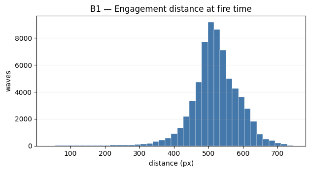

### B2 — Bullet power: ours (dejavu) vs theirs (incoming)

| Scope | Our mean | Our p50 | Their mean | Their p50 |
|---|---|---|---|---|
| overall | 0.31 | 0.15 | 0.40 | 0.15 |
| `aaa.r.ScalarR` | 0.25 | 0.15 | 0.70 | 0.15 |
| `cz.zamboch.Autopilot` | 1.64 | 1.95 | 1.23 | 1.00 |
| `jk.mega.DrussGT` | 0.36 | 0.15 | 0.30 | 0.15 |
| `kc.mega.BeepBoop` | 0.20 | 0.15 | 0.27 | 0.15 |
| `rsalesc.mega.Knight` | 0.27 | 0.15 | 0.27 | 0.15 |
| `voidious.Diamond` | 0.36 | 0.15 | 0.81 | 0.35 |

### B3 — Velocity at fire time (px/tick)

| Quantity | mean | std | p10 | p50 | p90 |
|---|---|---|---|---|---|
| lateral velocity | -0.06 | 5.85 | -7.9 | 0.0 | 7.9 |
| advancing velocity | 0.05 | 1.52 | -1.6 | 0.1 | 1.7 |

### B4 — Bullet flight time (ticks) = label latency

| mean | p10 | p50 | p90 | corr(flight, distance) | corr(flight, power) |
|---|---|---|---|---|---|
| 28.05 | 24.0 | 28.0 | 33.0 | 0.698 | 0.401 |
Latency scales with distance/power, so online evaluation must use each wave's own flight time, not a global constant.

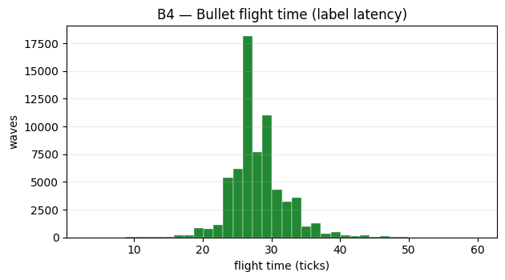

### B5 — Round length (ticks)

| N rounds | p10 | p50 | p90 | max |
|---|---|---|---|---|
| 360 | 406.7 | 2712.0 | 6562.1 | 7902 |

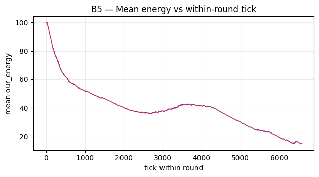

### B6 — Scan coverage (fresh-scan exposure)

| Opponent | Scan coverage | Median ticks-since-scan |
|---|---|---|
| `aaa.r.ScalarR` | 98.7% | 1.0 |
| `cz.zamboch.Autopilot` | 76.9% | 1.0 |
| `jk.mega.DrussGT` | 96.7% | 1.0 |
| `kc.mega.BeepBoop` | 99.4% | 1.0 |
| `rsalesc.mega.Knight` | 97.8% | 1.0 |
| `voidious.Diamond` | 96.4% | 1.0 |

### B7 — Wall proximity at fire time (edge-to-wall gap, px)

| N | p10 | p50 | p90 |
|---|---|---|---|
| 66,845 | 2.6 | 67.1 | 171.1 |
Battlefield 800×600 px, robot half-width 18 px.

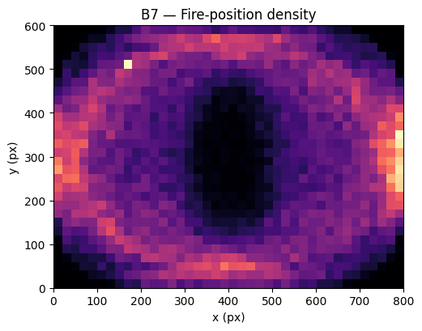

## Section C — Targeting (offensive gun): predicting GuessFactor

### C1 — GuessFactor distribution shape (dejavu real waves)

| Opponent | N | GF mean | GF std | Peak bin | Top-1 mass | Shape |
|---|---|---|---|---|---|---|
| `aaa.r.ScalarR` | 13,787 | -0.009 | 0.522 | -0.085 | 3.1% | flat |
| `cz.zamboch.Autopilot` | 1,619 | -0.016 | 0.616 | -0.000 | 13.7% | peaked |
| `jk.mega.DrussGT` | 11,107 | -0.006 | 0.505 | -0.000 | 5.2% | flat |
| `kc.mega.BeepBoop` | 17,254 | -0.005 | 0.502 | -0.128 | 3.1% | flat |
| `rsalesc.mega.Knight` | 13,624 | -0.008 | 0.505 | -0.000 | 3.5% | flat |
| `voidious.Diamond` | 9,454 | 0.001 | 0.495 | -0.000 | 3.5% | flat |

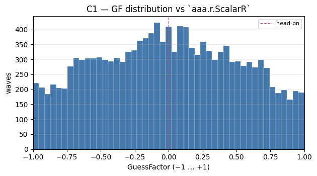
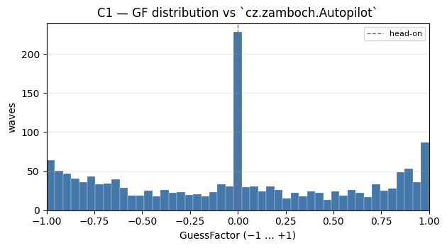
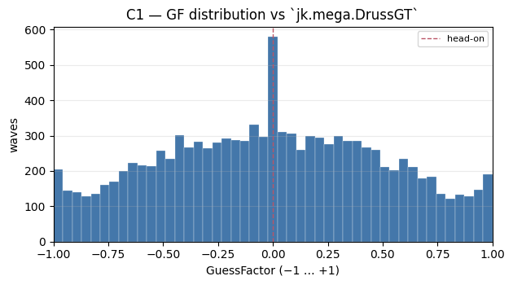
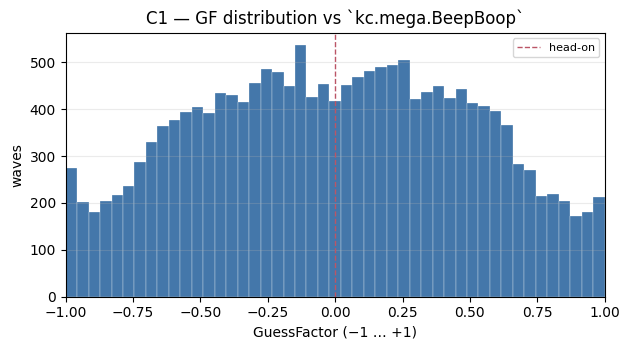
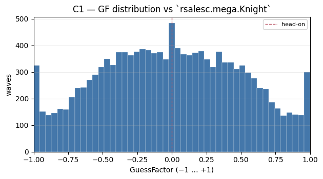
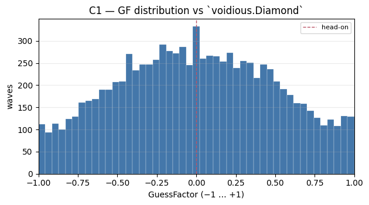

### C2 — GF entropy (bits) + head-on hit baseline (canonical, aim=0)

| Opponent | N | GF entropy | Head-on hit | 95% CI |
|---|---|---|---|---|
| `aaa.r.ScalarR` | 13,787 | 5.52 | 11.08% | [10.6, 11.6] |
| `cz.zamboch.Autopilot` | 1,619 | 5.24 | 18.78% | [16.9, 20.8] |
| `jk.mega.DrussGT` | 11,107 | 5.48 | 12.73% | [12.1, 13.4] |
| `kc.mega.BeepBoop` | 17,254 | 5.49 | 9.55% | [9.1, 10.0] |
| `rsalesc.mega.Knight` | 13,624 | 5.48 | 11.11% | [10.6, 11.7] |
| `voidious.Diamond` | 9,454 | 5.48 | 10.73% | [10.1, 11.4] |
Entropy is intrinsic targeting difficulty; head-on is the zero-learning baseline to beat.

### C3 — GF mass concentration

| Opponent | N | Top-1 bin mass | Effective bins (perplexity) |
|---|---|---|---|
| `aaa.r.ScalarR` | 13,787 | 3.1% | 45.8 |
| `cz.zamboch.Autopilot` | 1,619 | 13.7% | 37.7 |
| `jk.mega.DrussGT` | 11,107 | 5.2% | 44.6 |
| `kc.mega.BeepBoop` | 17,254 | 3.1% | 44.9 |
| `rsalesc.mega.Knight` | 13,624 | 3.5% | 44.6 |
| `voidious.Diamond` | 9,454 | 3.5% | 44.7 |
Out of 47 canonical bins; low effective-bins ⇒ peaked/learnable.

### C4 — Current-autopilot floor vs in-game hero (unpaired) + selection bias

| Opponent | Floor hit | Hero hit | Floor |GF err| | Hero |GF err| | Δdist (floor−hero) | Δ|latV| |
|---|---|---|---|---|---|---|
| `aaa.r.ScalarR` | 9.92% (N=3114) | 7.59% (N=13787) | 0.476 | 0.631 | -2.1 | 0.28 |
| `cz.zamboch.Autopilot` | 36.60% (N=418) | 14.14% (N=1619) | 0.336 | 0.725 | 6.6 | 0.32 |
| `jk.mega.DrussGT` | 12.62% (N=2432) | 8.59% (N=11107) | 0.447 | 0.601 | -14.3 | -0.39 |
| `kc.mega.BeepBoop` | 7.96% (N=1973) | 7.25% (N=17254) | 0.466 | 0.576 | -7.4 | 2.09 |
| `rsalesc.mega.Knight` | 9.06% (N=2153) | 8.05% (N=13624) | 0.472 | 0.595 | -4.5 | -0.74 |
| `voidious.Diamond` | 8.29% (N=2281) | 7.69% (N=9454) | 0.449 | 0.584 | -3.7 | 0.14 |
The floor fires at its own self-selected ticks/states, so the floor↔hero gap is **not** pure aim quality (trap #8): Δdist / Δ|latV| show how far apart the two fire-time samples are.

### C5 — Achievable ceiling

| Opponent | N | Quantization bound | Best-static | CV-model | Current (hero) |
|---|---|---|---|---|---|
| `aaa.r.ScalarR` | 13,787 | 100.0% | 11.38% @ GF=-0.04 | 12.85% | 7.59% |
| `cz.zamboch.Autopilot` | 1,619 | 100.0% | 19.21% @ GF=-0.04 | 12.60% | 14.14% |
| `jk.mega.DrussGT` | 11,107 | 100.0% | 12.73% @ GF=-0.00 | 12.83% | 8.59% |
| `kc.mega.BeepBoop` | 17,254 | 100.0% | 10.77% @ GF=0.17 | 10.99% | 7.25% |
| `rsalesc.mega.Knight` | 13,624 | 100.0% | 11.19% @ GF=-0.04 | 11.69% | 8.05% |
| `voidious.Diamond` | 9,454 | 100.0% | 10.84% @ GF=0.04 | 11.20% | 7.69% |
_Quantization bound = aim the realized bin every time (sanity bound, **not** learnable — aim = label). The learnable ceiling is best-static / CV-model._

### C6 — Fire-time feature relation to `our_break_gf` (pooled dejavu)

| Feature | Pearson r | Mutual info (nats) |
|---|---|---|
| `our_fire_lateral_velocity` | 0.358 | 0.1413 |
| `our_fire_direction` | 0.328 | 0.0809 |
| `our_fire_advancing_velocity` | -0.001 | 0.0202 |
| `our_fire_power` | 0.003 | 0.0131 |
| `our_fire_distance` | -0.014 | 0.0126 |
| `our_fire_bullet_speed` | -0.003 | 0.0121 |
| `our_fire_mea` | 0.004 | 0.0110 |
Computed on a seeded subsample of 30,000 dejavu real waves (capped at --max-model-rows=30,000; **not** full-data correlation).

### C7 — GF variance explained by segmentation axes (η²)

| Segmentation axis | η² (variance explained) |
|---|---|
| lateral velocity (5 bins) | 0.1303 |
| distance (5 bins) | 0.0001 |
| advancing velocity (5 bins) | 0.0001 |
| wall gap (3 bins) | 0.0001 |
Higher η² ⇒ the axis separates GF and is worth its data cost.

### C8 — Temporal autocorrelation of `our_break_gf` (within round)

| Lag | Mean autocorrelation | Rounds |
|---|---|---|
| lag 1 | 0.643 | 299 rounds |
| lag 2 | 0.120 | 299 rounds |
| lag 3 | -0.158 | 299 rounds |
Non-zero autocorrelation ⇒ sequence/pattern models can beat memoryless VCS.

### C9 — Hit rate vs engagement distance (canonical, hero aim)

| Distance (px) | N | Hero hit | 95% CI |
|---|---|---|---|
| 0–150 | 97 † | 28.87% | [20.8, 38.6] |
| 150–300 | 442 | 15.84% | [12.7, 19.5] |
| 300–450 | 6,907 | 10.47% | [9.8, 11.2] |
| 450–600 | 51,805 | 7.64% | [7.4, 7.9] |
| 600+ | 7,594 | 6.90% | [6.4, 7.5] |

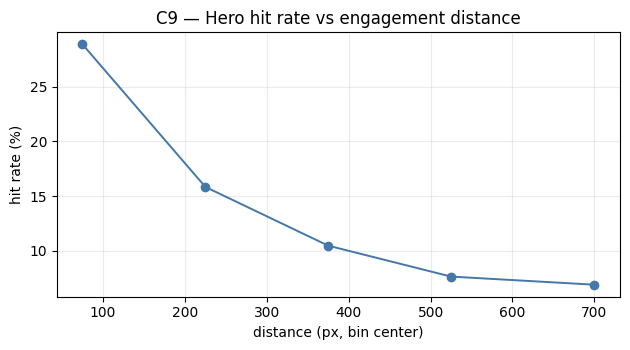

## Section D — Movement (defensive surfing): avoiding being hit

### D1 — Our dodge profile (`their_break_gf` — where we end up on their waves)

| Opponent | N | GF mean | GF entropy | Peak bin | Top-1 mass |
|---|---|---|---|---|---|
| `aaa.r.ScalarR` | 3,976 | -0.019 | 5.51 | -0.255 | 2.9% |
| `cz.zamboch.Autopilot` | 1,342 | -0.048 | 5.36 | -0.000 | 10.1% |
| `jk.mega.DrussGT` | 10,713 | -0.002 | 5.50 | -0.213 | 3.2% |
| `kc.mega.BeepBoop` | 11,925 | -0.002 | 5.48 | -0.000 | 3.4% |
| `rsalesc.mega.Knight` | 12,880 | -0.003 | 5.51 | 0.085 | 3.0% |
| `voidious.Diamond` | 4,140 | -0.006 | 5.50 | -0.000 | 3.3% |
A flat profile (high entropy) = hard to hit; a peak reveals an exploitable movement bias.

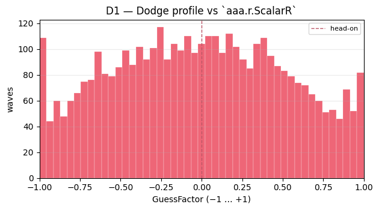
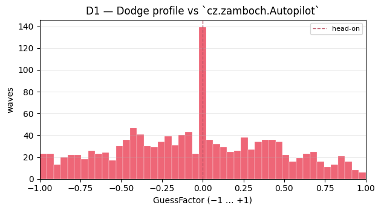
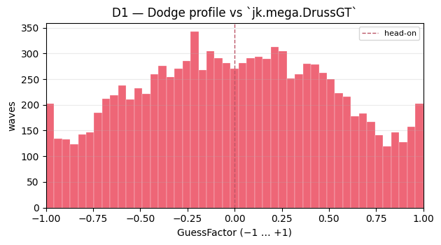
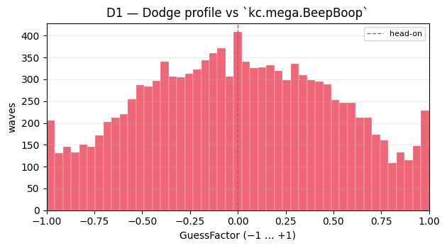
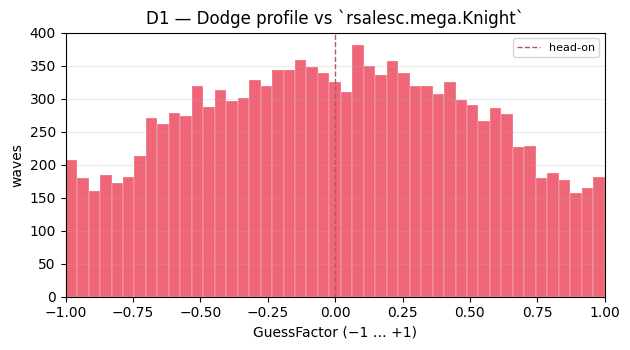
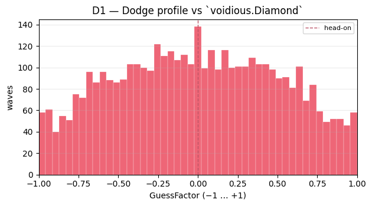

### D2 — Hit-us rate by opponent and bullet-power band

| Opponent | N | Hit-us | Power<1.5 | Power≥1.5 | Most-dangerous GF bin |
|---|---|---|---|---|---|
| `aaa.r.ScalarR` | 3,995 | 11.59% | 10.91% | 13.92% | (0.872, 0.915] |
| `cz.zamboch.Autopilot` | 1,342 | 6.04% | 5.16% | 11.06% | (0.915, 0.957] |
| `jk.mega.DrussGT` | 10,722 | 8.35% | 8.13% | 12.55% | (0.957, 1.0] |
| `kc.mega.BeepBoop` | 11,938 | 10.01% | 9.67% | 22.95% | (-0.957, -0.915] |
| `rsalesc.mega.Knight` | 12,894 | 8.20% | 7.79% | 17.65% | (-0.0213, 0.0213] |
| `voidious.Diamond` | 4,145 | 9.79% | 9.20% | 11.21% | (0.957, 1.0] |

### D3 — Where opponents aim relative to head-on (`their_break_gf` bias)

| Opponent | N | Mean aim GF | 95% CI | Peak bin |
|---|---|---|---|---|
| `aaa.r.ScalarR` | 3,976 | -0.019 | [-0.035, -0.004] | -0.255 |
| `cz.zamboch.Autopilot` | 1,342 | -0.048 | [-0.074, -0.023] | -0.000 |
| `jk.mega.DrussGT` | 10,713 | -0.002 | [-0.012, 0.009] | -0.213 |
| `kc.mega.BeepBoop` | 11,925 | -0.002 | [-0.011, 0.007] | -0.000 |
| `rsalesc.mega.Knight` | 12,880 | -0.003 | [-0.012, 0.006] | 0.085 |
| `voidious.Diamond` | 4,140 | -0.006 | [-0.022, 0.010] | -0.000 |
A bias away from 0 = a predictable gun that movement can deterministically dodge.

### D4 — Incoming bullet power × distance + zap overlap

| Opponent | N | Mean power | Mean distance | Fires on zap tick |
|---|---|---|---|---|
| `aaa.r.ScalarR` | 3,995 | 0.70 | 487 | 1.38% |
| `cz.zamboch.Autopilot` | 1,342 | 1.23 | 436 | 0.00% |
| `jk.mega.DrussGT` | 10,722 | 0.30 | 532 | 0.00% |
| `kc.mega.BeepBoop` | 11,938 | 0.27 | 542 | 0.44% |
| `rsalesc.mega.Knight` | 12,894 | 0.27 | 519 | 0.00% |
| `voidious.Diamond` | 4,145 | 0.81 | 534 | 0.34% |
Near-zero zap overlap confirms incoming bullets are real threats, not zap artifacts.

### D5 — Conditional hit-us by own state at incoming fire time

| Condition | N | Hit-us |
|---|---|---|
| close (<300 px) | 485 | 25.98% |
| far (≥300 px) | 44,551 | 8.91% |
| near wall (<50 px) | 16,864 | 8.19% |
| open field (≥50 px) | 28,172 | 9.64% |
Identifies dangerous states for movement constraints/penalties.

### D6 — Dodge time budget (incoming flight time, ticks)

| N | p10 | p50 | p90 |
|---|---|---|---|
| 44,976 | 24.0 | 28.0 | 34.0 |
Ticks the surfer has to react after detecting a wave.

## Section E — Feature analysis for ML

### E1 — Candidate feature inventory

| Feature | File | dtype | Range | %NaN | Units |
|---|---|---|---|---|---|
| `our_fire_distance` | `dejavu-waves.csv` | float64 | [37.6, 746.5] | 0.0% | px |
| `our_fire_lateral_velocity` | `dejavu-waves.csv` | float64 | [-8.0, 8.0] | 0.0% | px/tick |
| `our_fire_advancing_velocity` | `dejavu-waves.csv` | float64 | [-8.0, 8.0] | 0.0% | px/tick |
| `our_fire_bullet_speed` | `dejavu-waves.csv` | float64 | [11.0, 19.7] | 0.0% | px/tick |
| `our_fire_mea` | `dejavu-waves.csv` | float64 | [0.4, 0.8] | 0.0% | rad |
| `our_fire_direction` | `dejavu-waves.csv` | float64 | [-1.0, 1.0] | 0.0% | sign(±1) |
| `our_fire_bearing_absolute` | `dejavu-waves.csv` | float64 | [-3.1, 3.1] | 0.0% | rad |
| `our_fire_x` | `dejavu-waves.csv` | float64 | [18.0, 782.0] | 0.0% | px |
| `our_fire_y` | `dejavu-waves.csv` | float64 | [18.0, 582.0] | 0.0% | px |
| `our_fire_opponent_x` | `dejavu-waves.csv` | float64 | [18.0, 782.0] | 0.0% | px |
| `our_fire_opponent_y` | `dejavu-waves.csv` | float64 | [18.0, 582.0] | 0.0% | px |
| `our_fire_power` | `dejavu-waves.csv` | float64 | [0.1, 3.0] | 0.0% | energy |
| `our_fire_tick` | `dejavu-waves.csv` | float64 | [30.0, 7752.0] | 0.0% | tick |
| `our_fire_bullet_id` | `dejavu-waves.csv` | float64 | [0.0, 4010680.0] | 0.0% | id |
| `our_fire_aim_gf` | `dejavu-waves.csv` | float64 | [-1.0, 1.0] | 0.0% | GF[-1,1] |
| `our_fire_is_real` | `dejavu-waves.csv` | float64 | [1.0, 1.0] | 0.0% | bool |
| `our_aim_x` | `dejavu-waves.csv` | float64 | [18.0, 782.0] | 0.0% | — |
| `our_aim_y` | `dejavu-waves.csv` | float64 | [18.0, 582.0] | 0.0% | — |
| `our_aim_opponent_x` | `dejavu-waves.csv` | float64 | [18.0, 782.0] | 0.0% | — |
| `our_aim_opponent_y` | `dejavu-waves.csv` | float64 | [18.0, 582.0] | 0.0% | — |
| `our_aim_distance` | `dejavu-waves.csv` | float64 | [38.1, 746.5] | 0.0% | px |
| `our_aim_bearing_absolute` | `dejavu-waves.csv` | float64 | [-3.1, 3.1] | 0.0% | rad |
| `our_break_tick` | `dejavu-waves.csv` | float64 | [37.0, 7757.0] | 0.0% | tick |
| `our_break_gf` | `dejavu-waves.csv` | float64 | [-1.0, 1.0] | 0.0% | GF[-1,1] |
| `our_break_bearing_offset` | `dejavu-waves.csv` | float64 | [-0.8, 0.8] | 0.0% | rad |
| `our_break_opponent_x` | `dejavu-waves.csv` | float64 | [18.1, 782.0] | 0.0% | — |
| `our_break_opponent_y` | `dejavu-waves.csv` | float64 | [18.0, 582.0] | 0.0% | — |
| `our_break_hit` | `dejavu-waves.csv` | float64 | [0.0, 1.0] | 0.0% | bool |
| `their_fire_power` | `their-waves.csv` | float64 | [0.1, 3.0] | 0.0% | energy |
| `their_fire_tick` | `their-waves.csv` | float64 | [30.0, 7741.0] | 0.0% | — |
| `their_fire_x` | `their-waves.csv` | float64 | [18.0, 782.0] | 0.0% | — |
| `their_fire_y` | `their-waves.csv` | float64 | [18.0, 582.0] | 0.0% | — |
| `their_bullet_speed` | `their-waves.csv` | float64 | [11.0, 19.7] | 0.0% | px/tick |
| `their_fire_bearing` | `their-waves.csv` | float64 | [-3.1, 3.1] | 0.0% | — |
| `their_fire_distance` | `their-waves.csv` | float64 | [37.6, 746.5] | 0.0% | px |
| `their_fire_our_x` | `their-waves.csv` | float64 | [18.0, 782.0] | 0.0% | — |
| `their_fire_our_y` | `their-waves.csv` | float64 | [18.0, 582.0] | 0.0% | — |
| `their_aim_x` | `their-waves.csv` | float64 | [18.0, 782.0] | 0.0% | — |
| `their_aim_y` | `their-waves.csv` | float64 | [18.0, 582.0] | 0.0% | — |
| `their_aim_our_x` | `their-waves.csv` | float64 | [18.0, 782.0] | 0.0% | — |
| `their_aim_our_y` | `their-waves.csv` | float64 | [18.0, 582.0] | 0.0% | — |
| `their_aim_distance` | `their-waves.csv` | float64 | [38.1, 746.5] | 0.0% | — |
| `their_aim_bearing` | `their-waves.csv` | float64 | [-3.1, 3.1] | 0.0% | — |
| `their_break_tick` | `their-waves.csv` | float64 | [37.0, 7675.0] | 0.1% | — |
| `their_break_our_x` | `their-waves.csv` | float64 | [18.1, 782.0] | 0.1% | — |
| `their_break_our_y` | `their-waves.csv` | float64 | [18.0, 582.0] | 0.1% | — |
| `their_break_gf` | `their-waves.csv` | float64 | [-1.0, 1.0] | 0.1% | GF[-1,1] |
| `their_break_bearing_offset` | `their-waves.csv` | float64 | [-0.8, 0.8] | 0.1% | — |
| `their_hit_us` | `their-waves.csv` | float64 | [0.0, 1.0] | 0.0% | bool |
| `scan_tick` | `scan.csv` | float32 | [1.0, 7752.0] | 0.0% | — |
| `scan_distance` | `scan.csv` | float32 | [37.4, 754.4] | 0.0% | px |
| `scan_opponent_id_hash` | `scan.csv` | float32 | [-887270144.0, 1865178880.0] | 0.0% | hash |
| `scan_opponent_lateral_velocity` | `scan.csv` | float32 | [-8.0, 8.0] | 0.0% | px/tick |
| `scan_opponent_advancing_velocity` | `scan.csv` | float32 | [-8.0, 8.0] | 0.0% | px/tick |
| `scan_ticks_since_scan` | `scan.csv` | float32 | [1.0, 11.0] | 0.0% | tick |
| `scan_their_inactivity_zap_active` | `scan.csv` | float32 | [0.0, 1.0] | 0.0% | bool |

### E2 — Redundant feature pairs (|Pearson r| > 0.8)

| Feature pair | r |
|---|---|
| `our_fire_lateral_velocity` ↔ `our_fire_direction` | 0.882 |
| `our_fire_bullet_speed` ↔ `our_fire_mea` | -0.987 |
| `our_fire_bullet_speed` ↔ `our_fire_power` | -1.000 |
| `our_fire_mea` ↔ `our_fire_power` | 0.987 |

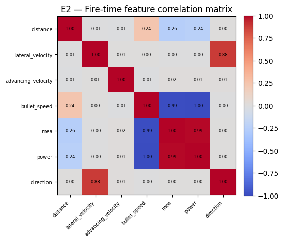

### E3 — Feature importance for GF prediction (RandomForest)

| Feature | Impurity importance | Permutation importance |
|---|---|---|
| `our_fire_lateral_velocity` | 0.6025 | 0.4570 |
| `our_fire_advancing_velocity` | 0.1824 | 0.1525 |
| `our_fire_distance` | 0.1621 | 0.1093 |
| `our_fire_bullet_speed` | 0.0207 | 0.0116 |
| `our_fire_mea` | 0.0140 | 0.0083 |
| `our_fire_power` | 0.0137 | 0.0078 |
| `our_fire_direction` | 0.0046 | 0.0008 |
Fit on 30,000 dejavu real waves (capped at --max-model-rows=30,000).

### E4 — Feature importance for hit / no-hit (PR-AUC-scored)

| Feature | Permutation importance (PR-AUC) |
|---|---|
| `our_fire_distance` | 0.2290 |
| `our_fire_advancing_velocity` | 0.2107 |
| `our_fire_lateral_velocity` | 0.2058 |
| `our_fire_bullet_speed` | 0.1070 |
| `our_fire_power` | 0.1046 |
| `our_fire_mea` | 0.0911 |
| `our_fire_direction` | 0.0889 |
Positive base rate 7.99% (2,396/30,000); in-sample PR-AUC 0.376. At ~12:1 imbalance, accuracy and impurity importance mislead, so PR-AUC is the fixed metric.

### E5 — Recommended v1 feature set

Top permutation-ranked GF features with one of each redundant pair dropped:

`our_fire_lateral_velocity`, `our_fire_advancing_velocity`, `our_fire_distance`, `our_fire_bullet_speed`

Dropped as redundant: `our_fire_direction`, `our_fire_mea`, `our_fire_power`.

## Section F — Learning dynamics

### F1 — Real-wave accumulation by round (per-matchup cold-start budget)

| Round | Waves/round (mean) | Waves/round (median) | Cumulative (mean) | Cumulative (median) |
|---|---|---|---|---|
| 0 | 253 | 142 | 253 | 142 |
| 1 | 424 | 394 | 677 | 590 |
| 2 | 501 | 490 | 1177 | 1110 |
| 3 | 526 | 526 | 1703 | 1622 |
| 4 | 525 | 489 | 2228 | 2155 |
Per-matchup statistics across 30 matchups (**not** the pooled 36-perspective sum); the cold-start budget is what a single battle accumulates.

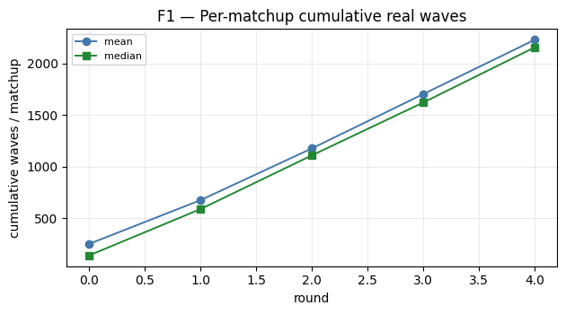

### F2 — Non-stationarity: KL(round 0 ‖ round 4) per opponent (bits)

| Opponent | N(r0/last) | KL (bits) | 95% CI |
|---|---|---|---|
| `aaa.r.ScalarR` | 1520/3381 | 0.038 | [0.046, 0.098] |
| `cz.zamboch.Autopilot` | 405/325 | 0.277 | [0.282, 0.599] |
| `jk.mega.DrussGT` | 735/2778 | 0.550 | [0.497, 0.725] |
| `kc.mega.BeepBoop` | 2071/3969 | 0.019 | [0.028, 0.059] |
| `rsalesc.mega.Knight` | 1522/3317 | 0.037 | [0.045, 0.091] |
| `voidious.Diamond` | 1336/1975 | 0.035 | [0.053, 0.104] |
High KL ⇒ the opponent adapts across rounds; recency-weighting matters.

### F3 — Segmented VCS grid occupancy (distance 5 × lateralV 5 × advancingV 3 = 75 cells)

| Opponent | N | Occupied cells | Mean rows/cell |
|---|---|---|---|
| `aaa.r.ScalarR` | 13,787 | 71/75 | 183.8 |
| `cz.zamboch.Autopilot` | 1,619 | 56/75 | 21.6 |
| `jk.mega.DrussGT` | 11,107 | 75/75 | 148.1 |
| `kc.mega.BeepBoop` | 17,254 | 73/75 | 230.1 |
| `rsalesc.mega.Knight` | 13,624 | 75/75 | 181.7 |
| `voidious.Diamond` | 9,454 | 75/75 | 126.1 |
Sparse grids (few rows/cell) argue for KNN over a fixed grid.

### F4 — GF stability vs sample size (bootstrap std of peak-bin GF)

| Sample size N | Std of peak-bin GF |
|---|---|
| 50 | 0.409 |
| 100 | 0.366 |
| 200 | 0.276 |
| 500 | 0.221 |
| 1000 | 0.176 |
Smaller std ⇒ fewer samples needed for a trustworthy per-segment aim.

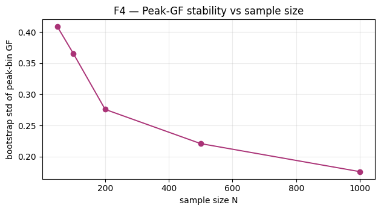

## Section G — Baselines & benchmarks

### G1 — Hit-rate scoreboard (canonical analytic; engine hit shown separately)

| Opponent | N | Floor (autopilot) | Hero (in-game) | Head-on | Best-static | Quant. bound | Hero 95% CI |
|---|---|---|---|---|---|---|---|
| `aaa.r.ScalarR` | 13,787 | 9.92% (eng 0.54%; N=3114) | 7.59% (eng 7.91%) | 11.08% | 11.38% | 100.0% | [7.2, 8.0] |
| `cz.zamboch.Autopilot` | 1,619 | 36.60% (eng 4.74%; N=418) | 14.14% (eng 24.21%) | 18.78% | 19.21% | 100.0% | [12.5, 15.9] |
| `jk.mega.DrussGT` | 11,107 | 12.62% (eng 1.31%; N=2432) | 8.59% (eng 9.11%) | 12.73% | 12.73% | 100.0% | [8.1, 9.1] |
| `kc.mega.BeepBoop` | 17,254 | 7.96% (eng 0.51%; N=1973) | 7.25% (eng 6.50%) | 9.55% | 10.77% | 100.0% | [6.9, 7.6] |
| `rsalesc.mega.Knight` | 13,624 | 9.06% (eng 0.69%; N=2153) | 8.05% (eng 10.49%) | 11.11% | 11.19% | 100.0% | [7.6, 8.5] |
| `voidious.Diamond` | 9,454 | 8.29% (eng 0.74%; N=2281) | 7.69% (eng 8.51%) | 10.73% | 10.84% | 100.0% | [7.2, 8.2] |
Floor is what ML must beat; head-on/best-static are dejavu-derived; the quantization bound is a sanity bound, not learnable. _Caveat: the floor's analytic hit recomputes from the shadow gun's `aim_gf`, but its engine-hit column reflects the **real** bullet (a different gun) — the two floor columns are not the same gun._

### G2 — Battle outcomes (robots facing this opponent)

| Opponent | Faced-robot wins | Losses | Ties | Mean round_hit_rate |
|---|---|---|---|---|
| `aaa.r.ScalarR` | 2 | 8 | 0 | 1.00% |
| `cz.zamboch.Autopilot` | 10 | 0 | 0 | 5.88% |
| `jk.mega.DrussGT` | 6 | 4 | 0 | 1.86% |
| `kc.mega.BeepBoop` | 0 | 10 | 0 | 0.48% |
| `rsalesc.mega.Knight` | 5 | 5 | 0 | 2.43% |
| `voidious.Diamond` | 7 | 3 | 0 | 1.40% |
Win = the robot facing this opponent beat it; many losses ⇒ a strong opponent.

### G3 — Virtual-gun hit-rate curves (fixed-aim sweep)

Sweeping a single fixed aim-GF through the canonical hit rule: the peak marks the best-static gun (GF=-0.043, 11.22%). The autopilot-fan overlay is the same sweep over the shadow gun's real rows (a different gun, shown for cross-check only).

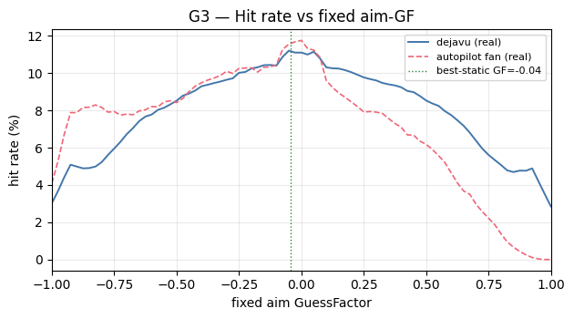

## Section H — Per-opponent profiles

### H1 — Per-opponent fingerprint

| Opponent | N | Mean dist | GF peak | GF entropy | Our hit | Hit-us | KL(adapt) | Typ. power |
|---|---|---|---|---|---|---|---|---|
| `aaa.r.ScalarR` | 13,787 | 494 | -0.085 | 5.52 | 7.59% | 11.59% | 0.038 | 0.25 |
| `cz.zamboch.Autopilot` | 1,619 | 431 | -0.000 | 5.24 | 14.14% | 6.04% | 0.277 | 1.64 |
| `jk.mega.DrussGT` | 11,107 | 533 | -0.000 | 5.48 | 8.59% | 8.35% | 0.550 | 0.36 |
| `kc.mega.BeepBoop` | 17,254 | 533 | -0.128 | 5.49 | 7.25% | 10.01% | 0.019 | 0.20 |
| `rsalesc.mega.Knight` | 13,624 | 519 | -0.000 | 5.48 | 8.05% | 8.20% | 0.037 | 0.27 |
| `voidious.Diamond` | 9,454 | 542 | -0.000 | 5.48 | 7.69% | 9.79% | 0.035 | 0.36 |

### H2 — Opponent similarity (Jensen-Shannon distance of GF distributions)

| Opponent | `ScalarR` | `Autopilot` | `DrussGT` | `BeepBoop` | `Knight` | `Diamond` | Cluster |
|---|---|---|---|---|---|---|---|
| `aaa.r.ScalarR` | 0.000 | 0.082 | 0.005 | 0.004 | 0.006 | 0.004 | 0 |
| `cz.zamboch.Autopilot` | 0.082 | 0.000 | 0.072 | 0.103 | 0.088 | 0.094 | 1 |
| `jk.mega.DrussGT` | 0.005 | 0.072 | 0.000 | 0.006 | 0.003 | 0.003 | 2 |
| `kc.mega.BeepBoop` | 0.004 | 0.103 | 0.006 | 0.000 | 0.004 | 0.003 | 0 |
| `rsalesc.mega.Knight` | 0.006 | 0.088 | 0.003 | 0.004 | 0.000 | 0.004 | 2 |
| `voidious.Diamond` | 0.004 | 0.094 | 0.003 | 0.003 | 0.004 | 0.000 | 0 |
Opponents in one cluster may share a model / warm-start prior.

## Section I — ML readiness & recommendations

### I1 — Per-task readiness summary

| Task | Label | Label budget | Noise / base rate | Per-wave latency | Stationarity |
|---|---|---|---|---|---|
| GF regression (targeting) | `our_break_gf` (dejavu real) | 87,768 waves | continuous, low NaN | variable 28 ticks mean | moderate (see F2 KL) |
| Hit / no-hit (fire policy) | canonical analytic hit | 87,768 waves | ~8–9% positive (imbalanced) | same as targeting | moderate |
| Movement (surf) | `their_break_gf` / `their_hit_us` | 55,597 waves | ~30% hit-us base | incoming flight time (D6) | per-opponent gun-dependent |

### I2 — Recommended target formulation

Per C1–C5: GF distributions are peaked enough to be learnable for several opponents but best-static ≈ CV-model for most, so **segmentation (VCS-style) is the primary lever**. Recommend **GF regression** (or fine-bin classification) over raw hit/no-hit, with a separate hit/no-hit head only for fire-power/selection policy.

### I3 — Leakage-safe train/test split

- Use **dejavu real waves** as labels (never the autopilot virtual fan).
- If autopilot virtual rows are ever used, **group by** `(matchup, round, our_fire_tick)`.
- Split by **battle/round**, not by row, so a round's waves never straddle the split.
- Isolate **self-play** matchups (excluded here from all aggregates).

### I4 — Ranked risks / traps

1. **Autopilot is a counterfactual**, not the game — use dejavu for characterization.
2. **Virtual-wave leakage** (autopilot only) — group by parent fire.
3. **Variable per-wave label latency** (mean ≈28 ticks; scales with distance/power — B4).
4. **Self-play double-counting** — excluded from aggregates.
5. **Per-round adaptation** — several opponents shift GF across rounds (F2).
6. **Round-end censoring** — unresolved waves (A4) are not missing at random.
7. **Floor selection bias** — the floor↔hero gap is unpaired (C4).
8. **Missing scans** — stale features when coverage drops (B6).

