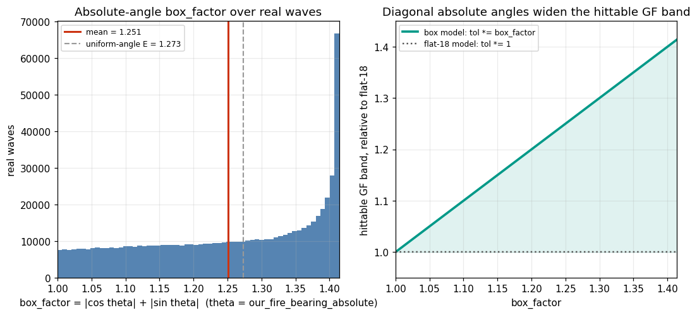

# Absolute bullet angle and GuessFactor hit geometry

_Generated 2026-06-07 13:25 UTC from `pipeline/build/battle-csv-producer/1780834355900-1780834355900`._

## Verdict: CONFIRMED (engine mechanism)

The hypothesis is correct **by construction**, not by chance. Robocode resolves a hit with `robot.getBoundingBox().intersectsLine(bulletLine)` and that box is an **axis-aligned 36x36 square that does not rotate with heading** (`wiki/physics.md`, `BulletPeer.java`). A bullet at absolute angle `theta` therefore sees a target of half-width `18 * (|cos theta| + |sin theta|)` px - 18 px at the cardinals, `18*sqrt(2) ~= 25.46` px at the diagonals (a 41% wider target). The hittable GuessFactor half-band is `box_factor * 18 / (distance * MEA)`, so **the hittable GF range is `box_factor`x wider, up to sqrt(2)x at 45-degree absolute angles.**

## How much it matters across real battles

Measured over **679,080** resolved real hero waves (`dejavu-waves.csv`, self-play and the non-competitive `cz.zamboch.Autopilot` excluded). The absolute bullet angle is the recorded `our_fire_bearing_absolute` column; `box_factor = |cos theta| + |sin theta|`:

| quantity | value |
|---|---|
| mean box_factor (mean GF-band widening) | 1.251x |
| median box_factor | 1.269x |
| p90 box_factor | 1.407x |
| max box_factor | 1.414x |
| waves with box_factor >= 1.10 | 82.9% |
| waves with box_factor >= 1.20 | 64.1% |
| waves with box_factor >= 1.30 | 43.3% |
| mean hit-band the flat-18 model misses | 20.1% |
| worst-case (diagonal) under-count | 29.3% |

Per box_factor bin (median hittable GF half-band, flat-18 vs box model):

| box_factor bin | center | waves | share | median dist | flat GF tol | box GF tol |
|---|---|---|---|---|---|---|
| [1.000, 1.052] | 1.026 | 58,517 | 8.6% | 529 | 0.0802 | 0.0823 |
| [1.052, 1.104] | 1.078 | 61,835 | 9.1% | 529 | 0.0804 | 0.0866 |
| [1.104, 1.155] | 1.129 | 65,433 | 9.6% | 527 | 0.0807 | 0.0911 |
| [1.155, 1.207] | 1.181 | 67,487 | 9.9% | 524 | 0.0811 | 0.0957 |
| [1.207, 1.259] | 1.233 | 71,157 | 10.5% | 521 | 0.0815 | 0.1005 |
| [1.259, 1.311] | 1.285 | 76,731 | 11.3% | 517 | 0.0822 | 0.1056 |
| [1.311, 1.362] | 1.337 | 89,118 | 13.1% | 513 | 0.0829 | 0.1109 |
| [1.362, 1.414] | 1.388 | 188,802 | 27.8% | 507 | 0.0839 | 0.1171 |

**Actionable:** the analytic hit rule `canonical_hit` in `scripts/intuition.py` (and `gf_tol ~= (18/fire_distance)/mea` in `wiki/intuition-design.md`) uses a **flat 18 px** half-width. It therefore under-counts the true hittable GF band by ~20% on average and up to 29% at diagonal absolute angles. Replacing 18 with `18 * (|cos theta| + |sin theta|)` (theta = `our_fire_bearing_absolute`) makes the analytic hit baseline match the engine.

## Figures

_Assets under `wiki/abs-angle-gf/`._

