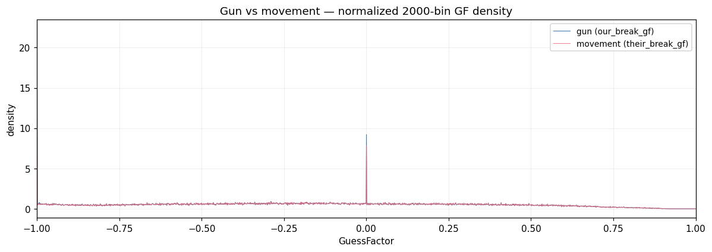
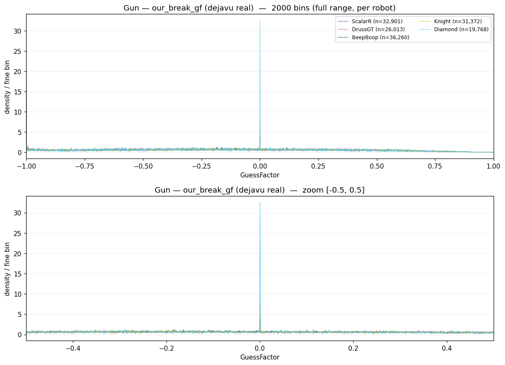
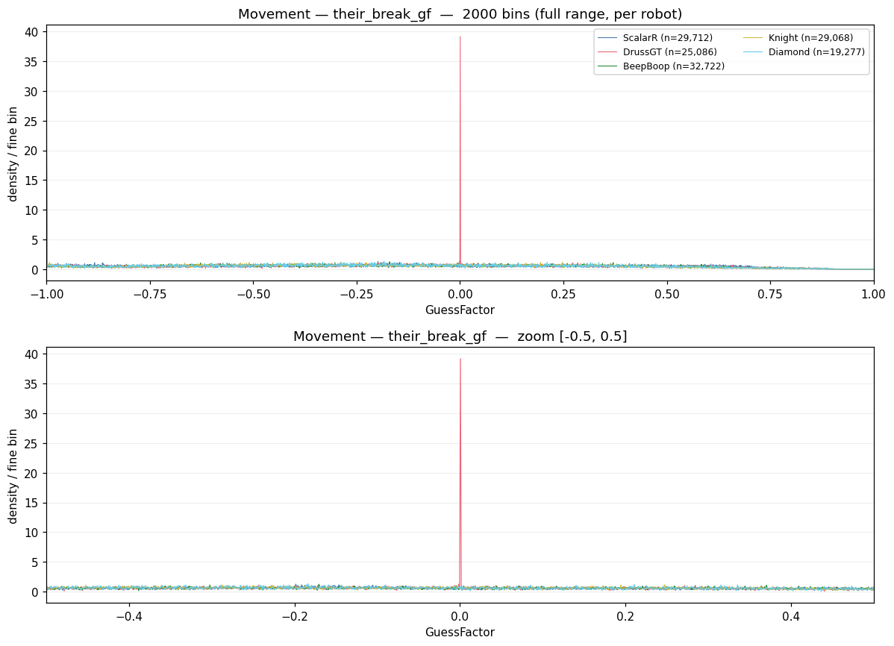

# Detailed GuessFactor Histogram — discreteness-artifact analysis

- **Generated (UTC):** 2026-06-22 13:30:24Z
- **Run directory:** `pipeline/build/intuition-run/1782133800396-1782133800396`
- **Fine binning:** 2000 bins over [-1, 1] (reference grid: 47 bins)
- **Self-play matchups excluded** from the pooled distributions.
- **Per robot:** BeepBoop, Diamond, DrussGT, Knight, ScalarR (one line per robot; excluded as too naive: Autopilot).

## Hypothesis

> A very granular GF histogram should expose *comb artifacts* — narrow, repeating spikes — produced by the engine's discrete state (integer velocities/accelerations -8..8, discrete bullet speeds `20 - 3*power` driving a quantized MEA). Because `GF = bearing_offset / MEA` is assembled from these discrete ingredients over an integer number of flight ticks, realized GF values should pile up at repeating rational positions instead of forming a smooth curve. Tested separately for the **gun** (`our_break_gf`, dejavu real waves) and **movement** (`their_break_gf`, their-waves).

## Verdict

- **Gun (`our_break_gf`):** FIXED-POINT only (GF=0 / +-1)
- **Movement (`their_break_gf`):** FIXED-POINT only (GF=0 / +-1)

**Verdict: PARTIALLY SUPPORTED — discreteness is real, but it is not an intermediate comb.** The only artifacts are sharp spikes at the *fixed points* GF=0 (head-on: zero net lateral offset) and GF=+-1 (MEA saturation / max escape angle). The interior of the distribution is smooth noise, **not** a repeating comb.

Mechanism: `GF = bearing_offset / MEA`. Even though `bearing_offset` is built from discrete integer velocities/accelerations, `MEA = asin(8 / bullet_speed)` varies continuously across waves (distance and chosen power differ shot to shot). Dividing a quasi-discrete numerator by a continuously-varying denominator *smears* any interior comb into a continuum. The two GF values that survive this smearing are exactly the ones independent of MEA: offset=0 -> GF=0, and saturation -> GF=+-1. So the engine's discreteness is visible, but only as these three fixed-point spikes, disproving the *comb* form of the hypothesis.

Decision rule: an *interior comb* requires >=10 spikes (excluding GF=0 and |GF|>=0.98) at >=5x their local smooth baseline, holding >=5% of all mass, with the tallest bin >=8x the median occupied bin. A *fixed-point* result is recorded when the GF=0 bin alone is >=8x the median occupied bin or the extremes hold >=1.5% of mass.

## Gun vs movement overlay

## Gun channel — `our_break_gf` (dejavu real waves)

Per-robot comb metrics (each robot's own gun):

| Robot | N | Spikiness | GF=0 spike | Interior comb spikes | Interior mass | Mass @\|GF\|>0.98 |
|---|---|---|---|---|---|---|
| ScalarR | 32,901 | 53.6x | 2.7x | 0 | 0.00% | 4.06% |
| DrussGT | 26,013 | 46.5x | 10.6x | 0 | 0.00% | 3.87% |
| BeepBoop | 36,260 | 40.2x | 12.5x | 0 | 0.00% | 3.12% |
| Knight | 31,372 | 35.4x | 17.2x | 0 | 0.00% | 2.87% |
| Diamond | 19,768 | 64.2x | 64.2x | 1 | 0.03% | 2.89% |

Pooled across all robots:

| Metric | Value |
|---|---|
| Resolved waves (N) | 146,314 |
| Fine bins | 2,000 (width 0.0010 GF) |
| Occupied bins | 1,915 / 2,000 (95.8%) |
| Tallest bin | 3,268 waves at GF=-0.9995 (2.23% of mass) |
| Spikiness (tallest / median occupied) | 41.4x |
| GF=0 spike height (/ median occupied) | 17.1x |
| Comb spikes (>=5x local baseline) | 2 |
| Mass inside comb spikes | 3.16% |
| Interior comb spikes (excl. GF=0, +-1) | 0 |
| Mass in interior comb spikes | 0.00% |
| Mass at GF=0 (+-1 bin) | 0.99% |
| Mass at extremes (|GF|>0.98) | 3.38% |

Top spike bins (engine-favored GF positions):

| Rank | GF center | Waves | % of mass |
|---|---|---|---|
| 1 | -0.9995 | 3,268 | 2.234% |
| 2 | +0.0005 | 1,349 | 0.922% |
| 3 | -0.2895 | 136 | 0.093% |
| 4 | -0.1095 | 124 | 0.085% |
| 5 | -0.1815 | 124 | 0.085% |
| 6 | -0.3385 | 122 | 0.083% |
| 7 | -0.3975 | 117 | 0.080% |
| 8 | -0.1285 | 116 | 0.079% |
| 9 | -0.1795 | 116 | 0.079% |
| 10 | +0.0575 | 116 | 0.079% |

## Movement channel — `their_break_gf` (their-waves)

Per-robot comb metrics (each robot's own movement):

| Robot | N | Spikiness | GF=0 spike | Interior comb spikes | Interior mass | Mass @\|GF\|>0.98 |
|---|---|---|---|---|---|---|
| ScalarR | 29,712 | 32.5x | 1.4x | 0 | 0.00% | 2.78% |
| DrussGT | 25,086 | 75.6x | 75.6x | 0 | 0.00% | 3.29% |
| BeepBoop | 32,722 | 28.9x | 1.2x | 0 | 0.00% | 2.55% |
| Knight | 29,068 | 56.1x | 1.3x | 0 | 0.00% | 4.37% |
| Diamond | 19,277 | 38.2x | 1.7x | 2 | 0.06% | 3.16% |

Pooled across all robots:

| Metric | Value |
|---|---|
| Resolved waves (N) | 135,865 |
| Fine bins | 2,000 (width 0.0010 GF) |
| Occupied bins | 1,915 / 2,000 (95.8%) |
| Tallest bin | 2,880 waves at GF=-0.9995 (2.12% of mass) |
| Spikiness (tallest / median occupied) | 38.9x |
| GF=0 spike height (/ median occupied) | 14.3x |
| Comb spikes (>=5x local baseline) | 2 |
| Mass inside comb spikes | 2.90% |
| Interior comb spikes (excl. GF=0, +-1) | 0 |
| Mass in interior comb spikes | 0.00% |
| Mass at GF=0 (+-1 bin) | 0.84% |
| Mass at extremes (|GF|>0.98) | 3.21% |

Top spike bins (engine-favored GF positions):

| Rank | GF center | Waves | % of mass |
|---|---|---|---|
| 1 | -0.9995 | 2,880 | 2.120% |
| 2 | +0.0005 | 1,059 | 0.779% |
| 3 | -0.2895 | 122 | 0.090% |
| 4 | -0.1815 | 113 | 0.083% |
| 5 | -0.1985 | 113 | 0.083% |
| 6 | -0.1845 | 111 | 0.082% |
| 7 | -0.1795 | 111 | 0.082% |
| 8 | -0.2945 | 110 | 0.081% |
| 9 | -0.1095 | 110 | 0.081% |
| 10 | -0.2255 | 110 | 0.081% |

## How to read this

- Each per-channel figure draws **one normalized-density line per robot** (Autopilot excluded). A genuine comb shows as repeating spikes at the *same* GF for every line; a per-robot quirk shows on a single line only.
- A spike exactly at `GF=0` is head-on accumulation (zero net lateral drift); spikes at `|GF|~=1` are max-escape-angle saturation. Intermediate repeating spikes come from integer lateral-velocity sequences over discrete flight ticks.
- `Spikiness` and `Comb spikes` quantify the effect; the smooth 47-bin view used elsewhere (e.g. `ML-intuition.md` C1) averages the comb away, which is why it looks continuous there.

