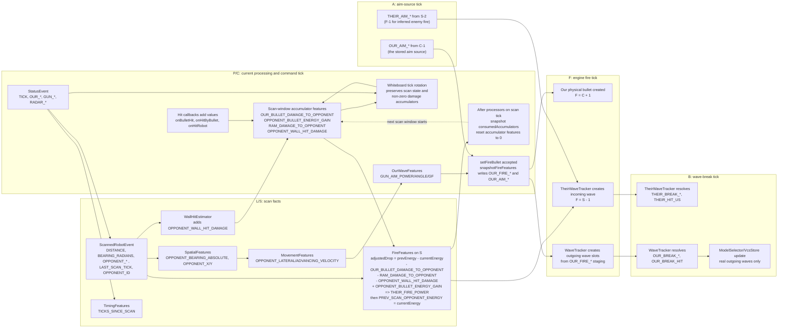

# Feature Flow

This document describes live-robot feature flow for `Autopilot` and `Whiteboard`.
The god-view pipeline has its own reconstruction path and can seed exact values,
but this document names feature lifetimes from the robot's in-game point of view.

## Robocode Turn Model

For each engine turn, Robocode loads the commands queued by the robot on the
previous callback, creates any queued bullets, moves existing bullets, moves and
collides robots, performs scans, handles deaths, publishes status, then wakes the
robot thread and dispatches callbacks. The live robot therefore sees a completed
engine turn in `onStatus` and other event callbacks, then queues commands for a
future engine turn in `doTurn()`.

Bullet creation is especially important: `setFireBullet()` returns a `Bullet`
handle immediately, but the engine creates the physical bullet when the next
execution/battle turn loads the queued command. The bullet heading is the gun
heading already present at that engine turn's command load, before that same
turn's gun rotation is applied.

## Tick Nomenclature

Use these names when describing feature timing:

| Term | Meaning |
|---|---|
| `P` | Current Whiteboard processing tick: `Feature.TICK` after `onStatus` rotated the tick ring and before/during `doTurn()` processing. |
| `S` | Scan tick. On a current scan tick, `S = P` and `LAST_SCAN_TICK == P`. |
| `L` | Last scan tick, `LAST_SCAN_TICK <= P`. On non-scan ticks, scan-derived values for `L` are sticky or from older ring slots. |
| `C` | Our fire command/snapshot tick: the robot callback tick where `setFireBullet()` is called and `snapshotFireFeatures()` writes `OUR_FIRE_*`. In current code, `OUR_FIRE_TICK` stores `C`. |
| `F` | Engine bullet-creation tick. For our bullets, `F = C + 1`. For inferred opponent bullets detected on scan tick `S`, `F = S - 1`. |
| `A` | Aim tick: the world state that caused the gun heading used at fire. For inferred opponent fires, `A = F - 1 = S - 2`. For our stored `OUR_AIM_*`, current code records `C - 1`, which is `F - 2` if `F` is the physical engine fire tick. |
| `B` | Wave-break tick: current processing tick when an active wave reaches its target and break columns are written. |

When `P == S`, opponent-fire equations are usually written as `F = S - 1` and
`A = S - 2`. On no-scan ticks, `S` is absent and `L` names the most recent scan.

## Whiteboard Storage Lifetimes

`TICKS` and `NONE` features live in a depth-3 tick ring. Writing `TICK` in
`onStatus` rotates the ring when time advances, clears the new current slot to
`NaN`, then stores current robot status. `getFeatureNTicksAgo(f, n)` reads this
ring for `n = 0..2`.

`NONE` features are not written to CSV. Some are inter-tick accumulators.
`Whiteboard` owns the tick-ring rotation rule: when `TICK` advances it clears
the new slot, preserves non-zero damage accumulators, and preserves scan state
such as `LAST_SCAN_TICK` and `PREV_SCAN_OPPONENT_ENERGY` across radar gaps.
After `doTurn()` processes a scan tick, `Autopilot` snapshots the consumed
damage accumulator values for validation and resets them to zero so the next
scan window starts clean.

`OUR_WAVES` and `THEIR_WAVES` feature APIs write to single-row staging arrays.
Trackers copy staging into ring-buffer wave records and mark slots `ACTIVE`.
Resolved slots keep their completed lifecycle columns until overwritten by a
future allocation. `OUR_FIRE_*` and `OUR_AIM_*` staging is cleared after
`WaveTracker` creates wave slots; `THEIR_FIRE_POWER` is cleared after
`TheirWaveTracker` creates an incoming wave. Break staging columns are row
outputs and remain latched until overwritten.

Feature processors are topologically sorted by declared dependencies. Inputs set
by callbacks have no producer edge. In the live robot, the relevant processors
are `SpatialFeatures`, `MovementFeatures`, `TimingFeatures`, `WallHitEstimator`,
`FireFeatures`, `IdentityFeatures`, `OurWaveFeatures`, `WaveTracker`, and
`TheirWaveTracker`.

## Accumulator Complexity

The accumulator implementation is deliberately smaller than the underlying tick
ring machinery. Conceptually, the four damage accumulator features are a
scan-window ledger:
collect known opponent-energy changes between two scans, subtract or add them
when the next scan's raw energy drop is evaluated, then reset the ledger for the
next scan window.

The code keeps that ledger visible as `FileType.NONE` features so debug
properties and validator plumbing can observe the same values as the feature
processors. `Whiteboard` owns the only ring-specific detail: during tick
rotation it carries non-zero damage accumulators and sticky scan state into the
new current slot. `Autopilot` no longer performs a carry/restore dance around
`TICK`; it only snapshots the accumulator values that were consumed on a scan
tick and resets the ledger after processors have run.

The remaining complexity is the dual role of these values: they are real feature
inputs to `FireFeatures`, and they are also diagnostic outputs used after reset.
That is why `consumedAccumulators` and `accumulatorsResetThisTurn` remain on the
live robot side.

## Tick And Scan Features

| Feature | Source and population | Conditions | Dependencies and source tick |
|---|---|---|---|
| `OUR_X` | `onStatus` writes `RobotStatus.getX()` into the current tick ring at `P`. | Every status callback for a live robot. | Engine status snapshot for `P`. |
| `OUR_Y` | `onStatus` writes `RobotStatus.getY()` at `P`. | Every status callback. | Engine status snapshot for `P`. |
| `OUR_HEADING` | `onStatus` writes body heading radians at `P`. | Every status callback. | Engine status snapshot for `P`. |
| `OUR_VELOCITY` | `onStatus` writes velocity at `P`. | Every status callback. | Engine status snapshot for `P`. |
| `OUR_ENERGY` | `onStatus` writes own energy at `P`. | Every status callback. | Engine status snapshot for `P`, after bullet, collision, and wall energy changes for the turn. |
| `GUN_HEAT` | `onStatus` writes gun heat at `P`. | Every status callback. | Engine status snapshot for `P`, after turn cooling and any command-loaded fire heat for that turn. |
| `GUN_HEADING` | `onStatus` writes gun heading radians at `P`. | Every status callback. | Engine status snapshot for `P`. |
| `RADAR_HEADING` | `onStatus` writes radar heading radians at `P`. | Every status callback. | Engine status snapshot for `P`. |
| `TICK` | `onStatus` writes `RobotStatus.getTime()` and rotates tick/none rings when it changes. | Every status callback. | Engine turn number `P`; controls cleanup of the new ring slot. |
| `DISTANCE` | `onScannedRobot` writes event distance at scan tick `S = P`. | A `ScannedRobotEvent` is dispatched. | Robocode scan arc result from `S`. |
| `BEARING_RADIANS` | `onScannedRobot` writes event bearing relative to our body heading at `S`. | A scan event is dispatched. | Robocode scan geometry at `S`; source depends on `OUR_HEADING@S` implicitly through event construction. |
| `OPPONENT_HEADING` | `onScannedRobot` writes scanned opponent body heading at `S`. | A scan event is dispatched. | Opponent engine state at `S`. |
| `OPPONENT_VELOCITY` | `onScannedRobot` writes scanned opponent velocity at `S`. | A scan event is dispatched. | Opponent engine state at `S`. |
| `OPPONENT_ENERGY` | `onScannedRobot` writes scanned opponent energy at `S`. | A scan event is dispatched. | Opponent engine state at `S`, after any fire, bullet hit, ram, or wall energy changes already processed that engine turn. |
| `LAST_SCAN_TICK` | `onScannedRobot` writes current `TICK`, so `LAST_SCAN_TICK = S`. It is sticky across later non-scan ticks. | A scan event is dispatched; `Whiteboard` tick rotation preserves it while no scan occurs. | `TICK@S`; later reads at `P` use `L`. |
| `OPPONENT_ID` | `onScannedRobot` stores the event name as a string feature. | A scan event is dispatched. | Scan event at `S`; the string store is separate from numeric rings. |
| `OPPONENT_ID_HASH` | `IdentityFeatures` hashes the bot id portion of `OPPONENT_ID` and writes at `P`. | `OPPONENT_ID` is present; before first scan of a round it remains unset. | `OPPONENT_ID` from latest scan/name. |

## Inter-Tick Accumulators

| Feature | Source and population | Conditions | Dependencies and source tick |
|---|---|---|---|
| `OUR_BULLET_DAMAGE_TO_OPPONENT` | `onBulletHit` adds `Rules.getBulletDamage(power)` to the scan-window accumulator preserved by `Whiteboard` tick rotation. | Our bullet hit event is dispatched before the next scan-window consumption. | Bullet hit event at `P`; consumed by `FireFeatures` on scan tick `S` to correct opponent energy drop. |
| `OPPONENT_BULLET_ENERGY_GAIN` | `onHitByBullet` adds `Rules.getBulletHitBonus(power)` to the scan-window accumulator preserved by `Whiteboard` tick rotation. | Opponent bullet hit us; event is dispatched. | Hit-by-bullet event at `P`; consumed by `FireFeatures` on `S` because the opponent gained this energy. |
| `RAM_DAMAGE_TO_OPPONENT` | `onHitRobot` adds `Rules.ROBOT_HIT_DAMAGE` to the scan-window accumulator preserved by `Whiteboard` tick rotation. | Robot collision event is dispatched. | Hit-robot event at `P`; consumed by `FireFeatures` on `S`. |
| `OPPONENT_WALL_HIT_DAMAGE` | `WallHitEstimator` estimates wall damage on scan ticks and adds it only when the accumulator is empty. | `P == S`, opponent scan geometry/velocity is present, no ram accumulator is already positive, and wall evidence is detected. | Current scan `S`, previous known scan in the tick ring, battlefield bounds, optional opponent id behavior prior; consumed by `FireFeatures` on `S`. |
| `PREV_SCAN_OPPONENT_ENERGY` | `FireFeatures` writes current `OPPONENT_ENERGY` after evaluating an energy drop. It is sticky across non-scan ticks. | Only on scan ticks `P == S`; guarded against duplicate processing of the same tick. | Current `OPPONENT_ENERGY@S`; previous value is read from the previous tick-ring slot as the prior scan's energy. |

## Derived Tick Features

| Feature | Source and population | Conditions | Dependencies and source tick |
|---|---|---|---|
| `OPPONENT_BEARING_ABSOLUTE` | `SpatialFeatures` computes `OUR_HEADING + BEARING_RADIANS` at `P`. | Bearing and heading are non-NaN, normally on scan ticks. | `OUR_HEADING@P`, `BEARING_RADIANS@S` where usually `S = P`; if no scan, bearing is absent in the current cleared ring slot. |
| `OPPONENT_X` | `SpatialFeatures` computes `OUR_X + DISTANCE * sin(absBearing)` at `P`. | `OUR_X`, `OUR_Y`, `DISTANCE`, and absolute bearing are present. | `OUR_X@P`, `OUR_Y@P`, `DISTANCE@S`, `OPPONENT_BEARING_ABSOLUTE@P`. |
| `OPPONENT_Y` | `SpatialFeatures` computes `OUR_Y + DISTANCE * cos(absBearing)` at `P`. | Same as `OPPONENT_X`. | `OUR_X@P`, `OUR_Y@P`, `DISTANCE@S`, `OPPONENT_BEARING_ABSOLUTE@P`. |
| `OPPONENT_LATERAL_VELOCITY` | `MovementFeatures` decomposes opponent velocity perpendicular to the opponent-to-us bearing line. | Opponent heading, velocity, and absolute bearing are present. | `OPPONENT_VELOCITY@S`, `OPPONENT_HEADING@S`, `OPPONENT_BEARING_ABSOLUTE@P`. |
| `OPPONENT_ADVANCING_VELOCITY` | `MovementFeatures` decomposes opponent velocity along the opponent-to-us bearing line. | Same as lateral velocity. | `OPPONENT_VELOCITY@S`, `OPPONENT_HEADING@S`, `OPPONENT_BEARING_ABSOLUTE@P`. |
| `TICKS_SINCE_SCAN` | `TimingFeatures` computes `TICK - LAST_SCAN_TICK` at `P`. | Both `TICK` and sticky `LAST_SCAN_TICK` are present. | `TICK@P`, `LAST_SCAN_TICK@L`. |
| `GUN_AIM_POWER` | `OurWaveFeatures.computeGunAim` chooses power from distance and zeros it when gun heat is positive. | `DISTANCE` is present; power becomes `0` if `GUN_HEAT > 0`. | `DISTANCE@S/L current ring`, `GUN_HEAT@P`. This is a robot-side decision, not CSV output. |
| `GUN_AIM_ANGLE` | `OurWaveFeatures.computeGunAim` computes absolute aim angle from bearing plus predicted GF offset. | `DISTANCE` and absolute bearing are present; VCS/model may refine GF, otherwise head-on offset. | `OPPONENT_BEARING_ABSOLUTE@P`, `OPPONENT_LATERAL_VELOCITY@S`, model/VCS state. This command affects a later engine tick, not the already-created bullet of that same engine turn. |
| `GUN_AIM_GF` | `OurWaveFeatures.computeGunAim` stores the chosen GF, defaulting to `0` without model signal. | Same as aim angle. | `DISTANCE@S`, `OPPONENT_LATERAL_VELOCITY@S`, model selector or VCS. |

## Their-Fire And Incoming-Wave Features

| Feature | Source and population | Conditions | Dependencies and source tick |
|---|---|---|---|
| `THEIR_FIRE_POWER` | `FireFeatures` computes adjusted scan-to-scan opponent energy drop at `S`. | `P == S`, previous scan energy exists, adjusted drop is in `[0.1, 3.0]`; otherwise set `NaN`. Cleared by `TheirWaveTracker` after wave creation. | Previous `PREV_SCAN_OPPONENT_ENERGY`, current `OPPONENT_ENERGY@S`, accumulators for bullet damage, bullet gain, ram, and wall damage over the scan window. |
| `THEIR_FIRE_TICK` | `TheirWaveTracker` writes `F = S - 1` to staging and ring slot. | `THEIR_FIRE_POWER` is present and fire geometry is usable. | Current `TICK@S` minus one. |
| `THEIR_FIRE_X` | `TheirWaveTracker` snapshots opponent muzzle X for `F`. | Incoming fire detected; previous tick opponent X is preferred, current scan X is fallback when `F` scan geometry is missing. | `OPPONENT_X@(S-1)` preferred, else `OPPONENT_X@S`. |
| `THEIR_FIRE_Y` | Same as `THEIR_FIRE_X`, for Y. | Same as `THEIR_FIRE_X`. | `OPPONENT_Y@(S-1)` preferred, else `OPPONENT_Y@S`. |
| `THEIR_BULLET_SPEED` | `TheirWaveTracker` computes `20 - 3 * THEIR_FIRE_POWER`. | Incoming fire detected. | `THEIR_FIRE_POWER@S`. |
| `THEIR_FIRE_BEARING` | `TheirWaveTracker` computes absolute bearing from opponent muzzle to our fire-time position. | Incoming fire detected and positions are present. | `THEIR_FIRE_X/Y@F`, `THEIR_FIRE_OUR_X/Y@F`. |
| `THEIR_FIRE_DISTANCE` | `TheirWaveTracker` computes distance from opponent muzzle to our fire-time position. | Incoming fire detected and positions are present. | `THEIR_FIRE_X/Y@F`, `THEIR_FIRE_OUR_X/Y@F`. |
| `THEIR_FIRE_OUR_X` | `TheirWaveTracker` snapshots our X at opponent fire tick `F`. | Incoming fire detected. | `OUR_X@(S-1)`, because our own position is known every tick. |
| `THEIR_FIRE_OUR_Y` | Same as `THEIR_FIRE_OUR_X`, for Y. | Incoming fire detected. | `OUR_Y@(S-1)`. |
| `THEIR_AIM_X` | `TheirWaveTracker` stores opponent position for aim tick `A = S - 2`. | Incoming fire detected; walks back to last known opponent position at or before `A`. | `OPPONENT_X` from `getLastKnownFeatureNTicksAgo(..., 2)`. |
| `THEIR_AIM_Y` | Same as `THEIR_AIM_X`, for Y. | Incoming fire detected. | `OPPONENT_Y` from last known scan at or before `A`. |
| `THEIR_AIM_OUR_X` | `TheirWaveTracker` stores our X at `A = S - 2`. | Incoming fire detected. | `OUR_X@(S-2)`. |
| `THEIR_AIM_OUR_Y` | Same as `THEIR_AIM_OUR_X`, for Y. | Incoming fire detected. | `OUR_Y@(S-2)`. |
| `THEIR_AIM_DISTANCE` | `TheirWaveTracker` derives distance between aim-time positions. | Incoming fire detected and aim positions are present. | `THEIR_AIM_X/Y@A`, `THEIR_AIM_OUR_X/Y@A`. |
| `THEIR_AIM_BEARING` | `TheirWaveTracker` derives absolute bearing from opponent to us at `A`. | Incoming fire detected and aim positions are present. | `THEIR_AIM_X/Y@A`, `THEIR_AIM_OUR_X/Y@A`. |
| `THEIR_BREAK_TICK` | `TheirWaveTracker.resolveWaves` writes current tick `B` when an incoming wave reaches us. | Active incoming wave where `(B - F) * speed >= distance(fire, our current position)`. | `TICK@B`, active their-wave ring slot. |
| `THEIR_BREAK_OUR_X` | `TheirWaveTracker` snapshots our X at break tick `B`. | Incoming wave resolves. | `OUR_X@B`. |
| `THEIR_BREAK_OUR_Y` | Same as `THEIR_BREAK_OUR_X`, for Y. | Incoming wave resolves. | `OUR_Y@B`. |
| `THEIR_BREAK_GF` | `TheirWaveTracker` computes our break GF from their perspective. | Incoming wave resolves. | Active slot's fire bearing and bullet speed, `OUR_X/Y@B`, MEA from bullet speed. |
| `THEIR_BREAK_BEARING_OFFSET` | `TheirWaveTracker` computes actual bearing minus fire bearing at break. | Incoming wave resolves. | Active slot fire bearing, `OUR_X/Y@B`, `THEIR_FIRE_X/Y@F`. |
| `THEIR_HIT_US` | `onHitByBullet` marks the oldest active incoming wave with matching power; break staging reads that value. | A hit-by-bullet event occurs before or by the wave's break processing; otherwise remains `0`. | Bullet hit event power at `P`, active their-wave ring slot, emitted at `B`. |

## Our-Fire And Outgoing-Wave Features

| Feature | Source and population | Conditions | Dependencies and source tick |
|---|---|---|---|
| `OUR_FIRE_POWER` | `snapshotFireFeatures` writes the accepted `setFireBullet()` power on command tick `C`. | Gun strategy requested positive power, gun turn remaining check passes, and `setFireBullet()` returns a non-null bullet handle. Cleared by `WaveTracker` after slot allocation. | `GUN_AIM_POWER@C`; engine bullet creation is `F = C + 1`. |
| `OUR_FIRE_BULLET_ID` | `snapshotFireFeatures` writes the returned bullet hash code at `C`. | Same as `OUR_FIRE_POWER`. | Bullet handle returned by Robocode API at command tick `C`; physical bullet is created at `F`. |
| `OUR_FIRE_X` | `snapshotFireFeatures` writes our current X at `C`. | Same as `OUR_FIRE_POWER`. | `OUR_X@C`. Note this is stored command/snapshot position, not physical engine muzzle position at `F`. |
| `OUR_FIRE_Y` | Same as `OUR_FIRE_X`, for Y. | Same as `OUR_FIRE_POWER`. | `OUR_Y@C`. |
| `OUR_FIRE_TICK` | `snapshotFireFeatures` writes current `TICK`, so this stores `C`. | Same as `OUR_FIRE_POWER`. | `TICK@C`; by the agreed terminology, engine fire tick is `F = C + 1`. |
| `OUR_FIRE_BEARING_ABSOLUTE` | `snapshotFireFeatures` copies current opponent absolute bearing. | Same as `OUR_FIRE_POWER`; value can be `NaN` if no current scan-derived bearing exists. | `OPPONENT_BEARING_ABSOLUTE@C` from current scan processing. |
| `OUR_FIRE_DISTANCE` | `snapshotFireFeatures` copies current opponent distance. | Same as `OUR_FIRE_POWER`. | `DISTANCE@C` when scanned/current. |
| `OUR_FIRE_LATERAL_VELOCITY` | `snapshotFireFeatures` copies current opponent lateral velocity. | Same as `OUR_FIRE_POWER`. | `OPPONENT_LATERAL_VELOCITY@C`. |
| `OUR_FIRE_ADVANCING_VELOCITY` | `snapshotFireFeatures` copies current opponent advancing velocity. | Same as `OUR_FIRE_POWER`. | `OPPONENT_ADVANCING_VELOCITY@C`. |
| `OUR_FIRE_OPPONENT_X` | `snapshotFireFeatures` copies current opponent X. | Same as `OUR_FIRE_POWER`. | `OPPONENT_X@C`, usually from scan-derived spatial features. |
| `OUR_FIRE_OPPONENT_Y` | Same as `OUR_FIRE_OPPONENT_X`, for Y. | Same as `OUR_FIRE_POWER`. | `OPPONENT_Y@C`. |
| `OUR_FIRE_AIM_GF` | `snapshotFireFeatures` copies robot-side chosen aim GF. | Same as `OUR_FIRE_POWER`. | `GUN_AIM_GF@C`; the gun heading used by the physical bullet at `F` was prepared earlier. |
| `OUR_FIRE_IS_REAL` | `snapshotFireFeatures` writes `1.0` for the real bullet staging row. | Same as `OUR_FIRE_POWER`; virtual rows are created later in wave slots with `0.0`. | Fire command accepted at `C`. |
| `OUR_FIRE_BULLET_SPEED` | `OurWaveFeatures.computeFireDerived` computes speed from `OUR_FIRE_POWER`. | `OUR_FIRE_POWER` staging is present, normally during `P = C + 1` before `WaveTracker` allocates slots. | `OUR_FIRE_POWER@C` staging. |
| `OUR_FIRE_MEA` | `OurWaveFeatures.computeFireDerived` computes max escape angle from bullet speed. | `OUR_FIRE_POWER` staging is present. | `OUR_FIRE_BULLET_SPEED` derived from `OUR_FIRE_POWER@C`. |
| `OUR_FIRE_DIRECTION` | `OurWaveFeatures.computeFireDerived` stores lateral direction sign. | `OUR_FIRE_POWER` staging is present. | `OUR_FIRE_LATERAL_VELOCITY@C`, default direction `1` if missing. |
| `OUR_AIM_X` | `snapshotFireFeatures` stores our previous-tick X relative to command tick. | Fire command accepted at `C`. | `OUR_X@(C-1)`, which is `F-2` when `F = C + 1`. |
| `OUR_AIM_Y` | Same as `OUR_AIM_X`, for Y. | Fire command accepted at `C`. | `OUR_Y@(C-1)`. |
| `OUR_AIM_OPPONENT_X` | `snapshotFireFeatures` stores the last known opponent X at or before `C - 1`. | Fire command accepted at `C`; walks back across radar gaps. | `OPPONENT_X` from `getLastKnownFeatureNTicksAgo(..., 1)`. |
| `OUR_AIM_OPPONENT_Y` | Same as `OUR_AIM_OPPONENT_X`, for Y. | Fire command accepted at `C`. | `OPPONENT_Y` from last known scan at or before `C - 1`. |
| `OUR_AIM_DISTANCE` | `snapshotFireFeatures` derives aim-time distance. | Fire command accepted and aim positions are present. | `OUR_AIM_X/Y@(C-1)`, `OUR_AIM_OPPONENT_X/Y` at or before `C-1`. |
| `OUR_AIM_BEARING_ABSOLUTE` | `snapshotFireFeatures` derives absolute bearing from aim-time positions. | Fire command accepted and aim positions are present. | `OUR_AIM_X/Y@(C-1)`, `OUR_AIM_OPPONENT_X/Y` at or before `C-1`. |
| `OUR_BREAK_TICK` | `WaveTracker.resolveWaves` writes current tick `B` for the real outgoing wave when it reaches the opponent. | Active real wave where `(B - OUR_FIRE_TICK) * speed >= distance(fire, opponent current position)`. | Active our-wave slot, `TICK@B`, `OPPONENT_X/Y@B`. Note the slot currently uses stored `OUR_FIRE_TICK = C` for travel math. |
| `OUR_BREAK_GF` | `WaveTracker` computes opponent break GF from our perspective. | Real outgoing wave resolves. | Slot fire bearing, MEA, direction, fire origin, `OPPONENT_X/Y@B`. |
| `OUR_BREAK_BEARING_OFFSET` | `WaveTracker` computes actual opponent bearing minus fire bearing at break. | Real outgoing wave resolves. | Slot fire bearing/origin, `OPPONENT_X/Y@B`. |
| `OUR_BREAK_OPPONENT_X` | `WaveTracker` snapshots opponent X at break tick `B`. | Real outgoing wave resolves. | `OPPONENT_X@B`. |
| `OUR_BREAK_OPPONENT_Y` | Same as `OUR_BREAK_OPPONENT_X`, for Y. | Real outgoing wave resolves. | `OPPONENT_Y@B`. |
| `OUR_BREAK_HIT` | `Whiteboard.markBulletHit` sets active matching real wave `BREAK_HIT` to `1.0`; `WaveTracker` emits it on real break, defaulting to `0`. | Our bullet hit event occurred for the tracked bullet id; otherwise real wave resolves as miss/virtual hit status remains `0`. | Bullet hit event at `P`, active our-wave slot, emitted at `B`. |

## Score Features

| Feature | Source and population | Conditions | Dependencies and source tick |
|---|---|---|---|
| `ROUND_HIT_RATE` | Not populated by the live robot path described here. The pipeline god-view path computes it at round end. | Live `Whiteboard` leaves it `NaN`. | Out of live-robot scope. |
| `ROUND_RESULT` | Not populated by the live robot path described here. The pipeline god-view path writes win/loss result at round end. | Live `Whiteboard` leaves it `NaN`. | Out of live-robot scope. |

## Feature Flow Graph

The graph below shows the main live-robot feature flow split by tick terms. The
outgoing-fire path includes both `C` and `F` because current code stores command
tick snapshots while Robocode creates the physical bullet on the following engine
turn.

