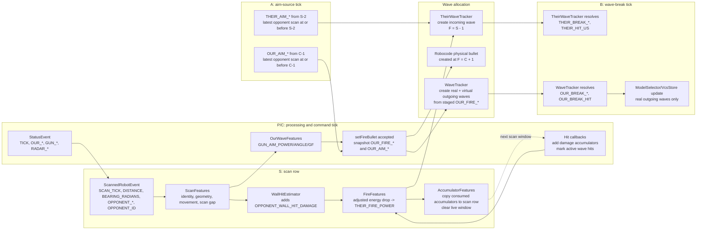

# Feature Flow

This document describes the live-robot feature flow for `Autopilot` and
`Whiteboard`. The quality pipeline has a god-view reconstruction path and, when
CSV is enabled for `BattleLoopTest`, writes from god-view whiteboards. The
`BattleCSVProducer` path writes robot-side observer whiteboards instead. The
feature lifetimes and timing names below are defined from the robot's in-game
point of view.

## Robocode Turn Model

For each engine turn, Robocode loads commands queued by the robot on the
previous callback, creates any queued bullets, moves existing bullets, moves and
collides robots, performs scans, handles deaths, publishes status, then wakes the
robot thread and dispatches callbacks. The live robot therefore sees a completed
engine turn in `onStatus` and event callbacks, then queues commands for a future
engine turn in `doTurn()`.

Bullet creation is especially important. `setFireBullet()` returns a `Bullet`
handle immediately, but the engine creates the physical bullet when the next
execution/battle turn loads the queued command. The bullet heading is the gun
heading already present at that command-load point, before that same engine turn
applies its new gun rotation.

## Tick Nomenclature

Use these names when describing feature timing:

| Term | Meaning |
|---|---|
| `P` | Current Whiteboard processing tick: `Feature.TICK` after `onStatus` rotates the tick ring and before/during `doTurn()`. |
| `S` | Scan tick. On a current scan tick, `S = P` and the current scan row has `SCAN_TICK == P`. |
| `L` | Last scan tick, read from the most recent scan row with `SCAN_TICK <= P` or another requested target tick. |
| `C` | Our fire command/snapshot tick: the robot callback tick where `setFireBullet()` succeeds and `snapshotFireFeatures()` writes `OUR_FIRE_*`. Current code stores `OUR_FIRE_TICK = C`. |
| `F` | Engine bullet-creation tick. For our bullets, physical creation is `F = C + 1`. For inferred opponent bullets detected on scan tick `S`, `F = S - 1`. |
| `A` | Aim-source tick. For inferred opponent fires, `A = F - 1 = S - 2`. For our stored `OUR_AIM_*`, current code records `C - 1`, which is `F - 2` relative to the physical engine fire tick. |
| `B` | Wave-break tick: current processing tick when an active wave reaches its target and break columns are written. |

## Source Of Truth In Code

The current live robot registers these processors in `Autopilot.initCommon()`:

```java
new ScanFeatures(),
new WallHitEstimator(bfWidth, bfHeight),
new FireFeatures(),
new AccumulatorFeatures(),
new OurWaveFeatures(),
new WaveTracker(),
new TheirWaveTracker()
```

`Whiteboard` hands them to `Transformer`, which sorts by declared dependencies
with deterministic class-name tie-breaking. Do not rely on registration order
unless a dependency edge forces it. The important dependency-constrained flow is:

```text
ScanFeatures -> WallHitEstimator -> FireFeatures -> AccumulatorFeatures
ScanFeatures -> OurWaveFeatures -> WaveTracker
FireFeatures + ScanFeatures -> TheirWaveTracker
```

The older `SpatialFeatures`, `MovementFeatures`, `TimingFeatures`, and
`IdentityFeatures` classes still exist for focused tests and compatibility, but
the live robot no longer registers them separately. Their current live behavior
is consolidated in `ScanFeatures`.

## Whiteboard Storage Model

`Feature.getFileType()` routes every feature to one of these tables:

| Table | Capacity and lifetime | Features |
|---|---|---|
| `TICKS` | Depth-3 tick ring. Rotates when `setFeature(TICK, value)` observes a new tick and clears the new current slot. | Robot/status facts: `OUR_X`, `OUR_Y`, `OUR_HEADING`, `OUR_VELOCITY`, `OUR_ENERGY`, `GUN_HEAT`, `GUN_HEADING`, `RADAR_HEADING`, `TICK`. |
| `SCAN` | 64-row scan ring. One row is opened by `beginScanRow(S)` for each `ScannedRobotEvent`. Historical reads walk this ring by `SCAN_TICK`. | Raw scan facts, scan-derived geometry/movement/timing, opponent identity, previous energy, and consumed damage ledger columns. |
| Damage accumulator state | Separate live scan-window state for four `SCAN` features. It survives tick-ring rotation until copied into the current scan row. | `OUR_BULLET_DAMAGE_TO_OPPONENT`, `OPPONENT_BULLET_ENERGY_GAIN`, `RAM_DAMAGE_TO_OPPONENT`, `OPPONENT_WALL_HIT_DAMAGE`. |
| `DECISIONS` | Depth-3 tick ring, rotated with `TICKS`. Not written to CSV. | Robot-side decisions: `GUN_AIM_POWER`, `GUN_AIM_ANGLE`, `GUN_AIM_GF`. |
| `OUR_WAVES` staging | Single staging row addressed by `getFeature`/`setFeature`; copied into the outgoing wave ring by `WaveTracker`. | `OUR_FIRE_*`, `OUR_AIM_*`, and real-break `OUR_BREAK_*` staging. |
| Our-wave ring | 64 slots. One real slot plus 10 virtual slots are allocated for each accepted real fire command. Slots move `FREE -> ACTIVE -> RESOLVED`. | Full lifecycle columns for outgoing real and virtual waves, plus internal `WAVE_ID`. |
| `THEIR_WAVES` staging | Single staging row addressed by `getFeature`/`setFeature`; copied into the incoming wave ring by `TheirWaveTracker`. | `THEIR_FIRE_*`, `THEIR_AIM_*`, and `THEIR_BREAK_*` staging. |
| Their-wave ring | 32 slots. One active slot per detected opponent fire. Slots move `FREE -> ACTIVE -> RESOLVED`. | Full lifecycle columns for incoming opponent waves. |
| `SCORES` | One score row. | `ROUND_HIT_RATE`, `ROUND_RESULT`. |

`getFeature(f)` returns the current table value for the feature's type. For scan
features it returns the live damage accumulator state first when the feature is
one of the four accumulator features; otherwise it returns the current scan row.
`getFeatureNTicksAgo(f, n)` supports `TICKS` and `DECISIONS` for `n = 0..2`.
For `SCAN`, only `n = 1` is accepted and means previous scan row, not previous
engine tick. `getScanFeatureAtOrBeforeTick(f, targetTick)` walks the scan ring
from newest to oldest and returns the first row whose `SCAN_TICK <= targetTick`.

## Processor Flow

| Processor | Runs when | Inputs | Outputs and side effects |
|---|---|---|---|
| `ScanFeatures` | Only when `wb.hasCurrentScan()` is true. | Current `TICK`, `SCAN_TICK`, our status, raw scan facts, `OPPONENT_ID`. | Hashes opponent id; computes `OPPONENT_BEARING_ABSOLUTE`, `OPPONENT_X/Y`, `OPPONENT_LATERAL/ADVANCING_VELOCITY`, and `TICKS_SINCE_SCAN`. |
| `WallHitEstimator` | Only on current scan rows. | Current/previous scan velocity and heading, current opponent position, battlefield bounds, ram accumulator, opponent id. | Adds `OPPONENT_WALL_HIT_DAMAGE` when wall evidence is present and no existing positive wall accumulator is present. It uses real scan gap from `SCAN_TICK`, not `TICKS_SINCE_SCAN`, for braking-budget math. |
| `FireFeatures` | Only on current scan rows, guarded against duplicate processing of the same `SCAN_TICK`. | Current opponent energy, previous scan opponent energy, and damage accumulators. | Writes `PREV_SCAN_OPPONENT_ENERGY` and detects `THEIR_FIRE_POWER` from adjusted energy drop. |
| `AccumulatorFeatures` | Only on current scan rows, after `FireFeatures` because it depends on `THEIR_FIRE_POWER`. | Live scan-window damage accumulators. | Copies the four damage accumulators into the current scan row, then clears the live accumulator state for the next scan window. |
| `OurWaveFeatures` | Every `wb.process()`. | Current scan distance/geometry for gun aim, gun heat, VCS/model selector, and any `OUR_FIRE_*` staging from the previous command tick. | Writes `GUN_AIM_POWER/ANGLE/GF`; when `OUR_FIRE_POWER` is staged, derives `OUR_FIRE_BULLET_SPEED`, `OUR_FIRE_MEA`, and `OUR_FIRE_DIRECTION`. |
| `WaveTracker` | Every `wb.process()`. | Staged `OUR_FIRE_*`/`OUR_AIM_*`, current opponent position, current tick, active outgoing waves. | Allocates one real and 10 virtual outgoing wave slots, clears fire/aim staging, resolves active outgoing waves, writes real `OUR_BREAK_*` staging, and updates VCS/model selector for real waves only. |
| `TheirWaveTracker` | Every `wb.process()`. | `THEIR_FIRE_POWER`, current/previous own positions, opponent scan geometry, active incoming waves. | Allocates incoming wave slots, fills `THEIR_FIRE_*` and `THEIR_AIM_*`, clears `THEIR_FIRE_POWER`, resolves incoming waves, and writes `THEIR_BREAK_*`/`THEIR_HIT_US`. |

## Feature Groups

### Tick Features

| Feature | Source and timing |
|---|---|
| `OUR_X`, `OUR_Y`, `OUR_HEADING`, `OUR_VELOCITY`, `OUR_ENERGY` | `Autopilot.onStatus` copies `RobotStatus` into the current tick ring at `P`. Energy is the engine status after that turn's bullet, collision, and wall effects. |
| `GUN_HEAT`, `GUN_HEADING`, `RADAR_HEADING` | `onStatus` copies gun/radar status at `P`. `GUN_HEAT` includes cooling and any command-loaded fire heat for that engine turn. |
| `TICK` | `onStatus` stores `RobotStatus.getTime()`. A new value rotates and clears the tick and decision rings before other status facts are written. |

### Scan Features

| Feature | Source and timing |
|---|---|
| `SCAN_TICK` | `onScannedRobot` opens a scan row with the current `TICK`, so `SCAN_TICK = S`. |
| `DISTANCE`, `BEARING_RADIANS`, `OPPONENT_HEADING`, `OPPONENT_VELOCITY`, `OPPONENT_ENERGY` | Raw `ScannedRobotEvent` values for scan tick `S`. |
| `OPPONENT_ID` | Raw scan event name stored in the scan string row. |
| `OPPONENT_ID_HASH` | `ScanFeatures` hashes the bot id portion of `OPPONENT_ID` after stripping a version suffix after the first space. |
| `OPPONENT_BEARING_ABSOLUTE` | `ScanFeatures`: `OUR_HEADING@P + BEARING_RADIANS@S`. |
| `OPPONENT_X`, `OPPONENT_Y` | `ScanFeatures`: our current position plus scan distance projected along `OPPONENT_BEARING_ABSOLUTE`. |
| `OPPONENT_LATERAL_VELOCITY`, `OPPONENT_ADVANCING_VELOCITY` | `ScanFeatures`: opponent velocity decomposed relative to the bearing line from opponent to us. |
| `TICKS_SINCE_SCAN` | `ScanFeatures`: current `SCAN_TICK - previous SCAN_TICK`; only set when a previous scan row exists. |
| `PREV_SCAN_OPPONENT_ENERGY` | `FireFeatures` writes the previous scan row's `OPPONENT_ENERGY` into the current scan row before evaluating the current energy drop. |

### Damage Accumulators

These four features are real inputs to `FireFeatures` and diagnostic scan-row
outputs after consumption. Before a scan row is consumed they live in
Whiteboard's separate damage accumulator state, not in the current scan row.

| Feature | Source and timing |
|---|---|
| `OUR_BULLET_DAMAGE_TO_OPPONENT` | `onBulletHit` adds `Rules.getBulletDamage(power)` and marks the matching active outgoing real wave as hit. |
| `OPPONENT_BULLET_ENERGY_GAIN` | `onHitByBullet` adds `Rules.getBulletHitBonus(power)` and marks the oldest active incoming wave with matching power as hit-us. |
| `RAM_DAMAGE_TO_OPPONENT` | `onHitRobot` adds `Rules.ROBOT_HIT_DAMAGE`. The ram score bonus is not treated as opponent energy gain. |
| `OPPONENT_WALL_HIT_DAMAGE` | `WallHitEstimator` estimates wall damage from scan-window evidence unless an exact positive value already exists, so pipeline god-view values can win. |

On scan tick `S`, `FireFeatures` consumes the live accumulator values in its
adjusted-drop equation:

```text
observedDrop = PREV_SCAN_OPPONENT_ENERGY - OPPONENT_ENERGY@S
adjustedDrop = observedDrop
    - OUR_BULLET_DAMAGE_TO_OPPONENT
    - RAM_DAMAGE_TO_OPPONENT
    - OPPONENT_WALL_HIT_DAMAGE
    + OPPONENT_BULLET_ENERGY_GAIN
```

If `adjustedDrop` is in `[0.1, 3.0]`, `THEIR_FIRE_POWER` is set to that value;
otherwise it is set to `NaN`. Then `AccumulatorFeatures` copies the consumed
accumulator values into the current scan row and clears the live accumulator
state.

`Autopilot.doTurn()` also publishes post-process accumulator diagnostics through
`getConsumedAccumulator()` and `wasAccumulatorResetThisTurn()`. Those values are
for observer/pipeline validation; the live robot strategy does not read them.

### Decision Features

| Feature | Source and timing |
|---|---|
| `GUN_AIM_POWER` | `OurWaveFeatures` computes power from current scan distance, clamps it to `[1.0, 3.0]`, and sets it to `0` when `GUN_HEAT > 0`. If no current scan distance is available, it leaves the current decision slot as `NaN`. |
| `GUN_AIM_ANGLE` | `OurWaveFeatures` starts from `OPPONENT_BEARING_ABSOLUTE` and applies a guess-factor offset from `ModelSelector` when present, else `VcsStore`, else head-on offset `0`. |
| `GUN_AIM_GF` | The chosen guess factor for `GUN_AIM_ANGLE`; default `0` without model signal. |

`DECISIONS` are intentionally excluded from CSV because they are robot-side
strategy outputs, not engine ground truth.

### Their-Fire And Incoming-Wave Features

Opponent fire is inferred on scan tick `S` from the scan-to-scan energy drop.
`TheirWaveTracker` treats the physical fire tick as `F = S - 1` and the aim
source tick as `A = S - 2`.

| Feature | Source and timing |
|---|---|
| `THEIR_FIRE_POWER` | `FireFeatures` writes the adjusted scan-to-scan energy drop when it is in `[0.1, 3.0]`; otherwise `NaN`. `TheirWaveTracker` clears it after allocation. |
| `THEIR_FIRE_TICK` | `TheirWaveTracker`: current `TICK - 1`, the inferred physical fire tick `F`. |
| `THEIR_FIRE_X`, `THEIR_FIRE_Y` | Opponent muzzle position for `F`. Code first asks the scan ring for `OPPONENT_X/Y` at or before `F`; if that is missing, it falls back to current scan `OPPONENT_X/Y` instead of walking farther back. |
| `THEIR_BULLET_SPEED` | `20 - 3 * THEIR_FIRE_POWER`. |
| `THEIR_FIRE_OUR_X`, `THEIR_FIRE_OUR_Y` | Our previous tick position, `OUR_X/Y@(S - 1)`. |
| `THEIR_FIRE_DISTANCE`, `THEIR_FIRE_BEARING` | Distance and absolute bearing from opponent muzzle to our fire-time position. |
| `THEIR_AIM_X`, `THEIR_AIM_Y` | Opponent position at or before `A = S - 2`, read from the scan ring. |
| `THEIR_AIM_OUR_X`, `THEIR_AIM_OUR_Y` | Our two-ticks-ago position, `OUR_X/Y@(S - 2)`. |
| `THEIR_AIM_DISTANCE`, `THEIR_AIM_BEARING` | Distance and absolute bearing from opponent aim-time position to our aim-time position. |
| `THEIR_BREAK_TICK` | Current tick `B` when `(B - THEIR_FIRE_TICK) * bulletSpeed >= distance(fire origin, our current position)`. |
| `THEIR_BREAK_OUR_X`, `THEIR_BREAK_OUR_Y` | Our position at break tick `B`. |
| `THEIR_BREAK_GF`, `THEIR_BREAK_BEARING_OFFSET` | Our break bearing from their perspective, normalized by max escape angle for the bullet speed. |
| `THEIR_HIT_US` | `onHitByBullet` marks the oldest active incoming wave with matching power; break staging writes that value, defaulting to `0`. |

### Our-Fire And Outgoing-Wave Features

Our fire command is staged during `doTurn()` after `wb.process()` has already run
for tick `C`. `WaveTracker` sees and allocates the staged fire on the next
`wb.process()` call. The stored `OUR_FIRE_TICK` is the command/snapshot tick
`C`; the physical Robocode bullet is created at engine tick `F = C + 1`.

| Feature | Source and timing |
|---|---|
| `OUR_FIRE_POWER` | `snapshotFireFeatures()` writes accepted `setFireBullet()` power when gun strategy requested positive power, gun turn remaining is under 5 degrees, and Robocode returned a non-null bullet handle. Cleared by `WaveTracker` after allocation. |
| `OUR_FIRE_BULLET_ID` | Hash code of the returned `Bullet` handle. Used to mark real outgoing wave hits. Virtual waves get bullet id `0`. |
| `OUR_FIRE_X`, `OUR_FIRE_Y` | Our current position at command tick `C`, not the later physical muzzle position at `F`. |
| `OUR_FIRE_TICK` | Current `TICK`, so it stores `C`. Travel math in `WaveTracker` currently uses this stored tick. |
| `OUR_FIRE_BEARING_ABSOLUTE`, `OUR_FIRE_DISTANCE` | Current scan-derived bearing and distance at `C`. They can be `NaN` if no usable scan-derived values exist. |
| `OUR_FIRE_LATERAL_VELOCITY`, `OUR_FIRE_ADVANCING_VELOCITY` | Current scan-derived opponent velocity decomposition at `C`. |
| `OUR_FIRE_OPPONENT_X`, `OUR_FIRE_OPPONENT_Y` | Current scan-derived opponent position at `C`. |
| `OUR_FIRE_AIM_GF` | Current `GUN_AIM_GF` decision at `C`. |
| `OUR_FIRE_IS_REAL` | `1.0` for the real staged bullet. `WaveTracker` creates 10 virtual siblings with `0.0`. |
| `OUR_FIRE_BULLET_SPEED` | `OurWaveFeatures` derives `GuessFactor.bulletSpeed(OUR_FIRE_POWER)` while staging is present. |
| `OUR_FIRE_MEA` | `OurWaveFeatures` derives max escape angle from `OUR_FIRE_BULLET_SPEED`. |
| `OUR_FIRE_DIRECTION` | `OurWaveFeatures` stores the sign of `OUR_FIRE_LATERAL_VELOCITY`, defaulting to `1` if missing. |
| `OUR_AIM_X`, `OUR_AIM_Y` | Our previous tick position, `OUR_X/Y@(C - 1)`. |
| `OUR_AIM_OPPONENT_X`, `OUR_AIM_OPPONENT_Y` | Latest scanned opponent position at or before `C - 1`, walking the scan ring across radar gaps. |
| `OUR_AIM_DISTANCE`, `OUR_AIM_BEARING_ABSOLUTE` | Distance and absolute bearing derived from the aim-time positions. |
| `OUR_BREAK_TICK` | Current tick `B` for the real outgoing wave when `(B - OUR_FIRE_TICK) * bulletSpeed >= distance(fire origin, opponent current position)`. |
| `OUR_BREAK_GF`, `OUR_BREAK_BEARING_OFFSET` | Opponent break bearing from our perspective, normalized by stored MEA and direction. |
| `OUR_BREAK_OPPONENT_X`, `OUR_BREAK_OPPONENT_Y` | Opponent position at break tick `B`. |
| `OUR_BREAK_HIT` | `Whiteboard.markBulletHit` sets the matching active real wave's `BREAK_HIT` to `1.0`; if the real wave resolves without a recorded hit, the emitted value is `0`. Virtual wave hit/miss is computed geometrically in ring slots but not emitted through real `OUR_BREAK_*` staging. |

When `WaveTracker` allocates outgoing waves, it creates one real slot and 10
virtual slots with evenly spaced aim GFs from `-1.0` to `1.0`. It then clears all
`OUR_FIRE_*` and `OUR_AIM_*` staging features so the fire is not re-created on a
later tick. Real wave resolution updates `ModelSelector` when present, otherwise
`VcsStore`; virtual waves never update the model.

### Score Features

| Feature | Source and timing |
|---|---|
| `ROUND_HIT_RATE` | Pipeline score output. The live robot path does not populate it. |
| `ROUND_RESULT` | Pipeline score output. The live robot path does not populate it. |

## CSV Row Timing

The pipeline writer groups headers directly from `Feature.getFileType()`. The
existing quality pipeline writes god-view rows when `BattleLoopTest` CSV output
is enabled; `BattleCSVProducer` writes the same files from robot-side observer
whiteboards and uses DeJaVu battle-end score events for `scores.csv`.

| CSV | Trigger in current pipeline |
|---|---|
| `ticks.csv` | Every processed tick, from the god-view whiteboard. |
| `scan.csv` | Processed ticks where the god-view whiteboard has a current scan row. |
| `autopilot-waves.csv` | Ticks where the pipeline detected an outgoing Autopilot wave resolution. The row contains `OUR_FIRE_*`, `OUR_AIM_*`, and `OUR_BREAK_*` values for that resolved real or virtual Autopilot wave. |
| `dejavu-waves.csv` | Ticks where a DeJaVu CommandReconstructor-backed real outgoing bullet wave resolves. The file uses the same outgoing-wave schema as `autopilot-waves.csv`. |
| `their-waves.csv` | For a perspective `pi`, written when the peer perspective's outgoing wave resolution corresponds to an incoming wave for `pi`. |
| `scores.csv` | End of round. |

`DECISIONS` are excluded from CSV headers.

## Feature Flow Graph

The graph below shows the main live-robot feature flow split by tick terms. The
outgoing-fire path includes both `C` and `F` because current code stores command
tick snapshots while Robocode creates the physical bullet on the next engine
turn.



## Practical Rules

- Use `ScanFeatures` as the live source for scan-derived identity, geometry,
  movement, and scan-gap values. Treat the split feature processors as legacy or
  focused-test helpers unless the registration changes.
- Use scan-ring APIs for opponent history. Tick-ring history only applies to our
  status and decision values.
- For opponent fire origin, prefer `F = S - 1`; when that scan-ring lookup is
  missing, the current code intentionally falls back to current scan position.
- For our fire origin and travel math, current wave slots use stored command tick
  snapshots (`C`), even though the physical Robocode bullet appears at `C + 1`.
- Accumulators are consumed by `FireFeatures` before they are copied into
  `scan.csv` and reset by `AccumulatorFeatures`.