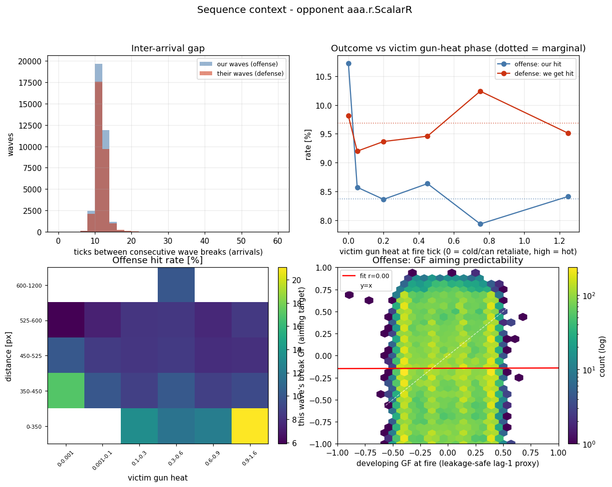
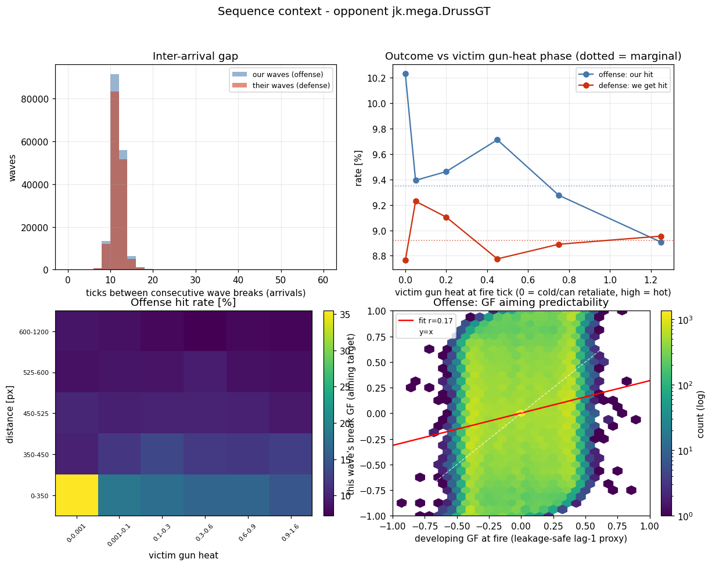
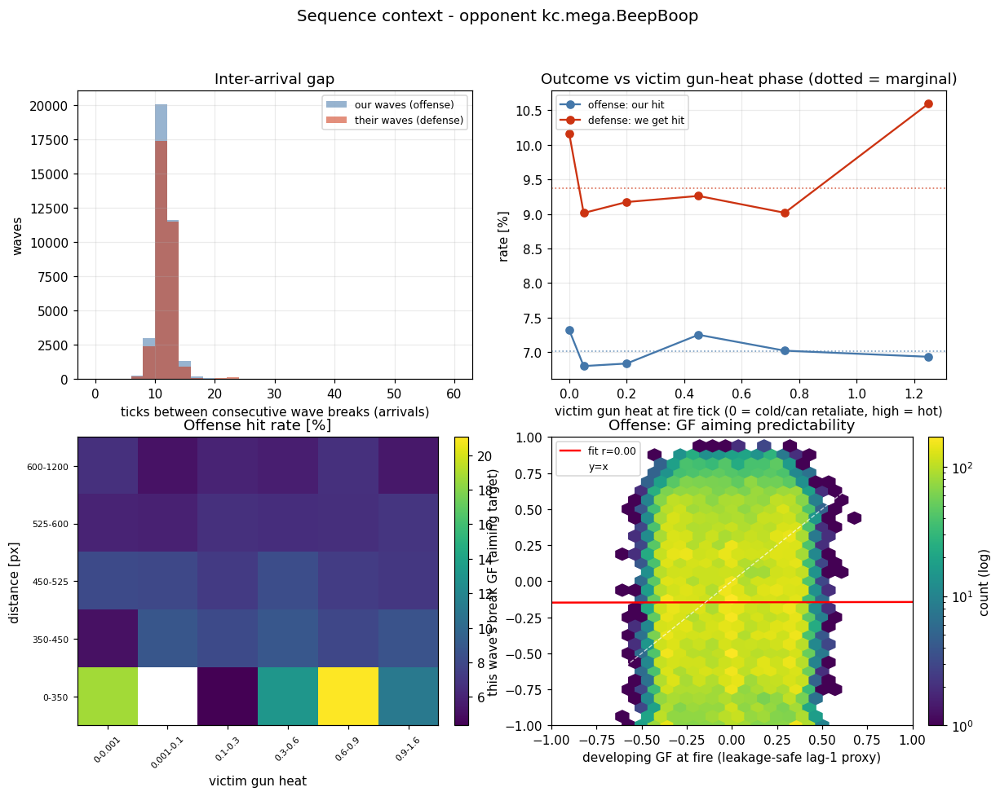
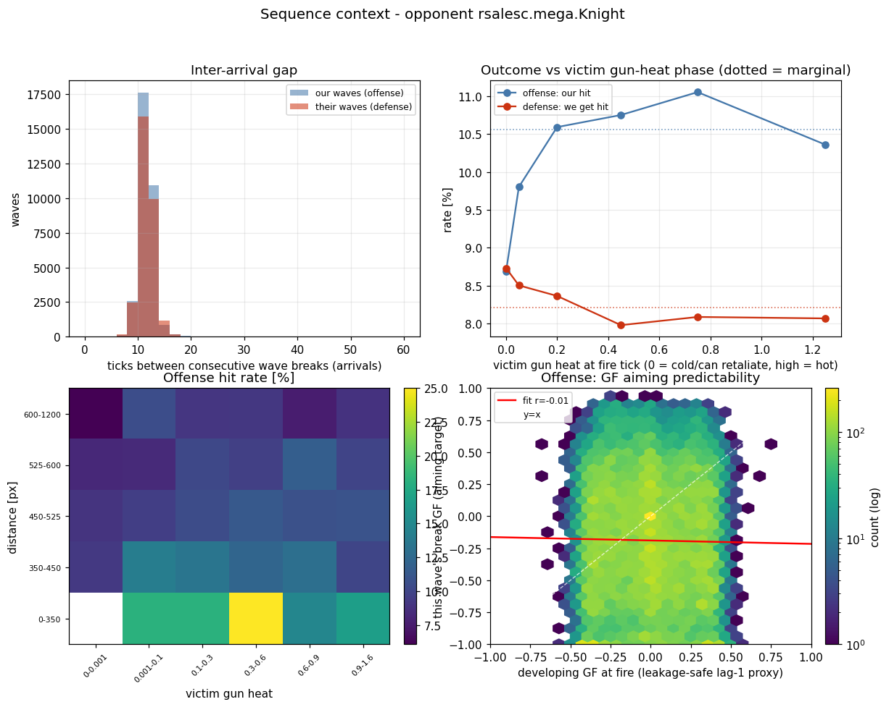
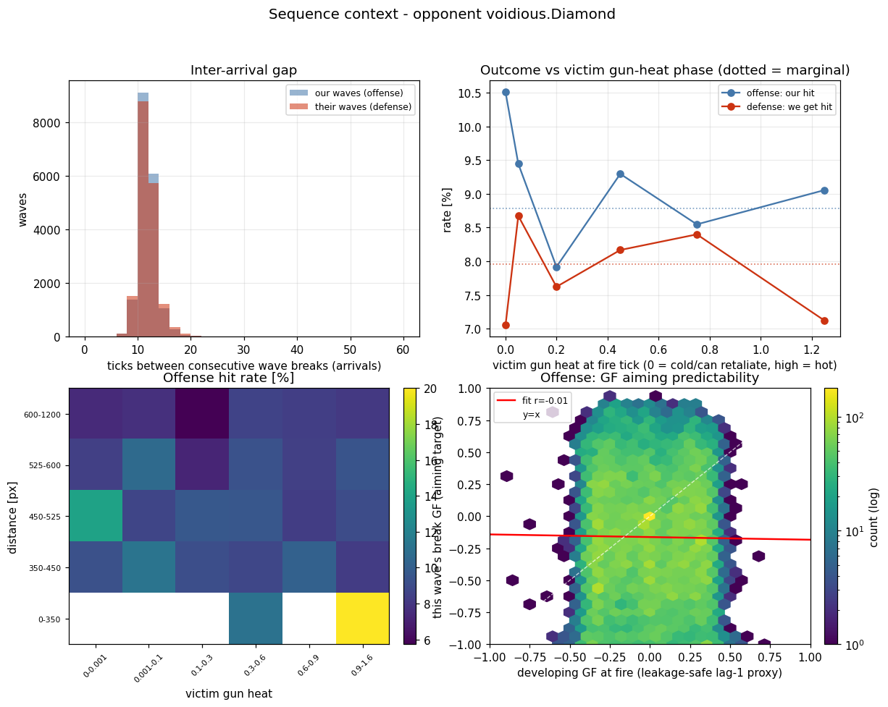

# Sequence hypothesis - does recent context predict a wave's aim (and outcome)?

_Generated 2026-06-07 16:12 UTC from `pipeline/build/battle-csv-producer/1780834355900-1780834355900`. Deterministic (seed 1234567). `cz.zamboch.Autopilot` excluded as host and opponent._

## What is tested

Each wave is described by context known **at the fire tick only** (no look-ahead) and scored two ways, per opponent:

- **Primary - aim (continuous).** Predict the wave's eventual **break GuessFactor** (`own_break_gf`) - *where* on the escape envelope the victim ends up. This is the quantity hypothesis C8 says is auto-correlated; it is measured by Pearson `r` / `R^2`, not bits.
- **Secondary - outcome (binary, noisy).** Predict whether the wave **hits** (offense `our_break_hit`) or **hits us** (defense `their_hit_us`). At a ~10% base rate against top guns this label is dominated by irreducible residual dodge, so it is reported with hit-rate lift + Wilson 95% CIs, never as a sole verdict.

Anchors: offense = the perspective bot's real wave (`dejavu-waves.csv`); defense = the opponent's wave (`their-waves.csv`). This run is a **round-robin of competitive bots** (`cz.zamboch.Autopilot` excluded as host and opponent), so "we"/"our" is whichever competitive bot owns the perspective and "victim" is its opponent - there is no metronome gun in the analysed data.

**Leakage guard.** Measured fire cadence (~14 ticks) < bullet flight (~34 ticks), so when a wave is fired the previous wave has not broken yet - its break GF is a future value (leak). Two leakage-safe predictors replace it: `developing_gf` (the previous still-in-flight wave's GF re-evaluated at the current fire tick - a faithful lag-1 proxy) and `online_broken_mean` (running mean of every wave already broken, which is ~3 fires stale because cadence is much shorter than flight). The raw fire-order lag-1 break-GF autocorrelation is reported only as the C8 reference, clearly flagged as leaky.

**Reconstruction self-check.** `developing_gf` evaluated at the break tick reproduces the recorded break GF to max abs error **1.04e-14** over 821,225 offense waves.

## Scenarios tested (S1-S4 observational; S5 deferred)

These are sophisticated competitive guns (DrussGT, Diamond, Knight, BeepBoop, ScalarR), not a fixed metronome: fire cadence varies (gap std ~1.7 ticks) and bullet power varies (often low for energy management, but with a tail to full power), so `inter_fire_gap` and `power_delta` are genuine - if weak - axes, not degenerate ones. The dominant structured signal is the **wave-stacking GF** the primary test targets; the opponent's gun-heat clock and engagement geometry are secondary. Every per-opponent figure is the same 2x2 panel; the scenarios map onto it as follows.

- **S1 - Opponent gun-heat phase (sync hot vs cold).** Does firing when the victim's gun is cold (heat ~0, it can retaliate at once) versus hot (just fired, long until its next shot) change our hit / get-hit rate? Combines the original sync-to-gun-heat-HOT and sync-to-gun-heat-COLD ideas. _Graph: top-right_ - outcome vs victim gun-heat phase curve (dotted line = that opponent's marginal rate).
- **S2 - Clock x geometry.** Does the gun-heat-phase effect depend on range - is a cold victim only exploitable up close? _Graph: bottom-left_ - offense hit-rate heatmap, victim gun heat (x) by distance (y).
- **S3 - Wave-stacking / developing GF (primary).** With 2-3 waves always in flight, does how the victim is *already* dodging the previous in-flight wave (`developing_gf`, leakage-safe) predict the next wave's **break GF**? This is the observable, online face of C8's GF autocorrelation. _Graph: bottom-right_ - developing GF at fire (x) vs this wave's break GF (y), with the fit line and `r`.
- **S4 - Arrival rhythm.** Is there structure in the cadence of wave *arrivals* (ticks between consecutive breaks), and does our outgoing rhythm differ from the incoming one? _Graph: top-left_ - inter-arrival gap histogram (our waves vs theirs).
- **S5 - Fire-slow-dive-fire-fast (deferred, interventional).** Fire a slow bullet, close the range, then fire a fast one. The hero never executes this in the recorded data, so it is **not graphed**; it needs new battles with a power-varying gun (see Further scenarios below).

## Verdict

**The earlier "all scenarios disproved" conclusion was a measurement artifact, not a true null.** It scored every hypothesis against the noisy hit/miss label with mutual-information-in-bits, and blamed a metronome gun that is not in the data. Measured on the right target - the continuous break GuessFactor - the central claim holds.

**Aim is strongly predictable - C8 confirmed.** The fire-order lag-1 break-GF autocorrelation is 0.67-0.71 across opponents (offense), reproducing the intuition report's C8 = 0.643: *where* the victim dodges is highly auto-correlated wave to wave.

**The signal survives the leakage guard - online and usable.** `developing_gf` is a faithful lag-1 proxy (proxy r 0.74-0.79) and **still predicts the next wave's break GF at fire time, r 0.17-0.24, positive for every opponent** - real aiming signal a memoryless VCS gun discards. The original script only ever correlated it with hit/miss (r ~ 0) and used the wrong feature for aim: the freshest *already-broken* wave is ~3 fires stale (`last_broken_gf` -> break GF r -0.09--0.05, ~ 0), which it mislabelled as "the autocorrelation is not available online." It is - through the in-flight wave.

**Hit/miss really is near-null - but that is expected, not a disproof.** At a ~10% base rate against world-class movement, whether one low-power bullet lands is dominated by irreducible residual dodge; conditioned on aim it carries almost no extra bits. That is why the outcome is judged by hit-rate **lift with CIs**, not MI: the heatmaps still expose real conditional cells - vs `rsalesc.mega.Knight` the best gun-heat x distance cell hits 22.9% versus a 10.9% marginal (0.1% of shots). `distance` stays the strongest single geometry axis (MI up to 0.0012 bits).

**Net.** Sequences win by sharpening **GF prediction** (the primary headline below), not by making a fixed shot more likely to land. The hit/miss tables are retained as a deliberately noisy secondary.

## Headline (primary): GF aiming predictability

Predicting the continuous break GuessFactor from fire-tick context. `lag-1 autocorr` is the C8 reference (leaky - uses the previous wave's *break* GF, a future value). `developing_gf -> GF` is the leakage-safe online predictor; `proxy` is how faithfully `developing_gf` tracks that previous break GF; `online_broken_mean -> GF` is the freshest *landed* feedback (stale).

| Opponent | side | N | lag-1 autocorr (C8 ref, leaky) | `developing_gf`->GF  r (R^2) | proxy r | `online_broken_mean`->GF  r |
|---|---|---|---|---|---|---|
| `aaa.r.ScalarR` | off | 192,697 | 0.670 | 0.191 (0.036) | 0.779 | -0.071 |
| `aaa.r.ScalarR` | def | 15,276 | 0.399 | 0.175 (0.030) | 0.785 | -0.029 |
| `jk.mega.DrussGT` | off | 170,493 | 0.685 | 0.166 (0.028) | 0.750 | -0.069 |
| `jk.mega.DrussGT` | def | 154,624 | 0.702 | 0.195 (0.038) | 0.760 | -0.065 |
| `kc.mega.BeepBoop` | off | 195,831 | 0.700 | 0.179 (0.032) | 0.757 | -0.053 |
| `kc.mega.BeepBoop` | def | 123,120 | 0.694 | 0.175 (0.031) | 0.741 | -0.066 |
| `rsalesc.mega.Knight` | off | 165,896 | 0.714 | 0.243 (0.059) | 0.787 | -0.073 |
| `rsalesc.mega.Knight` | def | 154,605 | 0.688 | 0.186 (0.035) | 0.764 | -0.068 |
| `voidious.Diamond` | off | 96,308 | 0.701 | 0.171 (0.029) | 0.743 | -0.072 |
| `voidious.Diamond` | def | 40,195 | 0.691 | 0.179 (0.032) | 0.745 | -0.118 |

> The leaky lag-1 column reproduces C8 (~0.7); the leakage-safe `developing_gf` keeps a positive, usable correlation with the next break GF on every opponent and side, while the stale broken-feedback mean sits near zero. This is the result the original report missed by testing hit/miss instead of the GF.

## Scenario 1: multi-lag GF aiming model

Extends the lag-1 headline. `lag-1/2/3` are the fire-order break-GF autocorrelations (leaky C8 reference); they show how fast the aiming signal decays with wave distance. `dev-only R^2` is the leakage-safe single-predictor fit (`developing_gf` -> break GF); `dev+online R^2` adds `online_broken_mean` to test whether older landed feedback adds anything beyond the lag-1 proxy.

| Opponent | side | N | lag-1 | lag-2 | lag-3 | dev-only R^2 | dev+online R^2 |
|---|---|---|---|---|---|---|---|
| `aaa.r.ScalarR` | off | 192,697 | 0.670 | 0.154 | -0.077 | 0.036 | 0.041 |
| `aaa.r.ScalarR` | def | 15,276 | 0.399 | 0.087 | -0.041 | 0.030 | 0.035 |
| `jk.mega.DrussGT` | off | 170,493 | 0.685 | 0.168 | -0.086 | 0.028 | 0.032 |
| `jk.mega.DrussGT` | def | 154,624 | 0.702 | 0.200 | -0.069 | 0.038 | 0.042 |
| `kc.mega.BeepBoop` | off | 195,831 | 0.700 | 0.193 | -0.073 | 0.032 | 0.035 |
| `kc.mega.BeepBoop` | def | 123,120 | 0.694 | 0.196 | -0.090 | 0.031 | 0.035 |
| `rsalesc.mega.Knight` | off | 165,896 | 0.714 | 0.223 | -0.059 | 0.059 | 0.064 |
| `rsalesc.mega.Knight` | def | 154,605 | 0.688 | 0.182 | -0.066 | 0.035 | 0.039 |
| `voidious.Diamond` | off | 96,308 | 0.701 | 0.193 | -0.084 | 0.029 | 0.035 |
| `voidious.Diamond` | def | 40,195 | 0.691 | 0.197 | -0.091 | 0.032 | 0.046 |

> The autocorrelation decays fast (lag-1 ~0.7 -> lag-2 a fraction of that -> lag-3 near zero or negative): only the immediately preceding wave carries strong aiming information, which is exactly why the in-flight `developing_gf` proxy works and the ~3-fires-stale broken feedback does not. `dev+online R^2` barely improves on `dev-only R^2` - the lag-1 proxy already captures the usable structure, so a deeper AR(k) model buys little.

## Scenarios 2-8 conditioned on the GF target

The same contexts as the hit/miss tables below, but scored against the continuous break GF instead of the noisy outcome. Each context is split into two subgroups; within each we report the leakage-safe `developing_gf` -> break-GF predictability `r` (n) and the mean break GF. A context helps aiming if `r` rises in one subgroup (aim is more predictable there) or the mean GF shifts (the opponent dodges to a different place).

| Opponent | side | Scenario | subgroup A | subgroup B |
|---|---|---|---|---|
| `aaa.r.ScalarR` | off | 2. Direction-reversal cadence | 0 flips: r 0.23 (n=75,874), GF -0.00 | >=2 flips: r 0.17 (n=35,979), GF 0.00 |
| `aaa.r.ScalarR` | off | 3. Post-hit adaptation | prev miss: r 0.19 (n=174,874), GF 0.00 | prev hit: r 0.20 (n=16,499), GF -0.00 |
| `aaa.r.ScalarR` | off | 4. Range trajectory | opening: r 0.18 (n=92,654), GF 0.00 | closing: r 0.20 (n=99,442), GF -0.00 |
| `aaa.r.ScalarR` | off | 5. Wall-proximity / cornering | cornered(<=49): r 0.14 (n=47,975), GF -0.00 | open(>=156): r 0.23 (n=47,903), GF -0.00 |
| `aaa.r.ScalarR` | off | 8. Inactivity-zap phase | zap off: r 0.19 (n=175,629), GF 0.00 | zap on: r 0.19 (n=16,187), GF 0.00 |
| `aaa.r.ScalarR` | def | 3. Post-hit adaptation | prev miss: r 0.17 (n=8,490), GF 0.01 | prev hit: r 0.20 (n=1,072), GF 0.00 |
| `aaa.r.ScalarR` | def | 6. Incoming fire rhythm | regular(<=0): r 0.19 (n=6,068), GF 0.01 | irregular(>=138): r 0.13 (n=612), GF 0.03 |
| `aaa.r.ScalarR` | def | 7. Incoming bullet-power ladder | power down: r 0.27 (n=1,862), GF -0.00 | power up: r -0.00 (n=881), GF 0.01 |
| `jk.mega.DrussGT` | off | 2. Direction-reversal cadence | 0 flips: r 0.23 (n=70,636), GF 0.00 | >=2 flips: r 0.15 (n=27,474), GF -0.00 |
| `jk.mega.DrussGT` | off | 3. Post-hit adaptation | prev miss: r 0.17 (n=153,519), GF 0.00 | prev hit: r 0.18 (n=15,755), GF 0.00 |
| `jk.mega.DrussGT` | off | 4. Range trajectory | opening: r 0.04 (n=61,634), GF 0.00 | closing: r 0.24 (n=105,779), GF 0.00 |
| `jk.mega.DrussGT` | off | 5. Wall-proximity / cornering | cornered(<=40): r 0.18 (n=42,404), GF 0.00 | open(>=120): r 0.21 (n=42,166), GF 0.00 |
| `jk.mega.DrussGT` | off | 8. Inactivity-zap phase | zap off: r 0.17 (n=169,279), GF 0.00 | zap on: r n/a (n=0), GF n/a |
| `jk.mega.DrussGT` | def | 3. Post-hit adaptation | prev miss: r 0.19 (n=139,726), GF 0.00 | prev hit: r 0.23 (n=13,764), GF -0.00 |
| `jk.mega.DrussGT` | def | 6. Incoming fire rhythm | regular(<=0): r 0.20 (n=126,092), GF 0.00 | irregular(>=0): r 0.19 (n=153,805), GF 0.00 |
| `jk.mega.DrussGT` | def | 7. Incoming bullet-power ladder | power down: r 0.27 (n=4,156), GF 0.01 | power up: r 0.22 (n=2,990), GF 0.02 |
| `kc.mega.BeepBoop` | off | 2. Direction-reversal cadence | 0 flips: r 0.23 (n=77,546), GF -0.00 | >=2 flips: r 0.14 (n=50,606), GF -0.00 |
| `kc.mega.BeepBoop` | off | 3. Post-hit adaptation | prev miss: r 0.17 (n=180,081), GF -0.00 | prev hit: r 0.24 (n=14,404), GF -0.00 |
| `kc.mega.BeepBoop` | off | 4. Range trajectory | opening: r 0.08 (n=65,757), GF -0.00 | closing: r 0.23 (n=129,492), GF -0.00 |
| `kc.mega.BeepBoop` | off | 5. Wall-proximity / cornering | cornered(<=0): r 0.19 (n=48,883), GF -0.00 | open(>=44): r 0.24 (n=48,642), GF -0.00 |
| `kc.mega.BeepBoop` | off | 8. Inactivity-zap phase | zap off: r 0.18 (n=188,903), GF -0.00 | zap on: r 0.21 (n=6,309), GF 0.00 |
| `kc.mega.BeepBoop` | def | 3. Post-hit adaptation | prev miss: r 0.17 (n=108,497), GF -0.00 | prev hit: r 0.19 (n=11,668), GF -0.01 |
| `kc.mega.BeepBoop` | def | 6. Incoming fire rhythm | regular(<=0): r 0.18 (n=91,190), GF -0.00 | irregular(>=1): r 0.16 (n=29,248), GF 0.00 |
| `kc.mega.BeepBoop` | def | 7. Incoming bullet-power ladder | power down: r 0.17 (n=6,391), GF -0.00 | power up: r 0.14 (n=5,537), GF -0.01 |
| `rsalesc.mega.Knight` | off | 2. Direction-reversal cadence | 0 flips: r 0.32 (n=93,709), GF -0.00 | >=2 flips: r 0.09 (n=9,003), GF -0.01 |
| `rsalesc.mega.Knight` | off | 3. Post-hit adaptation | prev miss: r 0.24 (n=146,730), GF -0.00 | prev hit: r 0.29 (n=17,924), GF -0.01 |
| `rsalesc.mega.Knight` | off | 4. Range trajectory | opening: r 0.22 (n=64,572), GF -0.00 | closing: r 0.32 (n=78,547), GF -0.00 |
| `rsalesc.mega.Knight` | off | 5. Wall-proximity / cornering | cornered(<=50): r 0.20 (n=41,153), GF -0.01 | open(>=129): r 0.31 (n=41,168), GF 0.00 |
| `rsalesc.mega.Knight` | off | 8. Inactivity-zap phase | zap off: r 0.24 (n=164,658), GF -0.00 | zap on: r n/a (n=0), GF n/a |
| `rsalesc.mega.Knight` | def | 3. Post-hit adaptation | prev miss: r 0.18 (n=140,208), GF -0.00 | prev hit: r 0.22 (n=13,184), GF -0.01 |
| `rsalesc.mega.Knight` | def | 6. Incoming fire rhythm | regular(<=0): r 0.18 (n=124,107), GF -0.00 | irregular(>=0): r 0.19 (n=153,786), GF -0.00 |
| `rsalesc.mega.Knight` | def | 7. Incoming bullet-power ladder | power down: r 0.22 (n=5,402), GF 0.01 | power up: r 0.17 (n=3,559), GF -0.01 |
| `voidious.Diamond` | off | 2. Direction-reversal cadence | 0 flips: r 0.22 (n=52,190), GF 0.00 | >=2 flips: r 0.10 (n=5,882), GF -0.00 |
| `voidious.Diamond` | off | 3. Post-hit adaptation | prev miss: r 0.17 (n=86,550), GF 0.00 | prev hit: r 0.19 (n=8,506), GF 0.00 |
| `voidious.Diamond` | off | 4. Range trajectory | opening: r 0.06 (n=37,768), GF -0.00 | closing: r 0.29 (n=47,788), GF 0.00 |
| `voidious.Diamond` | off | 5. Wall-proximity / cornering | cornered(<=30): r 0.19 (n=23,894), GF 0.00 | open(>=95): r 0.20 (n=23,745), GF -0.00 |
| `voidious.Diamond` | off | 8. Inactivity-zap phase | zap off: r 0.17 (n=90,714), GF -0.00 | zap on: r 0.17 (n=4,628), GF 0.02 |
| `voidious.Diamond` | def | 3. Post-hit adaptation | prev miss: r 0.18 (n=35,045), GF 0.00 | prev hit: r 0.19 (n=3,061), GF -0.00 |
| `voidious.Diamond` | def | 6. Incoming fire rhythm | regular(<=0): r 0.18 (n=31,697), GF -0.00 | irregular(>=0): r 0.18 (n=38,513), GF 0.00 |
| `voidious.Diamond` | def | 7. Incoming bullet-power ladder | power down: r 0.19 (n=27,819), GF 0.00 | power up: r 0.16 (n=2,466), GF -0.01 |

> Read across each row: similar `r` and mean GF in both subgroups means the context adds nothing to aiming; a gap means it carries exploitable structure. These mirror the hit/miss proposals below, which test the same axes against the ~10%-noise-floor outcome label.

## Secondary: gun-heat phase vs hit/miss (Wilson 95% CI + lift)

Noisy binary outcome. `cold` = victim gun heat ~0 (can retaliate at once); `hot` = hottest bin (just fired). `lift` = phase rate / that side's marginal; a CI bracketing 1.00x lift is not distinguishable from the marginal.

| Opponent | side | marginal | cold | cold lift | hot | hot lift |
|---|---|---|---|---|---|---|
| `aaa.r.ScalarR` | off | 8.6% [8.5, 8.7] (n=192,697) | 8.6% [8.5, 8.8] (n=176,546) | 1.00x | 8.3% [7.5, 9.1] (n=4,762) | 0.96x |
| `aaa.r.ScalarR` | def | 11.5% [11.0, 12.0] (n=15,276) | 11.4% [10.0, 13.0] (n=1,747) | 1.00x | 11.4% [10.0, 13.0] (n=1,688) | 1.00x |
| `jk.mega.DrussGT` | off | 9.3% [9.2, 9.5] (n=170,493) | 10.2% [9.2, 11.4] (n=2,805) | 1.09x | 8.9% [8.6, 9.2] (n=30,527) | 0.95x |
| `jk.mega.DrussGT` | def | 8.9% [8.8, 9.1] (n=154,624) | 8.8% [8.3, 9.2] (n=16,271) | 0.98x | 9.0% [8.5, 9.4] (n=15,512) | 1.00x |
| `kc.mega.BeepBoop` | off | 7.3% [7.2, 7.5] (n=195,831) | 7.7% [7.5, 7.9] (n=69,737) | 1.05x | 7.2% [6.9, 7.5] (n=25,439) | 0.98x |
| `kc.mega.BeepBoop` | def | 9.8% [9.6, 10.0] (n=123,120) | 9.8% [9.3, 10.3] (n=14,312) | 1.00x | 10.1% [9.5, 10.6] (n=12,340) | 1.03x |
| `rsalesc.mega.Knight` | off | 10.9% [10.8, 11.1] (n=165,896) | 10.7% [9.7, 11.7] (n=3,620) | 0.98x | 10.9% [10.6, 11.3] (n=30,100) | 1.00x |
| `rsalesc.mega.Knight` | def | 8.5% [8.4, 8.7] (n=154,605) | 8.6% [8.2, 9.0] (n=17,470) | 1.00x | 8.2% [7.8, 8.7] (n=16,861) | 0.97x |
| `voidious.Diamond` | off | 9.0% [8.8, 9.2] (n=96,308) | 9.4% [9.1, 9.6] (n=55,144) | 1.04x | 8.1% [7.6, 8.7] (n=9,331) | 0.90x |
| `voidious.Diamond` | def | 8.1% [7.9, 8.4] (n=40,195) | 8.1% [7.4, 8.9] (n=4,937) | 1.00x | 8.1% [7.4, 8.8] (n=6,127) | 0.99x |

† fewer than 200 events on one side.

## Secondary: hit/miss mutual information (noisy binary label)

Per feature, MI between the (quantile-binned) feature and the binary hit/miss outcome. Sequence features are the temporal-context axes; baseline features are the single-wave axes already in the intuition report. For a ~10% base-rate label even a useful predictor scores a tiny MI, so read this as a *relative* ranking among noisy axes, not as evidence for or against predictability - the aim signal lives in the GF headline above.

| Opponent | side | `target_gun_heat` | `developing_gf` | `last_broken_gf` | `arrival_gap` | `victim_energy_delta` | `distance` | `power_delta` | `inter_fire_gap` |
|---|---|---|---|---|---|---|---|---|---|
| `aaa.r.ScalarR` | off | 0.0000 | 0.0000 | 0.0001 | 0.0003 | 0.0000 | 0.0002 | 0.0000 | 0.0001 |
| `aaa.r.ScalarR` | def | 0.0012 | 0.0010 | 0.0002 | 0.0091 | 0.0043 | 0.0010 | 0.0021 | 0.0085 |
| `jk.mega.DrussGT` | off | 0.0001 | 0.0000 | 0.0000 | 0.0004 | 0.0000 | 0.0012 | 0.0001 | 0.0001 |
| `jk.mega.DrussGT` | def | 0.0000 | 0.0001 | 0.0001 | 0.0001 | 0.0004 | 0.0004 | 0.0000 | 0.0000 |
| `kc.mega.BeepBoop` | off | 0.0001 | 0.0000 | 0.0000 | 0.0002 | 0.0001 | 0.0005 | 0.0001 | 0.0001 |
| `kc.mega.BeepBoop` | def | 0.0000 | 0.0001 | 0.0001 | 0.0004 | 0.0002 | 0.0016 | 0.0001 | 0.0001 |
| `rsalesc.mega.Knight` | off | 0.0000 | 0.0001 | 0.0001 | 0.0002 | 0.0000 | 0.0011 | 0.0000 | 0.0003 |
| `rsalesc.mega.Knight` | def | 0.0000 | 0.0000 | 0.0000 | 0.0001 | 0.0001 | 0.0004 | 0.0000 | 0.0000 |
| `voidious.Diamond` | off | 0.0001 | 0.0000 | 0.0001 | 0.0001 | 0.0001 | 0.0008 | 0.0001 | 0.0003 |
| `voidious.Diamond` | def | 0.0002 | 0.0004 | 0.0003 | 0.0003 | 0.0006 | 0.0013 | 0.0004 | 0.0001 |

> Among these noisy axes `distance` is the strongest, matching the intuition report; the temporal `developing_gf`/`last_broken_gf` axes are near-flat *for hit/miss* specifically. That is expected: their structure is with the continuous break GF (headline above), which this binary-label MI cannot see.

## Per-opponent figures

### aaa.r.ScalarR

- Aim (primary): lag-1 GF autocorr 0.67 (C8 ref); leakage-safe `developing_gf` -> break GF r 0.19 (R^2 0.036).
- Offense: 192,697 shots, hit 8.6% (cold 8.6% → hot 8.3%).
- Best offense cell: heat 0.9-1.6, dist 0-350px → 15.3% (0.2% of shots).
- Defense: 15,276 incoming, get-hit 11.5% (cold 11.4% → hot 11.4%).

### jk.mega.DrussGT

- Aim (primary): lag-1 GF autocorr 0.68 (C8 ref); leakage-safe `developing_gf` -> break GF r 0.17 (R^2 0.028).
- Offense: 170,493 shots, hit 9.3% (cold 10.2% → hot 8.9%).
- Best offense cell: heat 0.6-0.9, dist 0-350px → 16.4% (0.2% of shots).
- Defense: 154,624 incoming, get-hit 8.9% (cold 8.8% → hot 9.0%).

### kc.mega.BeepBoop

- Aim (primary): lag-1 GF autocorr 0.70 (C8 ref); leakage-safe `developing_gf` -> break GF r 0.18 (R^2 0.032).
- Offense: 195,831 shots, hit 7.3% (cold 7.7% → hot 7.2%).
- Best offense cell: heat 0-0.001, dist 0-350px → 13.9% (0.3% of shots).
- Defense: 123,120 incoming, get-hit 9.8% (cold 9.8% → hot 10.1%).

### rsalesc.mega.Knight

- Aim (primary): lag-1 GF autocorr 0.71 (C8 ref); leakage-safe `developing_gf` -> break GF r 0.24 (R^2 0.059).
- Offense: 165,896 shots, hit 10.9% (cold 10.7% → hot 10.9%).
- Best offense cell: heat 0.001-0.1, dist 0-350px → 22.9% (0.1% of shots).
- Defense: 154,605 incoming, get-hit 8.5% (cold 8.6% → hot 8.2%).

### voidious.Diamond

- Aim (primary): lag-1 GF autocorr 0.70 (C8 ref); leakage-safe `developing_gf` -> break GF r 0.17 (R^2 0.029).
- Offense: 96,308 shots, hit 9.0% (cold 9.4% → hot 8.1%).
- Best offense cell: heat 0-0.001, dist 0-350px → 22.3% (0.2% of shots).
- Defense: 40,195 incoming, get-hit 8.1% (cold 8.1% → hot 8.1%).

_Assets under `wiki/sequence/`._

## Extended hit/miss scenario results (computed, noisy label)

Former proposal 1 (GF aiming) is now the **primary headline above**, measured the right way (leakage-safe `developing_gf` -> break GF). The remaining proposals 2-8 below stay on the noisy hit/miss label and are scored by `MI(feature, hit)` plus a hit-rate contrast across the natural split (offense label = our hit; defense = `their_hit_us`). As expected for a ~10% base-rate outcome, **every per-shot MI is < 0.005 bits**; the contrasts nudge the rate a few points in the plausible direction (cornered / recently-wobbling victims marginally easier) but none is a strong per-shot predictor. Read them as weak priors - the exploitable sequence signal is in the GF headline.

### Offense proposals (label = our hit; per-opponent marginal in parentheses)

| Opponent | Scenario | MI (bits) | Headline contrast |
|---|---|---|---|
| `aaa.r.ScalarR` (8.6%) | 2. Direction-reversal cadence | 0.0000 | 0 flips 8.6% vs >=2 flips 8.3% |
| `aaa.r.ScalarR` (8.6%) | 3. Post-hit adaptation | 0.0000 | prev miss 8.6% vs prev hit 9.0% |
| `aaa.r.ScalarR` (8.6%) | 4. Range trajectory (closing/opening) | 0.0007 | opening(<0) 8.9% vs closing(>0) 8.3% |
| `aaa.r.ScalarR` (8.6%) | 5. Wall-proximity / cornering | 0.0001 | cornered(<=49) 9.0% vs open(>=156) 8.1% |
| `aaa.r.ScalarR` (8.6%) | 8. Inactivity-zap phase | 0.0000 | zap off 8.6% vs zap on 9.0% |
| `jk.mega.DrussGT` (9.3%) | 2. Direction-reversal cadence | 0.0001 | 0 flips 9.2% vs >=2 flips 8.8% |
| `jk.mega.DrussGT` (9.3%) | 3. Post-hit adaptation | 0.0000 | prev miss 9.3% vs prev hit 9.3% |
| `jk.mega.DrussGT` (9.3%) | 4. Range trajectory (closing/opening) | 0.0003 | opening(<0) 9.5% vs closing(>0) 9.2% |
| `jk.mega.DrussGT` (9.3%) | 5. Wall-proximity / cornering | 0.0002 | cornered(<=40) 9.4% vs open(>=120) 8.6% |
| `jk.mega.DrussGT` (9.3%) | 8. Inactivity-zap phase | 0.0000 | n/a |
| `kc.mega.BeepBoop` (7.3%) | 2. Direction-reversal cadence | 0.0000 | 0 flips 7.3% vs >=2 flips 7.0% |
| `kc.mega.BeepBoop` (7.3%) | 3. Post-hit adaptation | 0.0000 | prev miss 7.4% vs prev hit 7.2% |
| `kc.mega.BeepBoop` (7.3%) | 4. Range trajectory (closing/opening) | 0.0004 | opening(<0) 7.7% vs closing(>0) 7.2% |
| `kc.mega.BeepBoop` (7.3%) | 5. Wall-proximity / cornering | 0.0003 | cornered(<=0) 6.9% vs open(>=44) 6.9% |
| `kc.mega.BeepBoop` (7.3%) | 8. Inactivity-zap phase | 0.0000 | zap off 7.3% vs zap on 7.8% |
| `rsalesc.mega.Knight` (10.9%) | 2. Direction-reversal cadence | 0.0000 | 0 flips 10.8% vs >=2 flips 10.4% |
| `rsalesc.mega.Knight` (10.9%) | 3. Post-hit adaptation | 0.0000 | prev miss 10.9% vs prev hit 11.1% |
| `rsalesc.mega.Knight` (10.9%) | 4. Range trajectory (closing/opening) | 0.0010 | opening(<0) 11.5% vs closing(>0) 10.6% |
| `rsalesc.mega.Knight` (10.9%) | 5. Wall-proximity / cornering | 0.0004 | cornered(<=50) 11.6% vs open(>=129) 10.0% |
| `rsalesc.mega.Knight` (10.9%) | 8. Inactivity-zap phase | 0.0000 | n/a |
| `voidious.Diamond` (9.0%) | 2. Direction-reversal cadence | 0.0002 | 0 flips 8.5% vs >=2 flips 8.4% |
| `voidious.Diamond` (9.0%) | 3. Post-hit adaptation | 0.0000 | prev miss 9.0% vs prev hit 9.3% |
| `voidious.Diamond` (9.0%) | 4. Range trajectory (closing/opening) | 0.0004 | opening(<0) 9.1% vs closing(>0) 9.0% |
| `voidious.Diamond` (9.0%) | 5. Wall-proximity / cornering | 0.0002 | cornered(<=30) 8.9% vs open(>=95) 8.4% |
| `voidious.Diamond` (9.0%) | 8. Inactivity-zap phase | 0.0000 | zap off 9.1% vs zap on 8.7% |

### Defense proposals (label = their hit on us)

| Opponent | Scenario | MI (bits) | Headline contrast |
|---|---|---|---|
| `aaa.r.ScalarR` (11.5%) | 3. Post-hit adaptation | 0.0000 | prev miss 11.6% vs prev hit 10.6% |
| `aaa.r.ScalarR` (11.5%) | 6. Incoming fire rhythm | 0.0072 | regular(<=0) 8.5% vs irregular(>=138) 15.9% |
| `aaa.r.ScalarR` (11.5%) | 7. Incoming bullet-power ladder | 0.0021 | power down 14.0% vs power up 9.9% |
| `jk.mega.DrussGT` (8.9%) | 3. Post-hit adaptation | 0.0000 | prev miss 8.9% vs prev hit 9.1% |
| `jk.mega.DrussGT` (8.9%) | 6. Incoming fire rhythm | 0.0000 | regular(<=0) 9.0% vs irregular(>=0) 8.9% |
| `jk.mega.DrussGT` (8.9%) | 7. Incoming bullet-power ladder | 0.0000 | power down 10.0% vs power up 8.6% |
| `kc.mega.BeepBoop` (9.8%) | 3. Post-hit adaptation | 0.0000 | prev miss 9.7% vs prev hit 10.1% |
| `kc.mega.BeepBoop` (9.8%) | 6. Incoming fire rhythm | 0.0000 | regular(<=0) 9.9% vs irregular(>=1) 9.4% |
| `kc.mega.BeepBoop` (9.8%) | 7. Incoming bullet-power ladder | 0.0001 | power down 8.7% vs power up 9.2% |
| `rsalesc.mega.Knight` (8.5%) | 3. Post-hit adaptation | 0.0000 | prev miss 8.5% vs prev hit 8.7% |
| `rsalesc.mega.Knight` (8.5%) | 6. Incoming fire rhythm | 0.0000 | regular(<=0) 8.5% vs irregular(>=0) 8.5% |
| `rsalesc.mega.Knight` (8.5%) | 7. Incoming bullet-power ladder | 0.0000 | power down 8.9% vs power up 8.6% |
| `voidious.Diamond` (8.1%) | 3. Post-hit adaptation | 0.0000 | prev miss 8.1% vs prev hit 8.6% |
| `voidious.Diamond` (8.1%) | 6. Incoming fire rhythm | 0.0001 | regular(<=0) 8.0% vs irregular(>=0) 8.2% |
| `voidious.Diamond` (8.1%) | 7. Incoming bullet-power ladder | 0.0004 | power down 8.4% vs power up 9.0% |

_Largest offense per-shot MI across all extended hit/miss scenarios: **0.0010 bits** - consistent with a near-irreducible binary outcome. The wall-proximity and direction-reversal contrasts move the hit rate a few points in the expected direction, but are too small and too rare to lift aggregate predictability. The exploitable structure is in the GF headline, not here. Proposals 9-10 (Further scenarios) stay deferred - they require new interventional battles with a deliberately power/cadence-scripted gun._

## Further scenarios to explore (other dimensions)

Ten more sequence framings on dimensions not exercised by S1-S5. Scenarios 1-8 are now **computed above** (the multi-lag GF model and the GF-context tables, plus the hit/miss tables); this list is retained as the catalogue of axes and channels. `[existing]` = minable from the current CSVs (done above); `[synthetic]` = needs new / interventional battles (9-10, still deferred). Each names a new axis and the data channel that feeds it.

1. **GF sign-sequence aiming model** `[existing]`. Predict the *next* break GF (sign or bin) from the last 2-3 break GFs in the round. Puts C8's lag-1 autocorrelation (0.643) to work on the aiming target itself, where the predictable structure actually lives. Channel: `our_break_gf` ordered by `our_break_tick`.
2. **Opponent direction-reversal cadence** `[existing]`. Count lateral-velocity sign flips over the last K ticks; a recently-wobbling dodger may be more predictable on the next shot. Channel: `scan_opponent_lateral_velocity`.
3. **Post-hit adaptation (Markov)** `[existing]`. Condition the next wave's GF / hit on whether the *previous* wave hit - detects opponents that shift their dodge right after being tagged. Channel: `our_break_hit[n-1]` -> `our_break_gf[n]`.
4. **Range trajectory (closing vs opening)** `[existing]`. Sign and magnitude of d(distance)/dt over the last K ticks at fire time: are shots into a closing gap better than into an opening one? Channel: `our_fire_advancing_velocity`, `scan_distance` trajectory.
5. **Wall-proximity / cornering** `[existing]`. Track the victim's distance-to-wall over the last K ticks; a freshly-cornered victim has less room to dodge. Channel: `scan_opponent_x`/`scan_opponent_y` vs battlefield bounds.
6. **Incoming fire rhythm (defense)** `[existing]`. Reconstruct the opponent's fire cadence from adjusted energy drops; a regular incoming metronome means predictable incoming waves we can pre-dodge. Channel: `scan_their_energy_drop_adjusted` / `their_fire_tick` deltas vs `their_hit_us`.
7. **Incoming bullet-power ladder (defense)** `[existing]`. Track escalation / de-escalation of `their_fire_power` across consecutive incoming waves - power management signals a targeting lock or an energy-war swing that precedes our getting hit. Channel: `their_fire_power` deltas.
8. **Inactivity-zap phase** `[existing]`. Use ticks-until-inactivity-zap as a forced-motion clock: as the zap nears, both bots must move or fire, so dodge entropy may collapse. Channel: `scan_their_inactivity_zap_active`.
9. **Tempo dithering** `[synthetic]`. Deliberately jitter our gun's fire cadence (skip ticks) to decorrelate our wave arrivals and disrupt the opponent's wave-surfing sync. Pair it with the proper **S5** fire-slow-dive-fire-fast power ramp. Needs new battles with a cadence/power-scripted gun.
10. **Decoy / feint power waves** `[synthetic]`. Alternate fake vs real bullet power to poison the opponent's wave-surfing buffers, then exploit the corrupted stat. Needs new interventional battles with a power-scripted gun.
